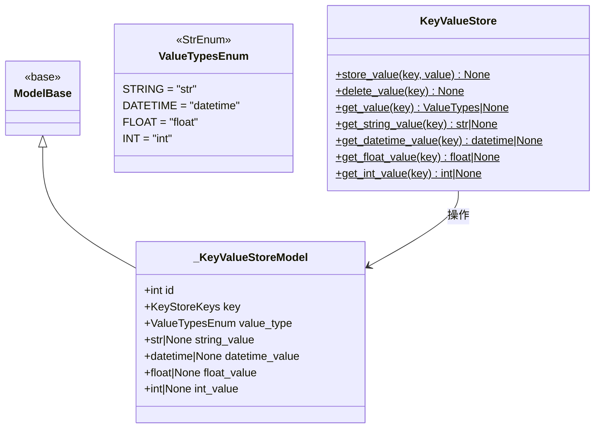

# key_value_store.py

## 概述

通用的 bot 级别持久化键值存储模块。提供跨重启的数据持久化能力，支持存储 `str`、`datetime`、`float` 和 `int` 四种值类型。典型应用场景包括记录 bot 首次启动时间、每次启动时间、Binance 迁移状态等。

## 架构图



## 核心类/函数

### ValueTypes

```python
ValueTypes = str | datetime | float | int
```

类型别名，定义键值存储支持的所有值类型。

### KeyStoreKeys

```python
KeyStoreKeys = Literal["bot_start_time", "startup_time", "binance_migration"]
```

类型别名，使用 `Literal` 严格限制允许的键名，防止任意键名的存储。

### ValueTypesEnum

`StrEnum` 枚举，定义数据库中 `value_type` 字段的合法值：`STRING`、`DATETIME`、`FLOAT`、`INT`。

### _KeyValueStoreModel

数据库 ORM 模型，映射到 `KeyValueStore` 表。

**表结构：**
| 字段 | 类型 | 说明 |
|------|------|------|
| `id` | Integer, PK | 主键 |
| `key` | String(25), indexed | 存储键名 |
| `value_type` | String(20) | 值类型标识 |
| `string_value` | String(255), nullable | 字符串值 |
| `datetime_value` | DateTime, nullable | 日期时间值 |
| `float_value` | Float, nullable | 浮点数值 |
| `int_value` | Integer, nullable | 整数值 |

设计采用了"类型标记 + 多列存储"模式：根据 `value_type` 决定读写哪个值列。

### KeyValueStore

静态方法集合类，提供键值存储的 CRUD 操作。所有方法均为 `@staticmethod`。

- `store_value(key, value)` -- 存储值。根据 value 的 Python 类型自动设置 `value_type` 并存入对应列。如果 key 已存在则更新。
- `delete_value(key)` -- 删除指定 key 的记录。
- `get_value(key)` -- 获取值，自动根据 `value_type` 从对应列读取并返回正确类型。datetime 值会附加 UTC 时区信息。
- `get_string_value(key)` -- 仅获取字符串类型的值。
- `get_datetime_value(key)` -- 仅获取 datetime 类型的值，返回带 UTC 时区。
- `get_float_value(key)` -- 仅获取浮点数类型的值。
- `get_int_value(key)` -- 仅获取整数类型的值。

### set_startup_time()

模块级函数，在 bot 启动时调用：
1. 检查 `bot_start_time` 是否已设置，如果未设置，则取第一笔交易的开仓时间或当前时间。
2. 每次启动都更新 `startup_time` 为当前时间。

## 依赖关系

### 内部依赖（本项目模块）
- `freqtrade.persistence.base.ModelBase` -- ORM 基类
- `freqtrade.persistence.base.SessionType` -- Session 类型
- `freqtrade.persistence.Trade` -- 在 `set_startup_time()` 中查询首笔交易时间

### 外部依赖（第三方库）
- `sqlalchemy` -- ORM 框架
- `datetime` -- 日期时间处理

### 被依赖（谁引用了本文件）
- `freqtrade.persistence.models` -- 在 init_db 中初始化 session
- `freqtrade.persistence.__init__` -- 导出 KeyStoreKeys, KeyValueStore
- `freqtrade.freqtradebot` -- 读取/写入启动时间
- `freqtrade.commands.db_commands` -- 数据库命令
- `freqtrade.rpc.rpc` -- RPC 接口中读取 bot 启动时间
