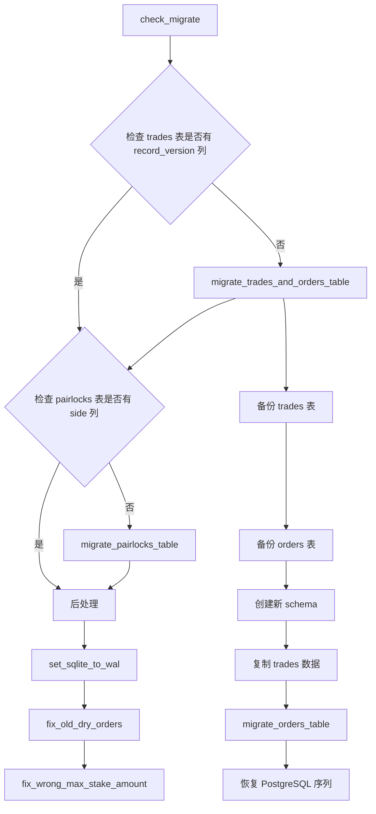

# migrations.py

## 概述

数据库迁移模块，负责检测旧版本数据库 schema 并自动迁移到当前版本。采用"备份旧表 -> 创建新表 -> 复制数据"的策略，支持 SQLite 和 PostgreSQL 两种数据库引擎。迁移范围涵盖 trades 表、orders 表和 pairlocks 表，并在迁移完成后执行一系列修复操作。

## 架构图

## 核心类/函数

### check_migrate(engine, decl_base, previous_tables)

迁移入口函数。检查是否需要迁移，如果需要则执行迁移。

**参数：**
- `engine: Engine` -- SQLAlchemy 引擎
- `decl_base` -- 声明基类（ModelBase）
- `previous_tables: list[str]` -- 迁移前已有的表名列表

**逻辑：**
1. 检查 `trades` 表是否有 `record_version` 列，没有则迁移 trades 和 orders
2. 检查 `pairlocks` 表是否有 `side` 列，没有则迁移 pairlocks
3. 如果 trades 存在但 orders 不存在，说明数据库版本过老，抛出异常
4. 设置 SQLite WAL 模式
5. 修复旧版 dry-run 订单
6. 修复杠杆交易的 max_stake_amount

### migrate_trades_and_orders_table(...)

执行 trades 表和 orders 表的迁移。

**关键逻辑：**
1. 将旧 `trades` 表重命名为备份表
2. 删除备份表上的索引
3. 保存 PostgreSQL 序列的当前值
4. 备份 `orders` 表
5. 使用 SQLAlchemy metadata 创建新 schema
6. 通过 SQL INSERT ... SELECT 从备份表复制数据，同时：
   - 处理列名变更（如 `sell_reason` -> `exit_reason`）
   - 处理默认值填充（缺失列使用 NULL 或计算值）
   - 转换退出原因名称（如 `sell_signal` -> `exit_signal`）
7. 迁移 orders 表
8. 恢复 PostgreSQL 序列 ID

### migrate_orders_table(engine, table_back_name, cols_order)

迁移 orders 表。处理新增列的默认值，如 `ft_fee_base`、`average`、`stop_price`、`funding_fee` 等。

### migrate_pairlocks_table(decl_base, inspector, engine, pairlock_back_name, cols)

迁移 pairlocks 表。主要添加 `side` 列，默认值为 `'*'`（表示双向）。

### set_sqlite_to_wal(engine)

将 SQLite 数据库设置为 WAL（Write-Ahead Logging）模式，提升并发读写性能。仅对非内存 SQLite 数据库生效。

### fix_old_dry_orders(engine)

修复旧版 dry-run 模式遗留的问题订单：
1. 关闭所有 open 状态的 stoploss dry-run 订单
2. 关闭所有关联交易已关闭但订单仍为 open 状态的 dry-run 订单

### fix_wrong_max_stake_amount(engine)

修复杠杆交易中 `max_stake_amount` 计算错误的问题。对 `record_version < 2` 且 `leverage > 1` 的已关闭交易，将 `max_stake_amount` 除以 `leverage`。

### 辅助函数

- `get_table_names_for_table(inspector, tabletype)` -- 获取以指定前缀开头的所有表名
- `has_column(columns, searchname)` -- 检查列列表中是否存在指定列
- `get_column_def(columns, column, default)` -- 获取列名或默认值（用于 SQL 拼接）
- `get_backup_name(tabs, backup_prefix)` -- 生成不重复的备份表名
- `get_last_sequence_ids(engine, sequence_name, table_back_name)` -- 获取 PostgreSQL 序列当前值
- `set_sequence_ids(engine, ...)` -- 设置 PostgreSQL 序列起始值
- `drop_index_on_table(engine, inspector, table_bak_name)` -- 删除备份表上的索引
- `drop_orders_table(engine, table_back_name)` -- 备份并删除 orders 表

## 依赖关系

### 内部依赖（本项目模块）
- `freqtrade.exceptions.OperationalException` -- 操作异常
- `freqtrade.persistence.trade_model.Order` -- Order 模型（用于 fix_old_dry_orders）
- `freqtrade.persistence.trade_model.Trade` -- Trade 模型（用于 fix 函数）

### 外部依赖（第三方库）
- `sqlalchemy` -- Engine, inspect, text, update, select 等数据库操作

### 被依赖（谁引用了本文件）
- `freqtrade.persistence.models` -- 在 init_db 中调用 check_migrate
- `freqtrade.commands.db_commands` -- 数据库命令中使用
