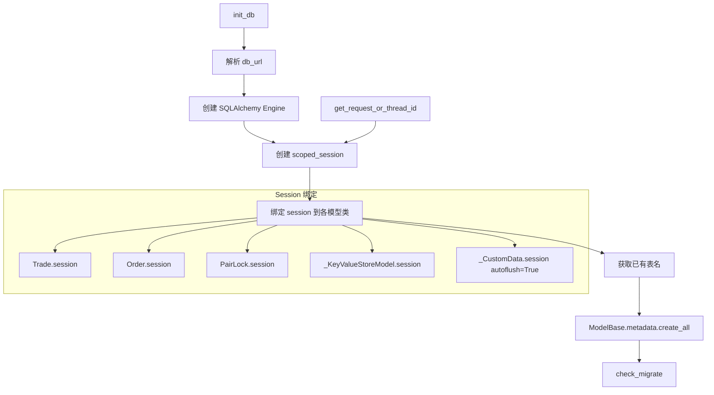

# models.py

## 概述

持久化层的核心初始化模块，负责创建数据库引擎、配置 scoped session、创建表结构并触发数据库迁移。同时提供线程/请求安全的 session 管理机制，以支持多线程交易机器人和 FastAPI REST API 的并发访问。

## 架构图

## 核心类/函数

### get_request_or_thread_id()

获取当前请求 ID 或线程 ID，用于 scoped session 的作用域函数。

**逻辑：**
1. 首先尝试从 `ContextVar` 获取请求 ID（适用于 FastAPI 异步请求场景）
2. 如果请求 ID 为 None（非 API 请求），则使用当前线程 ID

这确保了每个线程/请求都有独立的数据库 session，避免并发冲突。

### init_db(db_url: str)

数据库初始化的核心函数。

**参数：**
- `db_url: str` -- 数据库连接 URL（如 `sqlite:///tradesv3.sqlite`、`sqlite://`、PostgreSQL URL 等）

**逻辑：**
1. **URL 验证：** 拒绝 `sqlite:///`（空路径），需使用 `sqlite://` 作为内存数据库
2. **引擎配置：**
   - 内存 SQLite：使用 `StaticPool`（所有连接共享同一内存数据库）
   - 文件 SQLite：设置 `check_same_thread=False` 允许跨线程访问
3. **Session 创建：**
   - Trade/Order/PairLock/_KeyValueStoreModel 共享同一个 session（`autoflush=False`）
   - _CustomData 使用独立 session（`autoflush=True`），因为自定义数据需要立即持久化
   - 所有 session 使用 `get_request_or_thread_id` 作为作用域函数
4. **Schema 创建：** 调用 `ModelBase.metadata.create_all(engine)` 创建所有表
5. **迁移检查：** 调用 `check_migrate()` 检测并执行数据库迁移

### custom_data_rpc_wrapper(func)

RPC 方法装饰器，用于 custom_data 相关的 RPC 调用。

**行为：**
1. 执行前先 rollback _CustomData 的 session（清除可能的脏状态）
2. 执行被装饰的函数
3. 无论成功失败，最终 rollback 并 remove session

这类似于 `deps.get_rpc()` 的行为，但仅限于 custom_data 的 session 管理。

### 模块级常量

- `REQUEST_ID_CTX_KEY = "request_id"` -- ContextVar 的键名
- `_request_id_ctx_var` -- ContextVar 实例，用于存储 FastAPI 请求 ID
- `_SQL_DOCS_URL` -- SQLAlchemy 文档 URL，用于错误提示

## 依赖关系

### 内部依赖（本项目模块）
- `freqtrade.exceptions.OperationalException` -- 操作异常
- `freqtrade.persistence.base.ModelBase` -- ORM 声明基类
- `freqtrade.persistence.custom_data._CustomData` -- 自定义数据模型
- `freqtrade.persistence.key_value_store._KeyValueStoreModel` -- 键值存储模型
- `freqtrade.persistence.migrations.check_migrate` -- 数据库迁移入口
- `freqtrade.persistence.pairlock.PairLock` -- 交易对锁定模型
- `freqtrade.persistence.trade_model.Order` -- 订单模型
- `freqtrade.persistence.trade_model.Trade` -- 交易模型

### 外部依赖（第三方库）
- `sqlalchemy` -- create_engine, inspect, scoped_session, sessionmaker, StaticPool
- `threading` -- 获取线程 ID
- `contextvars.ContextVar` -- 异步上下文变量（支持 FastAPI）
- `functools` -- wraps 装饰器

### 被依赖（谁引用了本文件）
- `freqtrade.persistence.__init__` -- 导出 init_db
- `freqtrade.persistence.pairlock_middleware` -- 导入 PairLock
- `freqtrade.plugins.protectionmanager` -- 导入 PairLock
- `freqtrade.rpc.api_server.deps` -- 导入 PairLock
- `freqtrade.commands.db_commands` -- 调用 init_db
