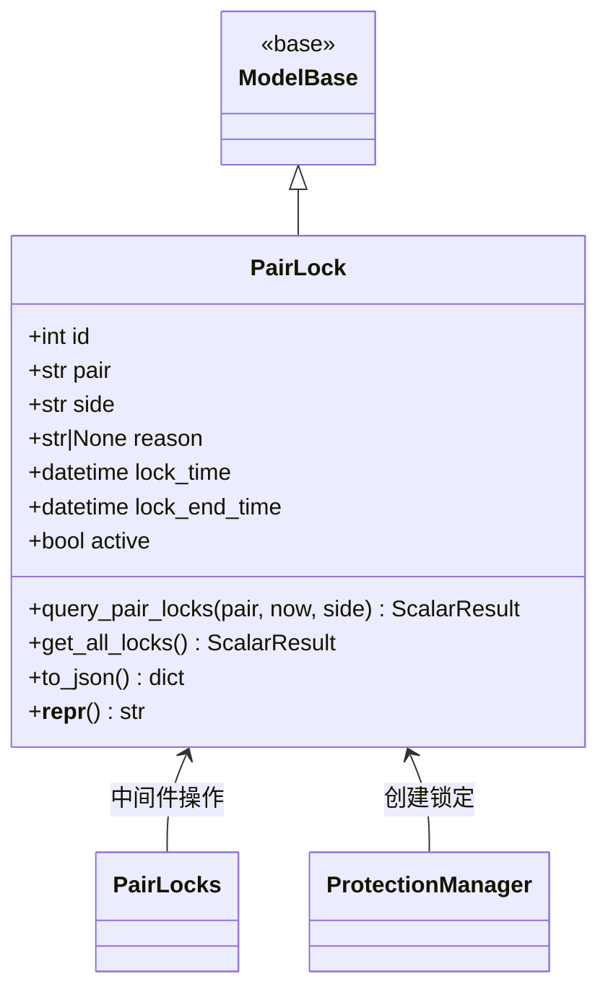

# pairlock.py

## 概述

交易对锁定的数据库模型模块，定义了 `PairLock` ORM 模型。交易对锁定是 freqtrade 的保护机制之一，允许临时禁止对某个交易对（或所有交易对）进行交易操作。支持方向性锁定（long/short/双向）。

## 架构图

## 核心类/函数

### PairLock

数据库 ORM 模型，映射到 `pairlocks` 表。

**表结构：**
| 字段 | 类型 | 说明 |
|------|------|------|
| `id` | Integer, PK | 主键 |
| `pair` | String(25), indexed | 交易对名称，`*` 表示全局锁定 |
| `side` | String(25), default='*' | 锁定方向：`long`、`short` 或 `*`（双向） |
| `reason` | String(255), nullable | 锁定原因说明 |
| `lock_time` | DateTime | 锁定开始时间 |
| `lock_end_time` | DateTime, indexed | 锁定结束时间 |
| `active` | Boolean, indexed | 是否激活 |

**关键方法：**

#### query_pair_locks(pair, now, side) -> ScalarResult[PairLock]

静态方法，查询当前激活的锁定记录。

**参数：**
- `pair: str | None` -- 交易对名称，None 返回所有锁定
- `now: datetime` -- 当前时间，用于过滤未过期的锁定
- `side: str | None` -- 方向过滤。`None` 返回所有方向；非 `*` 时返回匹配方向和 `*`（全方向）的锁定

**查询逻辑：**
1. 筛选 `lock_end_time > now`（未过期）
2. 筛选 `active = True`（激活状态）
3. 可选按 pair 和 side 过滤

#### get_all_locks() -> ScalarResult[PairLock]

静态方法，返回所有锁定记录（包括已过期的）。

#### to_json() -> dict

将 PairLock 转换为 JSON 兼容字典，时间戳同时提供格式化字符串和毫秒级 Unix 时间戳。

## 依赖关系

### 内部依赖（本项目模块）
- `freqtrade.constants.DATETIME_PRINT_FORMAT` -- 日期格式化字符串
- `freqtrade.persistence.base.ModelBase` -- ORM 基类
- `freqtrade.persistence.base.SessionType` -- Session 类型

### 外部依赖（第三方库）
- `sqlalchemy` -- ORM 框架（ScalarResult, String, select, or_ 等）
- `datetime` -- 日期时间处理

### 被依赖（谁引用了本文件）
- `freqtrade.persistence.models` -- 在 init_db 中绑定 session
- `freqtrade.persistence.pairlock_middleware` -- PairLocks 中间件操作 PairLock
- `freqtrade.plugins.protectionmanager` -- 保护管理器中使用
- `freqtrade.rpc.api_server.deps` -- API 依赖注入
- `freqtrade.commands.db_commands` -- 数据库命令
