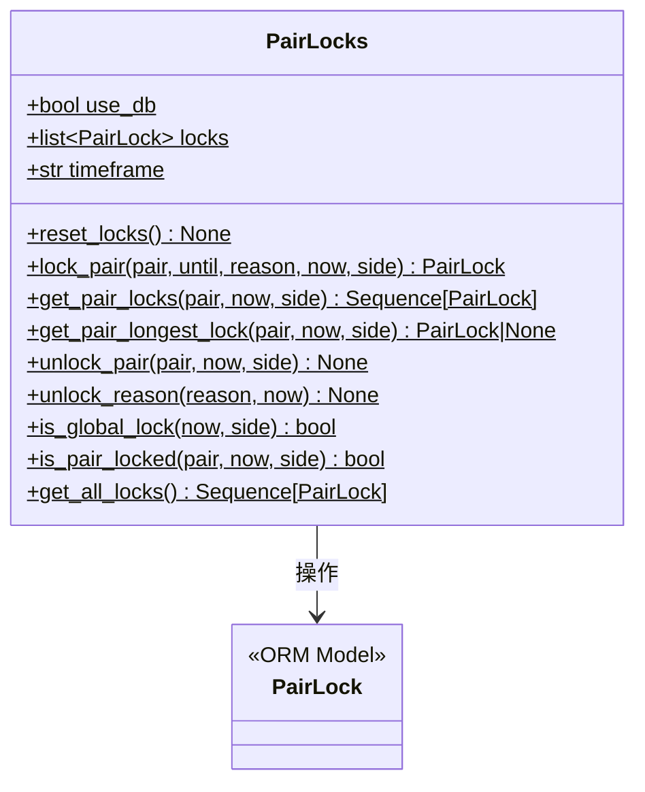

# pairlock_middleware.py

## 概述

交易对锁定的中间件模块，提供 `PairLocks` 类作为交易对锁定功能的统一接口。抽象了数据库层，使其在回测模式下可以使用内存列表替代数据库操作。该类被策略、保护管理器和交易机器人等多个模块广泛使用。

## 架构图

## 核心类/函数

### PairLocks

交易对锁定的中间件类。所有方法均为 `@staticmethod`，通过类属性切换数据库/内存模式。

**类属性：**
- `use_db: bool = True` -- 是否使用数据库。回测时设为 False
- `locks: list[PairLock] = []` -- 内存锁定列表（回测模式使用）
- `timeframe: str = ""` -- 当前 timeframe，用于将锁定结束时间对齐到 K 线边界

**关键方法：**

#### lock_pair(pair, until, reason, *, now, side) -> PairLock

创建交易对锁定。

**参数：**
- `pair: str` -- 交易对名称，`*` 表示全局锁定
- `until: datetime` -- 锁定结束时间，会被 `timeframe_to_next_date` 向上取整到下一根 K 线的时间
- `reason: str | None` -- 锁定原因
- `now: datetime | None` -- 锁定开始时间，默认为当前 UTC 时间
- `side: str = "*"` -- 锁定方向

数据库模式下创建 PairLock 记录并提交；内存模式下追加到 `locks` 列表。

#### get_pair_locks(pair, now, side) -> Sequence[PairLock]

获取指定交易对当前激活的所有锁定。

**逻辑：**
- 数据库模式：委托给 `PairLock.query_pair_locks()`
- 内存模式：遍历 `locks` 列表，过滤未过期、激活状态、匹配 pair 和 side 的记录

#### get_pair_longest_lock(pair, now, side) -> PairLock | None

获取指定交易对的最长有效锁定（按 `lock_end_time` 降序排序取第一个）。

#### unlock_pair(pair, now, side)

释放指定交易对的所有锁定。将匹配的锁定的 `active` 标志设为 False。

#### unlock_reason(reason, now)

按原因释放所有锁定。数据库模式下通过 SQL 查询匹配 reason；内存模式下遍历列表过滤。内存模式不输出日志以提升回测性能。

#### is_global_lock(now, side) -> bool

检查是否存在全局锁定（pair = `*`）。

#### is_pair_locked(pair, now, side) -> bool

检查指定交易对是否被锁定。同时检查针对该 pair 的锁定和全局锁定。

#### get_all_locks() -> Sequence[PairLock]

返回所有锁定记录（包括已过期的）。

#### reset_locks()

重置所有锁定，仅在回测模式下生效。

## 依赖关系

### 内部依赖（本项目模块）
- `freqtrade.exchange.timeframe_to_next_date` -- 将时间对齐到下一根 K 线
- `freqtrade.persistence.models.PairLock` -- PairLock ORM 模型

### 外部依赖（第三方库）
- `sqlalchemy.select` -- SQL 查询构建
- `datetime` -- 日期时间处理

### 被依赖（谁引用了本文件）
- `freqtrade.persistence.__init__` -- 导出 PairLocks
- `freqtrade.persistence.usedb_context` -- 控制 use_db 标志
- `freqtrade.plugins.protectionmanager` -- 保护管理器通过 PairLocks 创建/查询锁定
- `freqtrade.freqtradebot` -- 交易机器人检查锁定状态
- `freqtrade.strategy.interface` -- 策略中调用锁定
- `freqtrade.optimize.backtesting` -- 回测中使用
- `freqtrade.rpc.rpc` -- RPC 接口查询锁定
