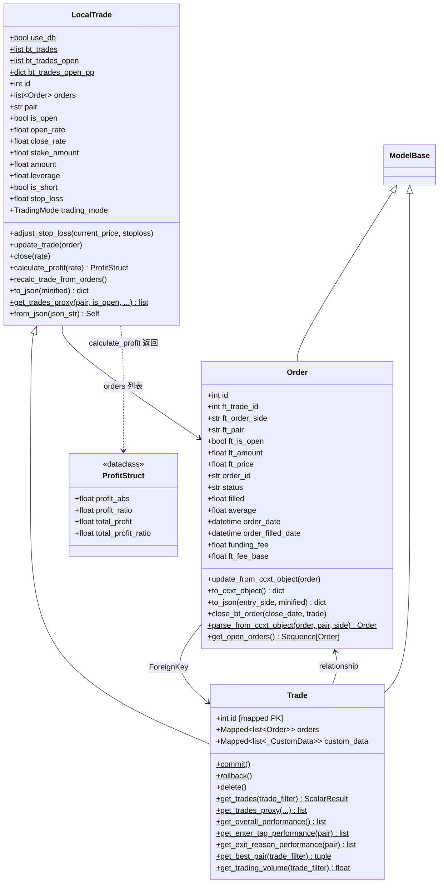

# trade_model.py

## 概述

freqtrade 最核心的持久化模块，定义了交易相关的所有数据模型：`Order`（订单）、`LocalTrade`（本地交易，用于回测）和 `Trade`（数据库交易模型）。该文件超过 2100 行，涵盖了交易的完整生命周期管理——从创建、更新、利润计算、止损调整到关闭。同时包含大量查询和统计方法，支持实盘和回测两种运行模式。

## 架构图

## 核心类/函数

### ProfitStruct

利润数据结构（dataclass），包含：
- `profit_abs` -- 当前仓位的绝对利润
- `profit_ratio` -- 当前仓位的利润比率
- `total_profit` -- 包含已实现利润的总绝对利润
- `total_profit_ratio` -- 包含已实现利润的总利润比率

### Order

订单数据库模型，映射到 `orders` 表。镜像 CCXT 订单结构。

**表结构（关键字段）：**
| 字段 | 类型 | 说明 |
|------|------|------|
| `id` | Integer, PK | 主键 |
| `ft_trade_id` | Integer, FK | 关联交易 ID |
| `ft_order_side` | String(25) | 订单方向：buy/sell/stoploss |
| `ft_pair` | String(25) | 交易对 |
| `ft_is_open` | Boolean | 是否未完成 |
| `ft_amount` | Float | freqtrade 记录的数量 |
| `ft_price` | Float | freqtrade 记录的价格 |
| `order_id` | String(255) | 交易所订单 ID |
| `status` | String | 订单状态 |
| `filled` | Float | 已成交数量 |
| `average` | Float | 平均成交价 |
| `stop_price` | Float | 止损价格 |
| `funding_fee` | Float | 资金费率 |
| `ft_fee_base` | Float | 以 base 货币支付的手续费 |
| `ft_order_tag` | String | 订单标签 |

**唯一约束：** `(ft_pair, order_id)`

**关键属性（safe_ 系列）：**
- `safe_amount` -- 优先返回 `amount`，回退到 `ft_amount`
- `safe_price` -- 优先 `average` > `price` > `stop_price` > `ft_price`
- `safe_filled` -- filled 或 0.0
- `safe_amount_after_fee` -- `filled - ft_fee_base`（扣除手续费后的数量）
- `stake_amount` -- 以 stake 货币计算的订单金额（考虑杠杆）

**关键方法：**
- `update_from_ccxt_object(order)` -- 从 CCXT 订单响应更新 Order 字段
- `to_ccxt_object()` -- 将 Order 转换为 CCXT 格式字典
- `to_json(entry_side, minified)` -- 转换为 JSON（minified 模式用于回测，减少数据量）
- `close_bt_order(close_date, trade)` -- 回测中关闭订单
- `parse_from_ccxt_object(order, pair, side)` -- 类方法，从 CCXT 订单创建 Order 实例
- `get_open_orders()` -- 静态方法，查询所有未完成订单

### LocalTrade

本地交易模型，主要用于回测模式。不继承 ModelBase，因此不映射到数据库。

**类属性（回测用）：**
- `bt_trades: list` -- 已关闭交易列表
- `bt_trades_open: list` -- 未关闭交易列表
- `bt_trades_open_pp: dict[str, list]` -- 按 pair 索引的未关闭交易字典
- `bt_open_open_trade_count: int` -- 当前未关闭交易数量
- `bt_total_profit: float` -- 累计总利润

**实例属性（交易字段，60+个）：**
涵盖交易的所有维度——身份信息（id, pair, exchange）、费用（fee_open, fee_close）、价格（open_rate, close_rate, stop_loss）、金额（stake_amount, amount）、时间（open_date, close_date）、杠杆（leverage, is_short, liquidation_price）、Futures 特性（funding_fees）、精度控制（amount_precision, price_precision）等。

**核心属性（computed）：**
- `entry_side / exit_side` -- 根据 is_short 确定入场/出场方向
- `trade_direction` -- 返回 "long" 或 "short"
- `has_open_orders` -- 是否有未完成的非止损订单
- `open_sl_orders` -- 未完成的止损订单列表
- `nr_of_successful_entries / exits` -- 已成交的入场/出场订单数量
- `date_last_filled_utc` -- 最后一笔成交订单的时间

**核心方法：**

#### adjust_stop_loss(current_price, stoploss, initial, allow_refresh)

调整止损价格。

**逻辑：**
1. 根据 `is_short` 和 `leverage` 计算新止损价
2. 使用 `price_to_precision` 精度处理
3. 首次设置时记录 `initial_stop_loss` 和 `initial_stop_loss_pct`
4. 后续只允许止损单向移动（long 只升不降，short 只降不升），除非 `allow_refresh=True`
5. 方向变化时标记 `is_stop_loss_trailing = True`

#### update_trade(order, recalculating)

用订单信息更新交易状态。

**逻辑：**
- 入场订单：更新 `open_rate` 和 `amount`，调用 `recalc_trade_from_orders()`
- 出场订单：检查是否全部出场（数量接近 0），如果是则调用 `close()`
- 止损订单：设置 `exit_reason = STOPLOSS_ON_EXCHANGE`

#### close(rate)

关闭交易。设置 `close_rate`、`close_date`、`is_open = False`，调用 `recalc_trade_from_orders(is_closing=True)` 计算最终利润。

#### calculate_profit(rate, amount, open_rate) -> ProfitStruct

计算利润指标（包含手续费）。

**逻辑：**
1. 计算 close_trade_value（考虑交易模式：SPOT/MARGIN/FUTURES）
2. 计算 open_trade_value
3. 根据 is_short 决定利润方向
4. 利润率乘以 leverage
5. 计算包含 realized_profit 的总利润

#### calc_close_trade_value(rate, amount) -> float

根据交易模式计算关闭价值：
- **SPOT**：`amount * rate - fees`
- **MARGIN**：额外考虑借贷利息
- **FUTURES**：额外考虑 funding fees

#### recalc_trade_from_orders(is_closing)

从所有已成交订单重新计算交易状态。使用加权平均价格计算 `open_rate`，累计 `realized_profit`，处理 DCA（Dollar Cost Averaging）场景。

#### from_json(json_str) -> Self

类方法，从 JSON 字符串创建 Trade 实例（用于调试）。

#### get_trades_proxy(pair, is_open, open_date, close_date) -> list

代理查询方法。回测模式下过滤内存列表，实盘模式下由 Trade 子类覆盖为数据库查询。

### Trade

数据库交易模型，继承 `ModelBase` 和 `LocalTrade`，映射到 `trades` 表。

**与 LocalTrade 的区别：**
- 所有字段通过 `mapped_column` 映射到数据库列
- `orders` 是 SQLAlchemy relationship（一对多关系，lazy="selectin"）
- `custom_data` 是与 _CustomData 的关系（lazy="raise" 避免意外加载）
- 提供数据库特有的查询方法

**Trade 独有方法：**
- `commit() / rollback()` -- 提交/回滚事务
- `delete()` -- 删除交易及其关联的 orders 和 custom_data
- `get_trades(trade_filter)` -- 使用 SQLAlchemy 过滤器查询交易
- `get_trades_query(trade_filter)` -- 返回 Select 查询对象（不执行）
- `get_open_trades_without_assigned_fees()` -- 查询费用未设置的未关闭交易
- `get_total_closed_profit()` -- 已实现总利润
- `total_open_trades_stakes()` -- 当前未关闭交易的总投入金额
- `get_overall_performance(start_date)` -- 按交易对统计业绩
- `get_enter_tag_performance(pair)` -- 按入场标签统计业绩
- `get_exit_reason_performance(pair)` -- 按退出原因统计业绩
- `get_mix_tag_performance(pair)` -- 按入场标签 + 退出原因组合统计
- `get_best_pair(trade_filter)` -- 获取最佳交易对
- `get_trading_volume(trade_filter)` -- 获取交易量
- `validate_string_len(key, value)` -- SQLAlchemy validates 装饰器，自动截断过长的 enter_tag 和 exit_reason

## 依赖关系

### 内部依赖（本项目模块）
- `freqtrade.constants` -- CANCELED_EXCHANGE_STATES, NON_OPEN_EXCHANGE_STATES, BuySell, LongShort 等
- `freqtrade.enums` -- ExitType, TradingMode
- `freqtrade.exceptions` -- DependencyException, OperationalException
- `freqtrade.exchange` -- ROUND_DOWN, ROUND_UP, amount_to_contract_precision, price_to_precision
- `freqtrade.exchange.exchange_types.CcxtOrder` -- CCXT 订单类型
- `freqtrade.leverage.interest` -- 保证金利息计算
- `freqtrade.misc.safe_value_fallback` -- 安全取值
- `freqtrade.persistence.base` -- ModelBase, SessionType
- `freqtrade.persistence.custom_data` -- CustomDataWrapper, _CustomData
- `freqtrade.util` -- FtPrecise, dt_from_ts, dt_now, dt_ts, round_value 等

### 外部依赖（第三方库）
- `sqlalchemy` -- 完整的 ORM 框架（Enum, Float, ForeignKey, select, func 等）
- `math.isclose` -- 浮点数近似比较
- `collections.defaultdict` -- 默认字典（回测交易索引）
- `dataclasses.dataclass` -- ProfitStruct 数据类

### 被依赖（谁引用了本文件）
- `freqtrade.persistence.__init__` -- 导出 LocalTrade, Order, Trade
- `freqtrade.persistence.models` -- init_db 中绑定 session
- `freqtrade.persistence.migrations` -- 迁移中使用 Order, Trade
- `freqtrade.persistence.usedb_context` -- 控制 Trade.use_db
- `freqtrade.freqtradebot` -- 核心交易逻辑
- `freqtrade.optimize.backtesting` -- 回测引擎
- `freqtrade.rpc.rpc` -- RPC 查询
- `freqtrade.strategy.interface` -- 策略接口
