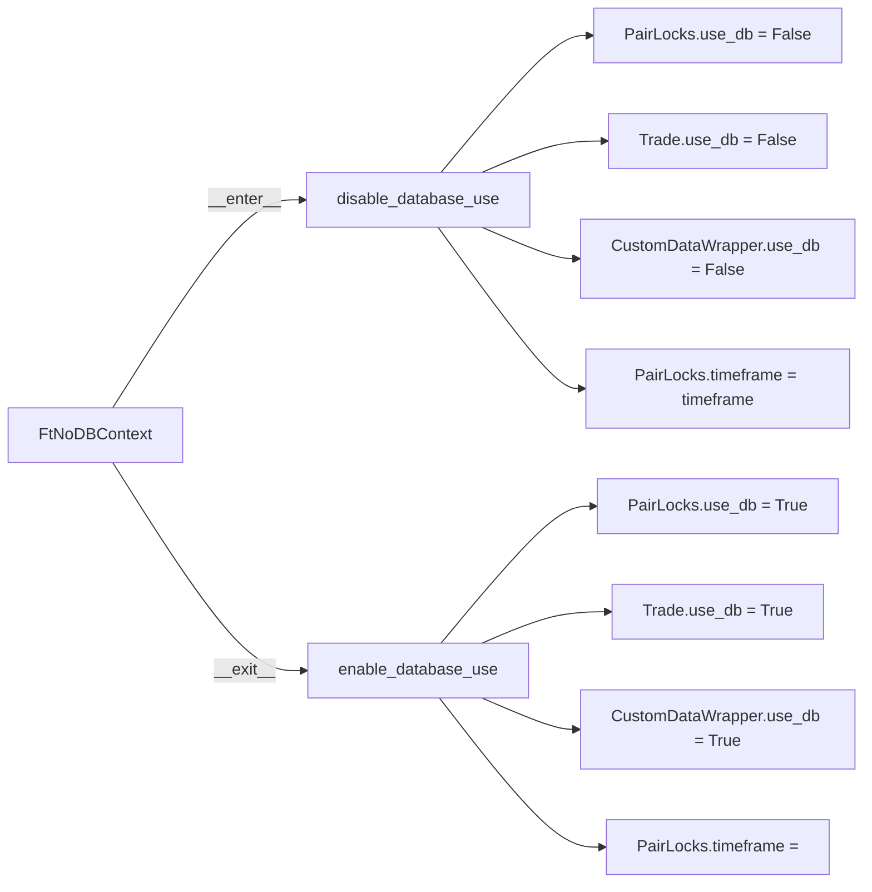

# usedb_context.py

## 概述

数据库使用开关模块，提供在实盘/模拟盘模式（使用数据库）和回测模式（使用内存）之间切换的功能。通过修改 `PairLocks.use_db`、`Trade.use_db` 和 `CustomDataWrapper.use_db` 三个类属性来控制持久化行为。同时提供上下文管理器 `FtNoDBContext` 方便在 with 语句中临时禁用数据库。

## 架构图



## 核心类/函数

### disable_database_use(timeframe: str)

禁用数据库使用。

**参数：**
- `timeframe: str` -- K 线时间周期（如 "5m"、"1h"），用于 PairLocks 的时间对齐

**行为：**
- 将 `PairLocks.use_db`、`Trade.use_db`、`CustomDataWrapper.use_db` 全部设为 `False`
- 设置 `PairLocks.timeframe` 为传入值

### enable_database_use()

恢复数据库使用。

**行为：**
- 将上述三个 `use_db` 标志恢复为 `True`
- 清空 `PairLocks.timeframe`

### FtNoDBContext

上下文管理器类，封装了 `disable_database_use` / `enable_database_use` 的调用对。

**使用示例：**
```python
with FtNoDBContext(timeframe="5m"):
    # 在此代码块内，所有持久化操作使用内存模式
    # 退出时自动恢复数据库模式
    ...
```

**参数：**
- `timeframe: str = ""` -- 传递给 `disable_database_use` 的时间周期

## 依赖关系

### 内部依赖（本项目模块）
- `freqtrade.persistence.custom_data.CustomDataWrapper` -- 自定义数据中间件
- `freqtrade.persistence.pairlock_middleware.PairLocks` -- 交易对锁定中间件
- `freqtrade.persistence.trade_model.Trade` -- 交易模型

### 外部依赖（第三方库）
无

### 被依赖（谁引用了本文件）
- `freqtrade.persistence.__init__` -- 导出 FtNoDBContext, disable_database_use, enable_database_use
- `freqtrade.rpc.rpc` -- RPC 中临时切换数据库模式
- `freqtrade.optimize.backtesting` -- 回测引擎禁用数据库
- `freqtrade.commands` -- 部分工具命令中使用
