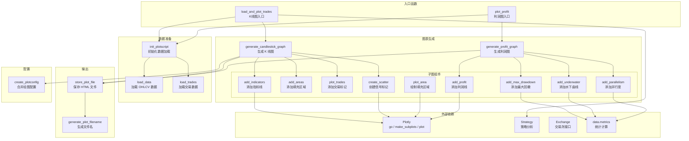
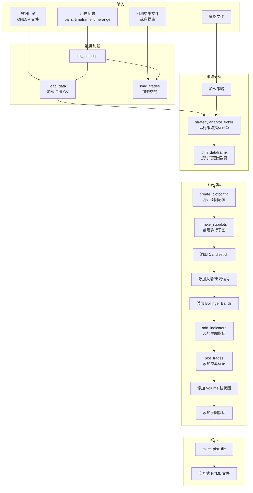
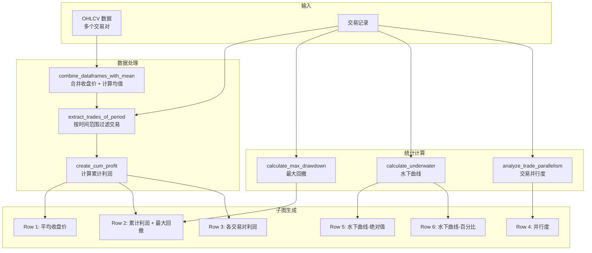
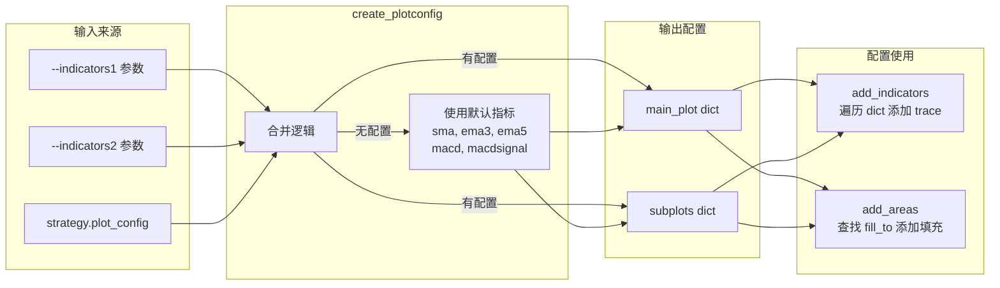

# Plot 绘图工具模块源码文档

## 1. 模块概述

Plot 模块是 freqtrade 的**交易数据可视化工具**，基于 **Plotly** 图表库生成交互式 HTML 图表文件。该模块提供两种核心图表：

1. **K 线图（Candlestick Chart）**：展示单个交易对的 OHLCV 数据、策略指标、买卖信号和交易记录
2. **利润总览图（Profit Plot）**：展示所有交易对的累计利润、最大回撤、水下曲线、交易并行度等综合指标

该模块主要在**命令行模式**下使用（`freqtrade plot-dataframe` 和 `freqtrade plot-profit` 命令），也可以被 API Server 的绘图配置功能间接使用。图表以交互式 HTML 文件输出，支持缩放、悬停查看、图层显隐等 Plotly 交互功能。

## 2. 目录结构

```
freqtrade/plot/
├── __init__.py      # 空模块初始化文件
├── plotting.py      # (~719行) 所有绘图逻辑的核心文件
```

该模块结构简洁，所有功能集中在一个文件中。

## 3. 架构图



## 4. 核心类/函数说明

### 4.1 `init_plotscript(config, markets, startup_candles)` -- 数据初始化

```python
def init_plotscript(config, markets: list, startup_candles: int = 0) -> dict
```

**功能**：加载绘图所需的所有数据，是两种图表共用的数据准备入口。

**处理流程：**
1. 从配置中解析交易对列表（`pairs` 或 `pair_whitelist`），使用 `expand_pairlist()` 展开通配符
2. 解析 `timerange` 时间范围
3. 调用 `load_data()` 加载 OHLCV 数据
4. 如果有 `startup_candles`，调整时间范围起始点
5. 调用 `load_trades()` 加载交易数据（支持 `file` 和 `db` 两种来源）
6. 使用 `trim_dataframe()` 按时间范围裁剪交易数据

**返回：**
```python
{
    "ohlcv": dict[str, DataFrame],  # pair -> OHLCV DataFrame
    "trades": DataFrame,             # 交易记录
    "pairs": list[str],             # 交易对列表
    "timerange": TimeRange,         # 解析后的时间范围
}
```

### 4.2 `create_plotconfig(indicators1, indicators2, plot_config)` -- 配置合并

```python
def create_plotconfig(
    indicators1: list[str], indicators2: list[str], plot_config: dict
) -> dict
```

**功能**：将命令行参数中的 indicators 与策略的 `plot_config` 合并为统一格式。

**配置结构：**
```python
{
    "main_plot": {
        "sma": {},                          # 默认配置
        "ema": {"color": "red"},            # 指定颜色
        "bb_lowerband": {"fill_to": "bb_upperband", "fill_color": "rgba(...)"}  # 填充区域
    },
    "subplots": {
        "MACD": {
            "macd": {"type": "scatter"},     # 散点图（默认）
            "macdsignal": {"type": "bar", "color": "green"}  # 柱状图
        },
        "RSI": {
            "rsi": {"plotly": {"line": {"dash": "dot"}}}  # 直接传递 Plotly 参数
        }
    }
}
```

**默认指标**（当无配置时）：
- Main: `sma`, `ema3`, `ema5`
- Sub: `macd`, `macdsignal`

### 4.3 `generate_candlestick_graph()` -- K 线图生成（核心函数）

```python
def generate_candlestick_graph(
    pair: str,
    data: pd.DataFrame,
    trades: pd.DataFrame | None = None,
    *,
    indicators1: list[str] | None = None,
    indicators2: list[str] | None = None,
    plot_config: dict[str, dict] | None = None,
) -> go.Figure
```

**功能**：生成完整的 K 线图，包含多个子图行。

**图表布局：**

```
┌─────────────────────────────────────────┐
│  Row 1: 主图 (row_width=4)              │
│  - Candlestick (OHLCV)                 │
│  - 入场/出场信号标记                      │
│  - Bollinger Bands 填充区域              │
│  - main_plot 中的所有指标                │
│  - 交易入场/出场标记                      │
├─────────────────────────────────────────┤
│  Row 2: 成交量 (row_width=1)            │
│  - Volume 柱状图                        │
├─────────────────────────────────────────┤
│  Row 3+: 子图 (row_width=1 each)       │
│  - subplots 中的每个子图一行             │
│  - 支持 scatter/bar 类型                │
│  - 支持 fill_to 区域填充                │
└─────────────────────────────────────────┘
```

**处理流程：**
1. 调用 `create_plotconfig()` 合并配置
2. 创建 `make_subplots(rows=2+N, shared_xaxes=True)` 多行子图
3. 添加 Candlestick 主图
4. 添加入场/出场信号散点（`create_scatter()`）
5. 添加 Bollinger Bands 区域填充（`plot_area()`）
6. 添加 main_plot 指标（`add_indicators()`）和区域填充（`add_areas()`）
7. 添加交易标记（`plot_trades()`）
8. 添加 Volume 柱状图
9. 为每个 subplot 添加指标和区域填充

### 4.4 `add_indicators(fig, row, indicators, data)` -- 添加指标

```python
def add_indicators(fig, row, indicators: dict[str, dict], data: pd.DataFrame) -> make_subplots
```

**支持的图表类型：**

| 类型 | Plotly 对象 | 说明 |
|------|-------------|------|
| `scatter` | `go.Scatter` | 折线图（默认） |
| `bar` | `go.Bar` | 柱状图 |

**配置选项：**
- `type`: 图表类型（`scatter` 或 `bar`）
- `color`: 线条/柱体颜色
- `plotly`: 任意 Plotly 参数透传

```python
# 示例配置
{
    "rsi": {"type": "scatter", "color": "blue"},
    "volume_mean": {"type": "bar", "color": "rgba(0,0,255,0.5)"},
    "custom": {"type": "scatter", "plotly": {"line": {"dash": "dot", "width": 0.5}}},
}
```

### 4.5 `plot_trades(fig, trades)` -- 添加交易标记

```python
def plot_trades(fig, trades: pd.DataFrame) -> make_subplots
```

在主图（Row 1）上添加三种交易标记：

| 标记 | 形状 | 颜色 | 说明 |
|------|------|------|------|
| Trade entry | circle-open | cyan | 入场点 |
| Exit - Profit | square-open | green | 盈利出场 |
| Exit - Loss | square-open | red | 亏损出场 |

每个标记的悬停文本包含：利润比率、enter_tag、exit_reason、持仓时间。

### 4.6 `create_scatter(data, column_name, color, direction)` -- 创建信号标记

```python
def create_scatter(data, column_name, color, direction) -> go.Scatter | None
```

为入场/出场信号创建三角形标记：

| 信号 | 颜色 | 方向 | 符号 |
|------|------|------|------|
| `enter_long` | green | up | triangle-up-dot |
| `exit_long` | red | down | triangle-down-dot |
| `enter_short` | blue | down | triangle-down-dot |
| `exit_short` | violet | up | triangle-up-dot |

### 4.7 `plot_area(fig, row, data, indicator_a, indicator_b, ...)` -- 区域填充

```python
def plot_area(fig, row, data, indicator_a, indicator_b,
              label="", fill_color="rgba(0,176,246,0.2)") -> make_subplots
```

在两个指标之间绘制填充区域（如 Bollinger Bands）。使用两个不可见的 Scatter trace，第二个使用 `fill="tonexty"` 填充两线之间的区域。

### 4.8 `add_areas(fig, row, data, indicators)` -- 批量添加填充区域

遍历指标配置，查找带 `fill_to` 属性的指标并调用 `plot_area()`。

配置示例：
```python
{
    "bb_lowerband": {
        "fill_to": "bb_upperband",
        "fill_label": "Bollinger Band",
        "fill_color": "rgba(0,176,246,0.2)"
    }
}
```

### 4.9 `generate_profit_graph()` -- 利润总览图生成

```python
def generate_profit_graph(
    pairs: str,
    data: dict[str, pd.DataFrame],
    trades: pd.DataFrame,
    timeframe: str,
    stake_currency: str,
    starting_balance: float,
) -> go.Figure
```

**图表布局（6行子图）：**

```
┌──────────────────────────────────────┐
│  Row 1: AVG Close Price (height=1)   │
│  - 所有交易对的平均收盘价              │
├──────────────────────────────────────┤
│  Row 2: Combined Profit (height=1)   │
│  - 累计利润曲线                       │
│  - 最大回撤标记（绿色方块）            │
├──────────────────────────────────────┤
│  Row 3: Profit per pair (height=1)   │
│  - 每个交易对的独立累计利润曲线         │
├──────────────────────────────────────┤
│  Row 4: Parallelism (height=0.5)     │
│  - 同时持仓数量（面积图）              │
├──────────────────────────────────────┤
│  Row 5: Underwater (height=0.75)     │
│  - 水下曲线（绝对值，红色）            │
├──────────────────────────────────────┤
│  Row 6: Relative Drawdown (h=0.75)   │
│  - 相对回撤百分比（绿色）              │
└──────────────────────────────────────┘
```

**处理流程：**
1. `combine_dataframes_with_mean()` 合并所有交易对的收盘价
2. `extract_trades_of_period()` 裁剪交易到可用数据范围
3. `create_cum_profit()` 计算累计利润
4. 添加平均收盘价线（Row 1）
5. `add_profit()` 添加累计利润线（Row 2）
6. `add_max_drawdown()` 添加最大回撤标记（Row 2）
7. `add_parallelism()` 添加并行度面积图（Row 4）
8. `add_underwater()` 添加水下曲线（Row 5 + Row 6）
9. 为每个交易对添加独立利润线（Row 3）

### 4.10 `add_max_drawdown()` -- 最大回撤标记

```python
def add_max_drawdown(fig, row, trades, df_comb, timeframe, starting_balance) -> make_subplots
```

在利润曲线上标记最大回撤的高点和低点：
- 使用 `calculate_max_drawdown()` 计算
- 高点和低点使用绿色方块标记（`square-open`）
- 标记文本显示回撤百分比

### 4.11 `add_underwater()` -- 水下曲线

```python
def add_underwater(fig, row, trades, starting_balance) -> make_subplots
```

添加两条水下曲线：
- **绝对水下曲线**（Row N）：红色填充，显示绝对金额回撤
- **相对水下曲线**（Row N+1）：绿色填充，显示百分比回撤

使用 `calculate_underwater()` 计算。

### 4.12 `add_parallelism()` -- 交易并行度

```python
def add_parallelism(fig, row, trades, timeframe) -> make_subplots
```

使用 `analyze_trade_parallelism()` 分析同一时间段内同时持仓的交易数量，以面积图显示。

### 4.13 `load_and_plot_trades(config)` -- K 线图完整入口

```python
def load_and_plot_trades(config: Config) -> None
```

完整的 K 线图生成流程：
1. 加载策略（`StrategyResolver.load_strategy()`）
2. 初始化交易所
3. 初始化 DataProvider
4. 调用 `init_plotscript()` 加载数据
5. 遍历每个交易对：
   - `strategy.analyze_ticker()` 运行策略分析
   - `trim_dataframe()` 裁剪数据
   - `extract_trades_of_period()` 提取对应交易
   - `generate_candlestick_graph()` 生成图表
   - `store_plot_file()` 保存 HTML 文件

输出路径：`{user_data_dir}/plot/freqtrade-plot-{pair}-{timeframe}.html`

### 4.14 `plot_profit(config)` -- 利润图完整入口

```python
def plot_profit(config: Config) -> None
```

利润总览图生成流程：
1. 初始化交易所
2. 调用 `init_plotscript()` 加载数据
3. 过滤有效交易（排除未关闭的交易）
4. `generate_profit_graph()` 生成图表
5. 保存为 `{user_data_dir}/plot/freqtrade-profit-plot.html`

### 4.15 辅助函数

```python
def generate_plot_filename(pair: str, timeframe: str) -> str
    # 生成文件名，如 "freqtrade-plot-BTC_USDT-5m.html"

def store_plot_file(fig, filename, directory, auto_open=False) -> None
    # 创建目录 + 保存 Plotly HTML 文件
    # 使用 plotly.offline.plot()
```

## 5. 依赖关系

### 内部依赖

```mermaid
graph TD
    plotting --> configuration[freqtrade.configuration]
    plotting --> constants[freqtrade.constants]
    plotting --> btanalysis[freqtrade.data.btanalysis]
    plotting --> converter[freqtrade.data.converter]
    plotting --> dataprovider[freqtrade.data.dataprovider]
    plotting --> history[freqtrade.data.history]
    plotting --> metrics[freqtrade.data.metrics]
    plotting --> enums[freqtrade.enums]
    plotting --> exceptions[freqtrade.exceptions]
    plotting --> exchange[freqtrade.exchange]
    plotting --> misc[freqtrade.misc]
    plotting --> pairlist_helpers[freqtrade.plugins.pairlist]
    plotting --> resolvers[freqtrade.resolvers]
    plotting --> strategy[freqtrade.strategy]
    plotting --> util[freqtrade.util]

    subgraph data.metrics 模块
        metrics --> calculate_max_drawdown
        metrics --> calculate_underwater
        metrics --> combine_dataframes_with_mean
        metrics --> create_cum_profit
    end

    subgraph data.btanalysis 模块
        btanalysis --> analyze_trade_parallelism
        btanalysis --> extract_trades_of_period
        btanalysis --> load_trades
    end
```



### 外部依赖

| 依赖 | 用途 | 说明 |
|------|------|------|
| `plotly.graph_objects` | 图表对象 | Candlestick、Scatter、Bar 等 |
| `plotly.subplots.make_subplots` | 多子图布局 | 创建共享 X 轴的多行子图 |
| `plotly.offline.plot` | HTML 输出 | 生成离线交互式 HTML 文件 |
| `pandas` | 数据处理 | DataFrame 操作 |

**注意**：`plotly` 是可选依赖。如果未安装，模块导入时会输出错误信息并调用 `exit(1)`。

## 6. 数据流

### 6.1 K 线图数据流



### 6.2 利润图数据流



### 6.3 指标配置处理流


