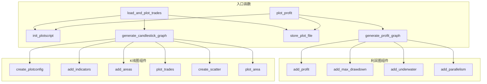

# plotting.py

## 概述

`freqtrade/plot/plotting.py` 是 freqtrade 的图表绘制模块，使用 Plotly 库生成交互式 HTML 图表。它支持两种主要的图表类型：

1. **K线图（Candlestick Chart）**：展示单个交易对的 OHLCV 数据、技术指标、买卖信号和交易记录
2. **利润图（Profit Chart）**：展示所有交易对的综合利润、回撤、并行交易数等统计信息

## 架构图

## 核心类/函数

### init_plotscript(config, markets, startup_candles=0)

初始化绘图所需的数据。

**返回字典包含：**
- `ohlcv` — 各交易对的 K 线数据
- `trades` — 交易记录
- `pairs` — 交易对列表
- `timerange` — 时间范围

**流程：**
1. 展开交易对列表（支持通配符）
2. 解析时间范围
3. 加载 OHLCV 数据
4. 加载交易记录（从文件或数据库）
5. 按时间范围裁剪数据

### generate_candlestick_graph(pair, data, trades, *, indicators1, indicators2, plot_config) -> go.Figure

生成单个交易对的 K 线图。

**图表布局：**
- Row 1: 主图 — K 线、入场/退场信号标记、主指标、Bollinger Bands
- Row 2: 成交量图
- Row 3+: 子图 — 各子图指标

**参数：**
- `pair` — 交易对名称（显示为标题）
- `data` — 包含指标和信号的 DataFrame
- `trades` — 交易记录
- `indicators1` — 主图指标列表
- `indicators2` — 子图指标列表
- `plot_config` — 高级绘图配置（支持颜色、图表类型、fill_to 区域填充等）

### generate_profit_graph(pairs, data, trades, timeframe, stake_currency, starting_balance) -> go.Figure

生成综合利润图，包含 6 个子图：
1. 平均收盘价
2. 累积利润（含最大回撤标记）
3. 各交易对利润
4. 并行交易数
5. 水下曲线（Underwater Plot）
6. 相对回撤百分比

### add_indicators(fig, row, indicators, data) -> make_subplots

向指定行添加指标图表。

**支持的图表类型（通过 `conf.type`）：**
- `scatter` — 线形图（默认）
- `bar` — 柱状图

**支持的配置选项：**
- `color` — 颜色
- `plotly` — 直接传递给 Plotly 的额外配置

### plot_trades(fig, trades) -> make_subplots

在 K 线图上标记交易入场和退场点。
- 入场：青色圆圈
- 盈利退场：绿色方块
- 亏损退场：红色方块
- Hover 文本包含利润率、入场标签、退出原因、交易时长

### create_plotconfig(indicators1, indicators2, plot_config) -> dict

合并命令行指标参数和策略的 `plot_config` 配置。

**默认指标：**
- 主图：`sma`, `ema3`, `ema5`
- 子图：`macd`, `macdsignal`

### plot_area(fig, row, data, indicator_a, indicator_b, label, fill_color) -> make_subplots

绘制两条线之间的填充区域（如 Bollinger Bands）。

### add_areas(fig, row, data, indicators) -> make_subplots

解析指标配置中的 `fill_to` 选项，批量添加区域填充。

### create_scatter(data, column_name, color, direction) -> go.Scatter | None

为入场/退场信号创建三角形标记点。

### add_profit(fig, row, data, column, name)

添加利润曲线。

### add_max_drawdown(fig, row, trades, df_comb, timeframe, starting_balance)

添加最大回撤标记点（方块标记最高点和最低点）。

### add_underwater(fig, row, trades, starting_balance)

添加水下曲线（绝对值和相对百分比）。

### add_parallelism(fig, row, trades, timeframe)

添加并行交易数曲线。

### load_and_plot_trades(config)

完整的 K 线图绘制流程入口。

**流程：**
1. 加载策略和交易所
2. 初始化 DataProvider
3. 调用策略的 `analyze_ticker()` 分析每个交易对
4. 为每个交易对生成 K 线图并保存为 HTML

### plot_profit(config)

完整的利润图绘制流程入口。

**流程：**
1. 加载交易所和交易数据
2. 过滤有效交易（排除未关闭的）
3. 生成利润图并保存为 HTML

### generate_plot_filename(pair, timeframe) -> str

生成绘图文件名，格式为 `freqtrade-plot-{pair}-{timeframe}.html`。

### store_plot_file(fig, filename, directory, auto_open=False)

将 Plotly 图表保存为 HTML 文件。

## 依赖关系

### 内部依赖（本项目模块）
- `freqtrade.configuration.TimeRange` — 时间范围
- `freqtrade.data.btanalysis` — 交易分析（analyze_trade_parallelism, extract_trades_of_period, load_trades）
- `freqtrade.data.converter` — 数据裁剪
- `freqtrade.data.dataprovider.DataProvider` — 数据提供者
- `freqtrade.data.history` — 历史数据加载
- `freqtrade.data.metrics` — 指标计算（max_drawdown, underwater, cum_profit 等）
- `freqtrade.resolvers` — ExchangeResolver, StrategyResolver
- `freqtrade.strategy.IStrategy` — 策略接口
- `freqtrade.strategy.strategy_wrapper` — 安全调用包装器
- `freqtrade.misc.pair_to_filename` — 交易对名转文件名
- `freqtrade.plugins.pairlist.pairlist_helpers` — 交易对展开

### 外部依赖（第三方库）
- `plotly.graph_objects` — Plotly 图表对象（Candlestick, Scatter, Bar）
- `plotly.offline.plot` — 离线 HTML 输出
- `plotly.subplots.make_subplots` — 多子图布局
- `pandas` — 数据处理

### 被依赖（谁引用了本文件）
- `freqtrade.commands.plot_commands` — `plot-dataframe` 和 `plot-profit` 命令入口
- `freqtrade.freqai.utils` — FreqAI 绘图
