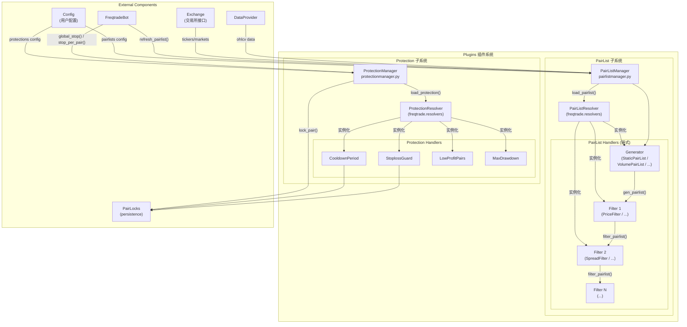
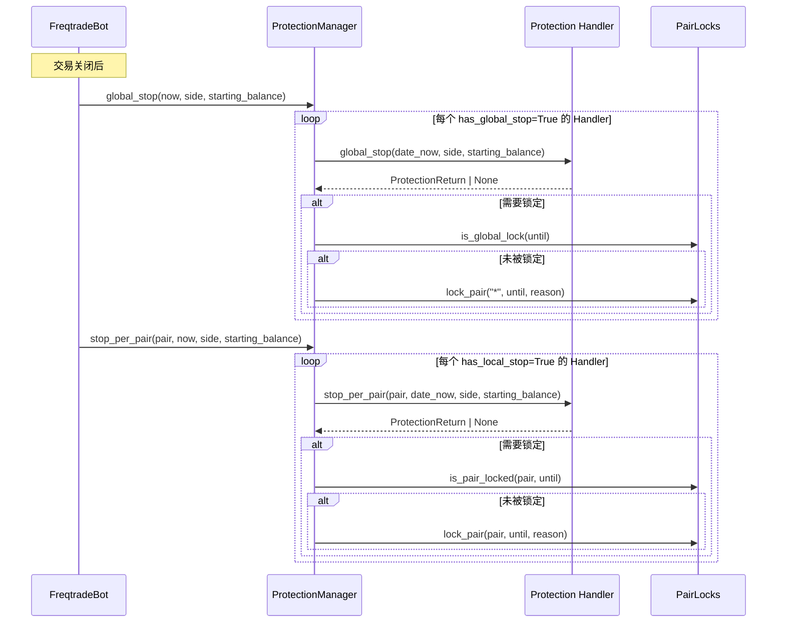
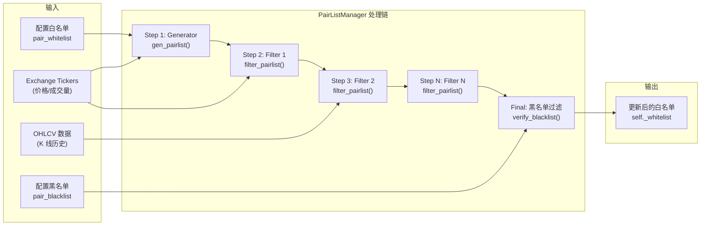
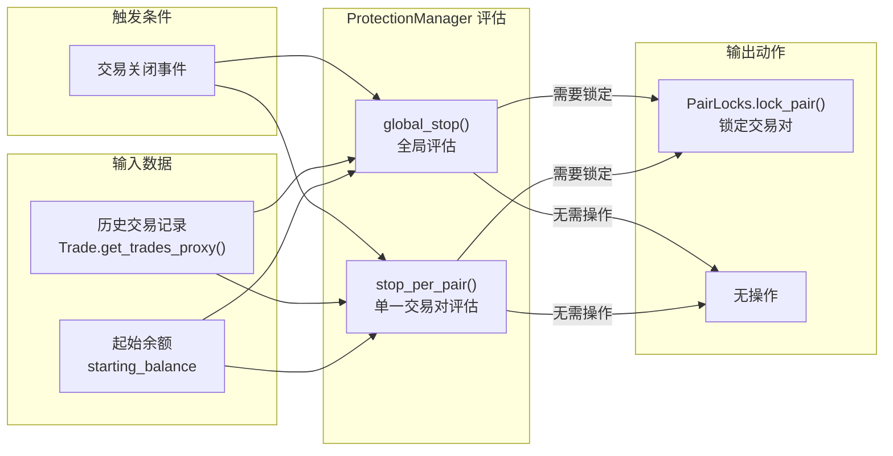

# Plugins -- 插件系统根目录

## 1. 模块概述

`freqtrade.plugins` 模块是 Freqtrade 的插件系统根目录，采用 **管理器模式（Manager Pattern）** 设计，提供了两大插件子系统的统一管理入口：

1. **PairList 插件系统**（交易对筛选）：通过链式处理器模式（Chain of Handlers），动态生成和过滤交易对白名单
2. **Protection 插件系统**（交易保护）：通过事件驱动模式，在交易完成后评估风控条件并触发交易对锁定

根目录仅包含两个管理器类和一个空的 `__init__.py`，具体的插件实现分别位于 `pairlist/` 和 `protections/` 子目录中。

**设计理念：**
- **可插拔架构**：所有插件通过 Resolver 动态加载，用户可通过配置文件灵活组合
- **链式处理**：PairList 插件按配置顺序串联执行，第一个作为生成器（Generator），后续作为过滤器（Filter）
- **关注点分离**：管理器只负责编排和生命周期管理，具体逻辑由各插件实现

## 2. 目录结构

| 文件/目录 | 功能说明 |
|---|---|
| `__init__.py` | 空文件，标记为 Python 包 |
| `pairlistmanager.py` | PairList 管理器，负责加载、编排和执行交易对筛选插件链 |
| `protectionmanager.py` | Protection 管理器，负责加载和执行交易保护插件 |
| `pairlist/` | 交易对筛选插件子目录（详见 [pairlist/README.md](pairlist/README.md)） |
| `protections/` | 交易保护插件子目录（详见 [protections/README.md](protections/README.md)） |

## 3. 架构图



## 4. 核心类/函数说明

### 4.1 `PairListManager` 类 (`pairlistmanager.py`)

PairList 管理器是交易对筛选系统的核心编排器，继承自 `LoggingMixin`。

#### 初始化流程

```python
def __init__(self, exchange, config, dataprovider=None):
    # 1. 从配置中读取白名单和黑名单
    self._whitelist = config["exchange"]["pair_whitelist"]
    self._blacklist = config["exchange"].get("pair_blacklist", [])

    # 2. 通过 PairListResolver 逐个加载 PairList Handler
    for pairlist_handler_config in config.get("pairlists", []):
        handler = PairListResolver.load_pairlist(
            pairlist_handler_config["method"], ...
        )
        self._pairlist_handlers.append(handler)

    # 3. 检查 tickers 需求
    # 4. 回测兼容性检查
    self._check_backtest()
```

#### 核心方法

| 方法 | 功能 |
|---|---|
| `refresh_pairlist(only_first, pairs)` | 执行完整的 PairList 刷新链 |
| `verify_blacklist(pairlist, logmethod)` | 根据黑名单过滤交易对 |
| `verify_whitelist(pairlist, logmethod)` | 验证白名单并展开正则表达式 |
| `create_pair_list(pairs, timeframe)` | 创建 `(pair, timeframe, candle_type)` 元组列表 |
| `expanded_blacklist` (property) | 展开后的黑名单（支持通配符） |

#### 链式执行流程

`refresh_pairlist()` 方法的执行逻辑：

1. **获取 Tickers**：如果任何 Handler 需要 tickers，则从交易所获取（带 TTL 缓存，30 分钟）
2. **生成初始列表**：调用第一个 Handler 的 `gen_pairlist(tickers)` 生成初始交易对列表
3. **链式过滤**：依次调用后续 Handler 的 `filter_pairlist(pairlist, tickers)`
4. **黑名单验证**：最终结果经过黑名单过滤
5. **更新白名单**：将处理后的列表赋值给 `self._whitelist`

#### 回测支持

`_check_backtest()` 方法检查每个 Handler 的 `supports_backtesting` 属性：
- `SupportsBacktesting.NO`: 抛出异常，禁止在回测中使用
- `SupportsBacktesting.NO_ACTION`: 警告，该 Handler 在回测中不会产生变化
- `SupportsBacktesting.BIASED`: 警告，该 Handler 会引入前视偏差（lookahead bias）
- `SupportsBacktesting.YES`: 完全支持回测

### 4.2 `ProtectionManager` 类 (`protectionmanager.py`)

Protection 管理器负责加载和执行所有交易保护插件。

#### 初始化流程

```python
def __init__(self, config, protections):
    # 1. 验证配置有效性
    self.validate_protections(protections)

    # 2. 通过 ProtectionResolver 加载每个保护插件
    for protection_config in protections:
        handler = ProtectionResolver.load_protection(
            protection_config["method"], ...
        )
        self._protection_handlers.append(handler)
```

#### 核心方法

| 方法 | 功能 |
|---|---|
| `global_stop(now, side, starting_balance)` | 评估全局停止条件（所有交易对），返回 PairLock 或 None |
| `stop_per_pair(pair, now, side, starting_balance)` | 评估单个交易对的停止条件，返回 PairLock 或 None |
| `validate_protections(protections)` | 静态方法，验证 Protection 配置的合法性 |
| `name_list` (property) | 已加载 Handler 的名称列表 |
| `short_desc()` | Handler 的简短描述列表 |

#### 配置验证规则

`validate_protections()` 检查以下互斥配置：
- `stop_duration` 与 `stop_duration_candles` 不可同时配置
- `lookback_period` 与 `lookback_period_candles` 不可同时配置
- `unlock_at` 与 `stop_duration`/`stop_duration_candles` 不可同时配置
- `unlock_at` 必须符合 `%H:%M` 格式

#### 执行流程



## 5. 依赖关系

### PairListManager 的依赖

| 依赖模块 | 用途 |
|---|---|
| `freqtrade.exchange.Exchange` | 获取市场数据、tickers |
| `freqtrade.data.dataprovider.DataProvider` | 获取 OHLCV 数据（某些 Handler 需要） |
| `freqtrade.resolvers.PairListResolver` | 动态加载 PairList Handler |
| `freqtrade.plugins.pairlist.IPairList` | Handler 基类接口 |
| `freqtrade.plugins.pairlist.pairlist_helpers` | `expand_pairlist()` 通配符展开 |
| `freqtrade.mixins.LoggingMixin` | 日志去重功能 |
| `freqtrade.enums.RunMode` | 运行模式判断 |
| `cachetools.LRUCache` | 黑名单缓存 |
| `freqtrade.util.FtTTLCache` | Tickers 缓存（TTL=1800s） |

### ProtectionManager 的依赖

| 依赖模块 | 用途 |
|---|---|
| `freqtrade.persistence.PairLocks` | 执行交易对锁定 |
| `freqtrade.persistence.models.PairLock` | PairLock 数据模型 |
| `freqtrade.resolvers.ProtectionResolver` | 动态加载 Protection Handler |
| `freqtrade.plugins.protections.IProtection` | Handler 基类接口 |
| `freqtrade.exceptions.ConfigurationError` | 配置错误异常 |

## 6. 数据流

### 6.1 PairList 刷新数据流



### 6.2 Protection 保护数据流



### 6.3 配置示例

```json
{
    "pairlists": [
        {"method": "VolumePairList", "number_assets": 50, "sort_key": "quoteVolume"},
        {"method": "AgeFilter", "min_days_listed": 10},
        {"method": "PriceFilter", "low_price_ratio": 0.01},
        {"method": "SpreadFilter", "max_spread_ratio": 0.005},
        {"method": "RangeStabilityFilter", "lookback_days": 10, "min_rate_of_change": 0.01}
    ],
    "protections": [
        {"method": "CooldownPeriod", "stop_duration": 5},
        {"method": "StoplossGuard", "trade_limit": 4, "stop_duration_candles": 2, "only_per_pair": false},
        {"method": "MaxDrawdown", "max_allowed_drawdown": 0.2, "lookback_period_candles": 48}
    ]
}
```

在这个配置中：
- PairList 链：`VolumePairList`(生成器) -> `AgeFilter` -> `PriceFilter` -> `SpreadFilter` -> `RangeStabilityFilter`
- Protection 链：每笔交易关闭后依次检查 `CooldownPeriod` -> `StoplossGuard` -> `MaxDrawdown`
