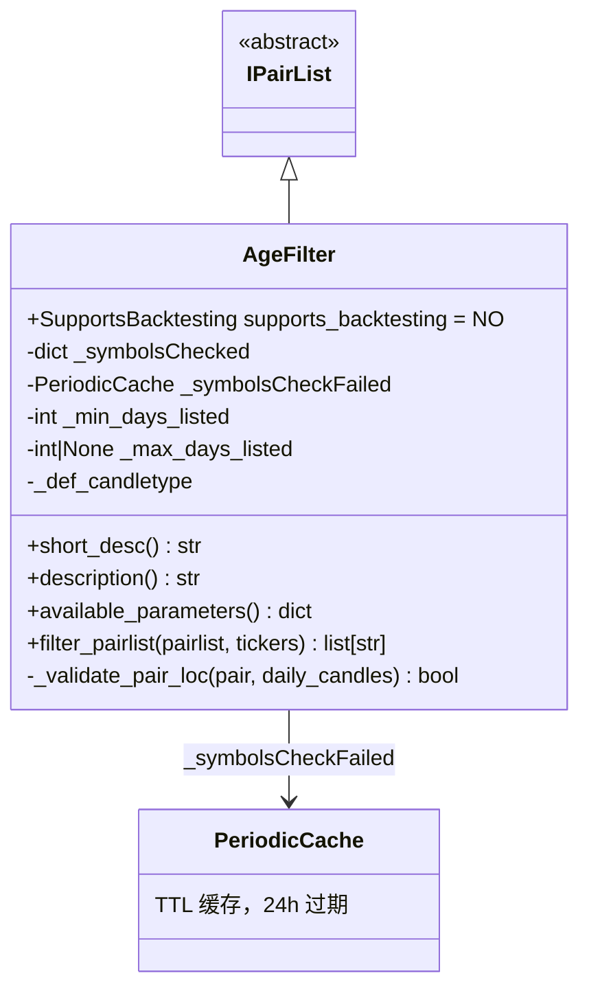

# AgeFilter.py

## 概述

基于交易对上市天数（Age）进行过滤的 Pairlist Filter 插件。该过滤器通过获取每日 K 线数据来判断某个交易对在交易所上市了多少天，可以设置最小和最大上市天数来过滤交易对。

典型用途：排除刚上市的高风险交易对，或排除上市时间过长的老旧交易对。

## 架构图

## 核心类/函数

### AgeFilter

继承自 `IPairList`，不支持回测 (`supports_backtesting = NO`)。

**配置参数：**
- `min_days_listed` (default: 10) -- 最小上市天数，必须 >= 1
- `max_days_listed` (default: None) -- 最大上市天数（可选），必须 > min_days_listed

**构造函数验证：**
- `min_days_listed` 必须 >= 1
- `min_days_listed` 不得超过交易所允许的最大 K 线请求数
- `max_days_listed`（如果设置了）必须 > `min_days_listed` 且不超过交易所限制

**关键方法：**

#### filter_pairlist(pairlist, tickers) -> list[str]
重写了父类的通用过滤方法，执行批量 K 线数据获取：
1. 筛选出尚未检查且未失败的交易对
2. 计算需要获取的时间范围（`since_ms`）
3. 调用 `exchange.refresh_latest_ohlcv` 批量获取日线数据
4. 对每个交易对调用 `_validate_pair_loc` 进行验证

#### _validate_pair_loc(pair, daily_candles) -> bool
验证单个交易对的上市天数：
- 已在缓存 `_symbolsChecked` 中的直接返回 True
- 检查日线数量是否在 `[min_days_listed, max_days_listed]` 范围内
- 通过验证的加入 `_symbolsChecked` 缓存
- 未通过的加入 `_symbolsCheckFailed` 缓存（TTL 24 小时）

## 依赖关系

### 内部依赖（本项目模块）
- `freqtrade.plugins.pairlist.IPairList` -- 基类 IPairList、PairlistParameter、SupportsBacktesting
- `freqtrade.constants.ListPairsWithTimeframes` -- 类型定义
- `freqtrade.exceptions.OperationalException` -- 配置错误异常
- `freqtrade.exchange.exchange_types.Tickers` -- Tickers 类型
- `freqtrade.misc.plural` -- 复数形式辅助函数
- `freqtrade.util.PeriodicCache` -- 带 TTL 的周期性缓存
- `freqtrade.util.dt_floor_day, dt_now, dt_ts` -- 时间辅助函数

### 外部依赖（第三方库）
- `pandas.DataFrame` -- K 线数据格式
- `copy.deepcopy` -- 安全遍历列表
- `datetime.timedelta` -- 时间计算

### 被依赖（谁引用了本文件）
- `freqtrade.resolvers.pairlist_resolver` -- 通过名称动态加载该插件
- `freqtrade.plugins.pairlistmanager` -- PairlistManager 调度链中使用
