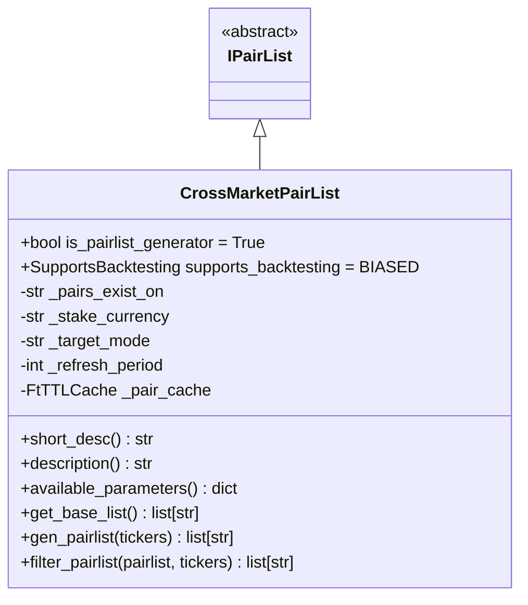
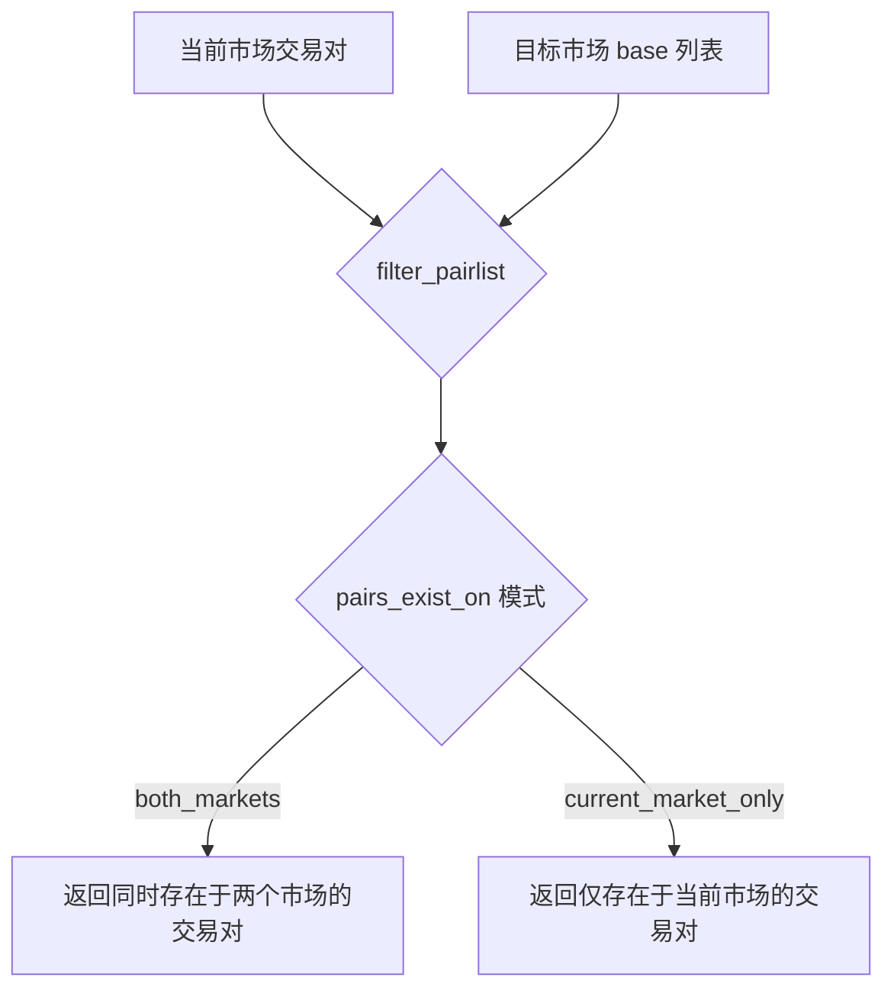

# CrossMarketPairList.py

## 概述

跨市场交易对列表插件，用于根据交易对在不同市场（现货/合约）的存在情况进行过滤或生成交易对列表。例如，如果你在合约模式下运行，可以选择只交易那些同时在现货市场也存在的交易对（或反之）。

该插件既可以作为 Pairlist Generator（链中第一个位置）生成初始列表，也可以作为 Filter 过滤已有列表。

## 架构图

## 核心类/函数

### CrossMarketPairList

继承自 `IPairList`，是 Pairlist Generator（`is_pairlist_generator = True`），回测支持为 `BIASED`。

**配置参数：**
- `pairs_exist_on` (default: "both_markets") -- 模式选择
  - `"both_markets"` -- 只保留同时在当前市场和目标市场都存在的交易对
  - `"current_market_only"` -- 只保留仅在当前市场存在（不在目标市场）的交易对
- `refresh_period` (default: 1800) -- 缓存刷新周期（秒）

**关键方法：**

#### get_base_list() -> list[str]
获取目标市场（如果当前是 futures 则目标为 spot，反之亦然）中所有活跃交易对的 base 货币列表。

#### gen_pairlist(tickers) -> list[str]
作为 Generator 时的入口：
1. 先检查缓存
2. 获取当前市场的所有交易对
3. 通过黑名单过滤
4. 调用 `filter_pairlist` 进行跨市场过滤

#### filter_pairlist(pairlist, tickers) -> list[str]
核心过滤逻辑：
1. 获取目标市场的 base 列表
2. 对每个交易对提取 base 货币
3. 检查 base 是否在目标市场存在（支持 PairPrefixes 前缀匹配，如 `PEPE` vs `1000PEPE`）
4. 根据模式返回白名单或过滤后列表

## 依赖关系

### 内部依赖（本项目模块）
- `freqtrade.plugins.pairlist.IPairList` -- 基类
- `freqtrade.constants.PairPrefixes` -- 交易对前缀常量（如 "1000", "K" 等）
- `freqtrade.exchange.exchange_types.Tickers` -- Tickers 类型
- `freqtrade.util.FtTTLCache` -- TTL 缓存

### 外部依赖（第三方库）
无

### 被依赖（谁引用了本文件）
- `freqtrade.resolvers.pairlist_resolver` -- 动态加载该插件
- `freqtrade.plugins.pairlistmanager` -- PairlistManager 调度链
