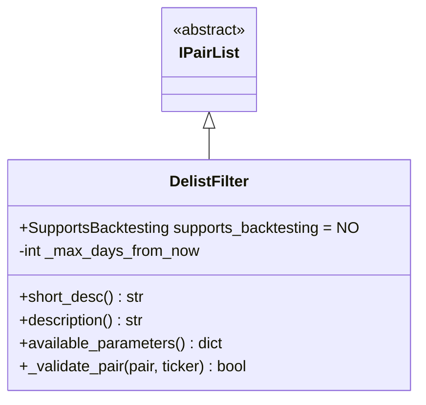
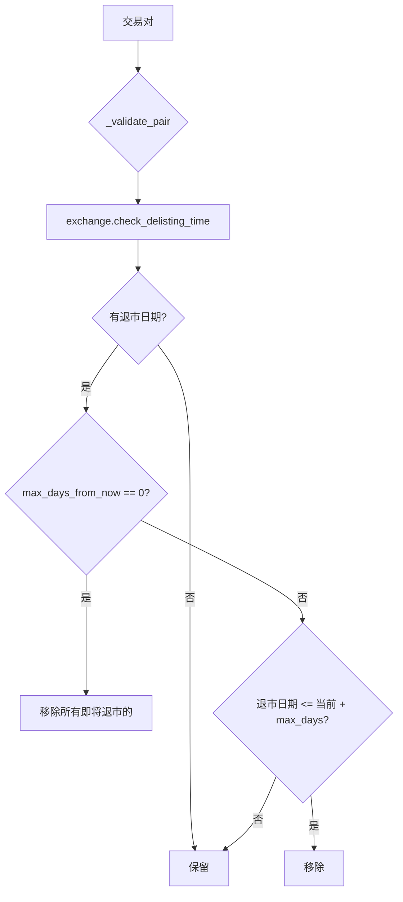

# DelistFilter.py

## 概述

退市过滤器插件，用于过滤即将在交易所退市（delist）的交易对。通过查询交易所提供的退市时间信息，自动将即将退市的交易对从白名单中移除，避免在退市前购入无法交易的资产。

## 架构图

## 核心类/函数

### DelistFilter

继承自 `IPairList`，不支持回测 (`supports_backtesting = NO`)。

**配置参数：**
- `max_days_from_now` (default: 0) -- 从当前日期起的最大天数
  - 设为 0：移除所有有退市日期的交易对
  - 设为正数 N：只移除在未来 N 天内退市的交易对

**构造函数验证：**
- `max_days_from_now` 必须 >= 0
- 交易所必须支持 `has_delisting` 功能（通过 `_ft_has["has_delisting"]` 检查）

**关键方法：**

#### _validate_pair(pair, ticker) -> bool
验证单个交易对是否即将退市：
1. 调用 `exchange.check_delisting_time(pair)` 获取退市日期
2. 如果没有退市日期，返回 True（保留）
3. 如果 `max_days_from_now == 0`，移除所有有退市日期的交易对
4. 否则计算 `当前时间 + max_days_from_now`，如果退市日期在此之前则移除

## 依赖关系

### 内部依赖（本项目模块）
- `freqtrade.plugins.pairlist.IPairList` -- 基类
- `freqtrade.exceptions.ConfigurationError` -- 配置错误异常
- `freqtrade.exchange.exchange_types.Ticker` -- Ticker 类型
- `freqtrade.util.format_date` -- 日期格式化工具

### 外部依赖（第三方库）
- `datetime` -- 日期时间处理

### 被依赖（谁引用了本文件）
- `freqtrade.resolvers.pairlist_resolver` -- 动态加载该插件
- `freqtrade.plugins.pairlistmanager` -- PairlistManager 调度链
