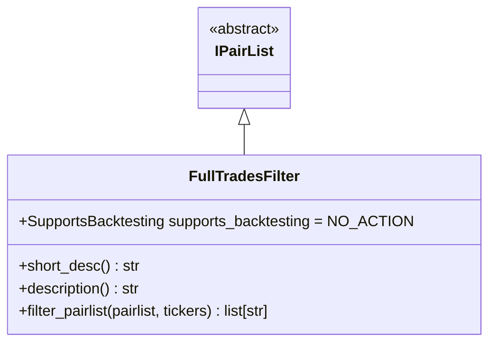
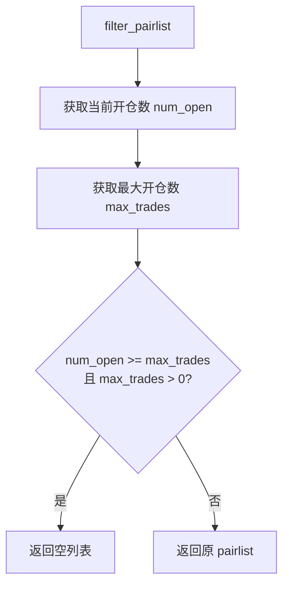

# FullTradesFilter.py

## 概述

交易槽位满载过滤器。当所有交易槽位都被占满时（即当前开仓交易数 >= `max_open_trades`），该过滤器会将白名单清空，返回空列表，从而阻止 bot 尝试开新仓。

这是一个非常简单但实用的优化插件：当没有可用交易槽位时，跳过所有后续的交易对过滤和数据获取操作，减少不必要的 API 调用。

## 架构图

## 核心类/函数

### FullTradesFilter

继承自 `IPairList`，回测时不执行操作 (`supports_backtesting = NO_ACTION`)。

**配置参数：** 无额外配置参数。

**关键方法：**

#### filter_pairlist(pairlist, tickers) -> list[str]
核心过滤逻辑：
1. 通过 `Trade.get_open_trade_count()` 获取当前开仓交易数
2. 从 `config["max_open_trades"]` 获取最大允许开仓数
3. 如果开仓数已达到或超过上限且上限 > 0，返回空列表
4. 否则返回原始 pairlist 不做修改

## 依赖关系

### 内部依赖（本项目模块）
- `freqtrade.plugins.pairlist.IPairList` -- 基类
- `freqtrade.exchange.exchange_types.Tickers` -- Tickers 类型
- `freqtrade.persistence.Trade` -- 交易持久化模型，查询开仓数

### 外部依赖（第三方库）
无

### 被依赖（谁引用了本文件）
- `freqtrade.resolvers.pairlist_resolver` -- 动态加载该插件
- `freqtrade.plugins.pairlistmanager` -- PairlistManager 调度链
