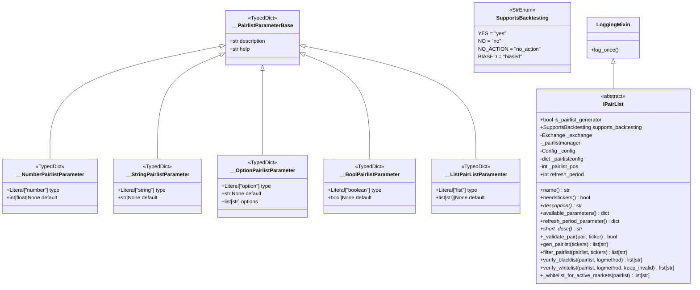

# IPairList.py

## 概述

PairList Handler 的抽象基类文件，定义了所有 Pairlist 插件必须遵循的接口规范。该文件包含：
1. **PairlistParameter 类型系统** -- 用于描述各 Handler 可配置参数的 TypedDict 联合类型
2. **SupportsBacktesting 枚举** -- 指示 Handler 是否支持回测
3. **IPairList 抽象基类** -- 所有 Pairlist Handler 的父类，提供通用的过滤、验证和生命周期管理逻辑

所有 Pairlist Handler（如 VolumePairList、StaticPairList 等）都必须继承 IPairList 并实现其抽象方法。

## 架构图

## 核心类/函数

### PairlistParameter (联合类型)

由以下五种 TypedDict 构成的联合类型：
- `__NumberPairlistParameter` -- 数值型参数 (`type="number"`)
- `__StringPairlistParameter` -- 字符串型参数 (`type="string"`)
- `__OptionPairlistParameter` -- 选项型参数 (`type="option"`，含 `options` 列表)
- `__BoolPairlistParameter` -- 布尔型参数 (`type="boolean"`)
- `__ListPairListParamenter` -- 列表型参数 (`type="list"`)

每种都包含 `description`、`help`、`type`、`default` 字段。

### SupportsBacktesting (枚举)

指示 Pairlist Handler 是否支持回测：
- `YES` -- 完全支持
- `NO` -- 不支持
- `NO_ACTION` -- 回测时不执行任何操作（如 PerformanceFilter）
- `BIASED` -- 支持但可能引入胜者偏差（如 VolumePairList）

### IPairList (抽象基类)

**构造参数：**
- `exchange: Exchange` -- Exchange 实例
- `pairlistmanager` -- PairlistManager 实例
- `config: Config` -- 全局 bot 配置
- `pairlistconfig: dict[str, Any]` -- 该 Handler 的专属配置
- `pairlist_pos: int` -- 在 Handler 链中的位置

**类属性：**
- `is_pairlist_generator = False` -- 是否为交易对生成器（可作为链中第一个）
- `supports_backtesting` -- 是否支持回测

**关键方法：**

| 方法 | 说明 |
|------|------|
| `name` (property) | 返回类名 |
| `needstickers` (property) | 是否需要 ticker 数据，默认 `False` |
| `description()` (abstract static) | 返回 Handler 描述字符串 |
| `available_parameters()` (static) | 返回可配置参数的字典 |
| `refresh_period_parameter()` (static) | 返回通用的 refresh_period 参数定义 |
| `short_desc()` (abstract) | 返回启动消息用的短描述 |
| `_validate_pair(pair, ticker)` | 验证单个交易对，子类可重写 |
| `gen_pairlist(tickers)` | 生成初始交易对列表，仅 Generator 类型的 Handler 需要重写 |
| `filter_pairlist(pairlist, tickers)` | 过滤/排序交易对列表，通用实现逐个调用 `_validate_pair` |
| `verify_blacklist(pairlist, logmethod)` | 代理方法，调用 PairlistManager 的黑名单验证 |
| `verify_whitelist(pairlist, logmethod, keep_invalid)` | 代理方法，调用 PairlistManager 的白名单验证 |
| `_whitelist_for_active_markets(pairlist)` | 从列表中移除不可用/不可交易/不活跃的市场对 |

## 依赖关系

### 内部依赖（本项目模块）
- `freqtrade.constants.Config` -- 配置类型
- `freqtrade.exceptions.OperationalException` -- 操作异常
- `freqtrade.exchange.Exchange` -- Exchange 实例，用于获取市场信息
- `freqtrade.exchange.market_is_active` -- 判断市场是否活跃
- `freqtrade.exchange.exchange_types.Ticker, Tickers` -- Ticker 类型定义
- `freqtrade.mixins.LoggingMixin` -- 日志混入类，提供 `log_once` 方法

### 外部依赖（第三方库）
- `copy.deepcopy` -- 深拷贝 pairlist 以安全遍历
- `enum.StrEnum` -- 字符串枚举基类
- `typing` -- 类型注解

### 被依赖（谁引用了本文件）
- `freqtrade.plugins.pairlist.*` -- 所有 Pairlist Handler 子类（AgeFilter, VolumePairList, StaticPairList 等共 18 个）
- `freqtrade.plugins.pairlistmanager` -- PairlistManager 管理所有 Handler
- `freqtrade.resolvers.pairlist_resolver` -- 动态加载 Pairlist Handler
