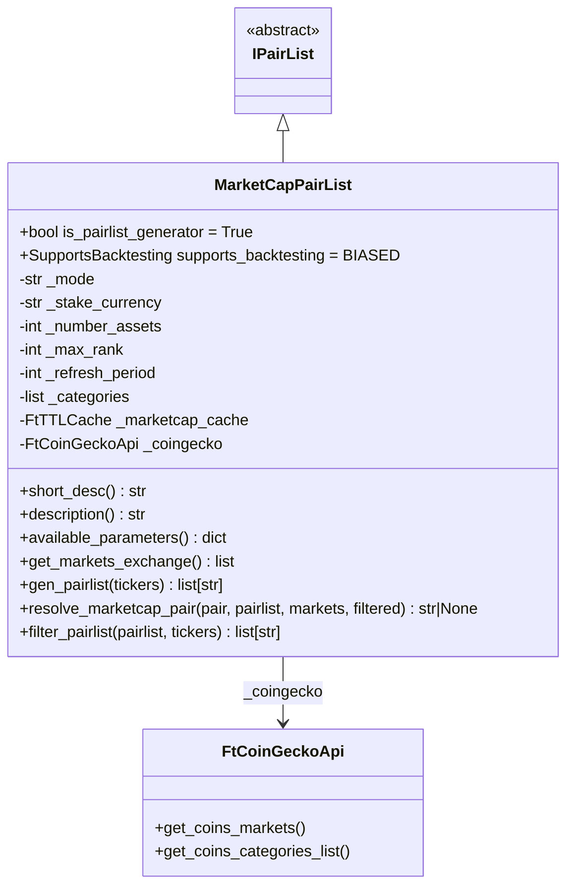
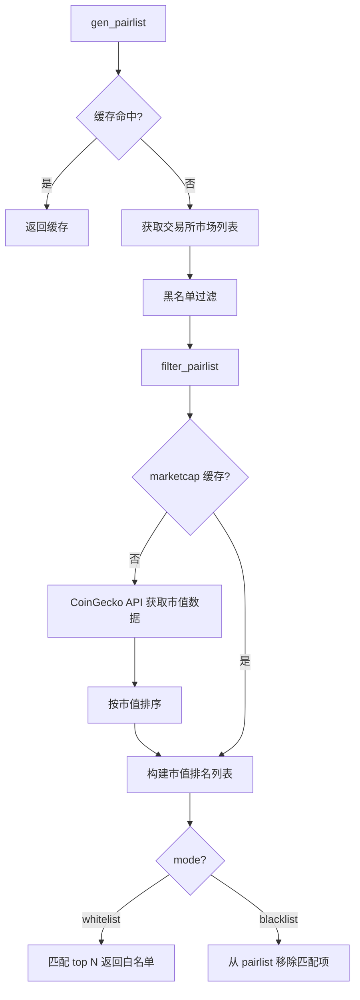

# MarketCapPairList.py

## 概述

基于 CoinGecko 市值排名的 Pairlist Generator 插件。该插件通过 CoinGecko API 获取加密货币的市值排名数据，按市值从高到低选择交易对。支持白名单和黑名单两种模式，并可按加密货币类别（如 layer-1、defi 等）进行筛选。

## 架构图

## 核心类/函数

### MarketCapPairList

继承自 `IPairList`，是 Pairlist Generator（`is_pairlist_generator = True`），回测支持为 `BIASED`。

**配置参数：**
- `number_assets` (default: 30) -- 返回的交易对数量（whitelist 模式必须指定）
- `max_rank` (default: 30) -- 最大市值排名（从 CoinGecko 获取前 max_rank 个）
- `refresh_period` (default: 86400) -- 缓存刷新周期（秒），默认 24 小时
- `categories` (default: []) -- CoinGecko 币种类别列表（如 "layer-1"）
- `mode` (default: "whitelist") -- 操作模式，"whitelist" 或 "blacklist"

**CoinGecko 配置（全局）：**
- `config.coingecko.api_key` -- CoinGecko API Key
- `config.coingecko.is_demo` -- 是否使用 Demo API

**关键方法：**

#### get_markets_exchange() -> list
获取当前交易所符合 stake_currency 的活跃可交易市场列表。

#### gen_pairlist(tickers) -> list[str]
Generator 入口，带 TTL 缓存，过期后重新获取并过滤。

#### resolve_marketcap_pair(pair, pairlist, markets, filtered_pairlist) -> str | None
解析市值排名中的交易对与交易所实际交易对的映射。处理交易对前缀差异（如 `PEPE` vs `1000PEPE`）。

#### filter_pairlist(pairlist, tickers) -> list[str]
核心过滤/排序逻辑：
1. 从缓存或 CoinGecko API 获取市值排名
2. 按 `max_rank` 截取 top N
3. 构造交易对格式（含 futures 后缀如 `:USDT`）
4. 白名单模式：收集匹配的交易对直到 `number_assets`
5. 黑名单模式：从 pairlist 中移除匹配项

## 依赖关系

### 内部依赖（本项目模块）
- `freqtrade.plugins.pairlist.IPairList` -- 基类
- `freqtrade.constants.PairPrefixes` -- 交易对前缀常量
- `freqtrade.exceptions.OperationalException` -- 操作异常
- `freqtrade.exchange.exchange_types.Tickers` -- Tickers 类型
- `freqtrade.util.FtTTLCache` -- TTL 缓存
- `freqtrade.util.coin_gecko.FtCoinGeckoApi` -- CoinGecko API 封装

### 外部依赖（第三方库）
- `math` -- 计算分页数

### 被依赖（谁引用了本文件）
- `freqtrade.resolvers.pairlist_resolver` -- 动态加载该插件
- `freqtrade.plugins.pairlistmanager` -- PairlistManager 调度链
