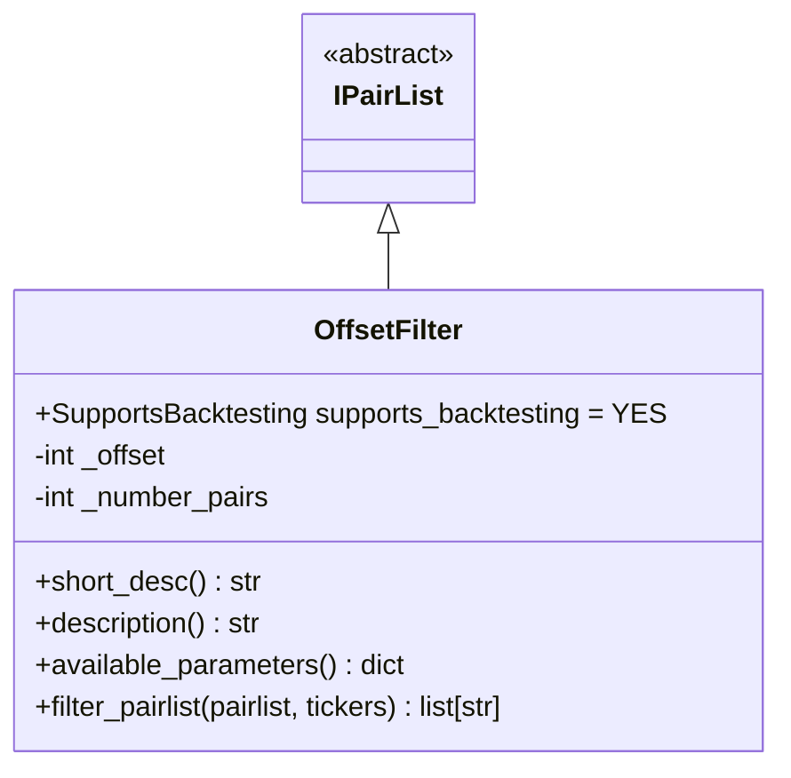
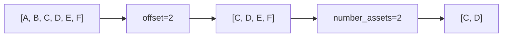

# OffsetFilter.py

## 概述

偏移量过滤器插件，用于对交易对列表进行截取操作。可以跳过列表前面的若干个交易对（offset），并限制返回的交易对数量（number_assets）。

典型用途：与 VolumePairList 配合使用，实现"取第 11-20 名成交量的交易对"这样的需求——先用 VolumePairList 获取 top 20，再用 OffsetFilter(offset=10, number_assets=10) 截取后半部分。

## 架构图

## 核心类/函数

### OffsetFilter

继承自 `IPairList`，完全支持回测 (`supports_backtesting = YES`)。

**配置参数：**
- `offset` (default: 0) -- 跳过前 N 个交易对，必须 >= 0
- `number_assets` (default: 0) -- 返回的交易对数量，0 表示不限制

**关键方法：**

#### filter_pairlist(pairlist, tickers) -> list[str]
简单的列表切片操作：
1. 如果 offset 大于列表长度，记录警告日志
2. 使用 `pairlist[offset:]` 跳过前 offset 个
3. 如果设置了 `number_assets`，再用 `[:number_assets]` 截取

## 依赖关系

### 内部依赖（本项目模块）
- `freqtrade.plugins.pairlist.IPairList` -- 基类
- `freqtrade.exceptions.OperationalException` -- 配置错误异常
- `freqtrade.exchange.exchange_types.Tickers` -- Tickers 类型

### 外部依赖（第三方库）
无

### 被依赖（谁引用了本文件）
- `freqtrade.resolvers.pairlist_resolver` -- 动态加载该插件
- `freqtrade.plugins.pairlistmanager` -- PairlistManager 调度链
