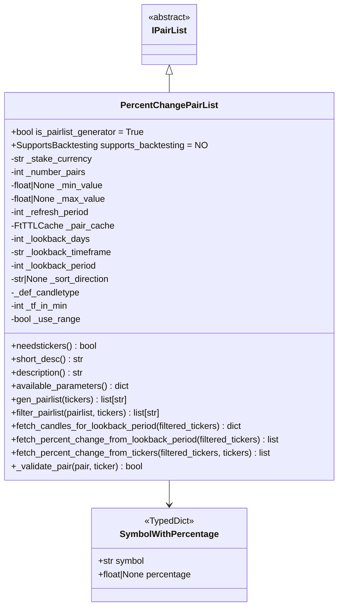
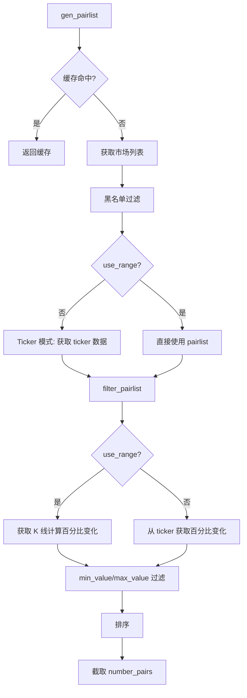

# PercentChangePairList.py

## 概述

基于价格百分比变化的动态 Pairlist Generator 插件。该插件根据交易对在指定时间段内的价格变化百分比来筛选和排序交易对。支持两种数据来源：
1. **Ticker 模式** -- 使用交易所 ticker 中的 24h 涨跌幅（`percentage` 字段）
2. **K线回溯模式** -- 通过获取历史 K 线数据计算自定义时间范围的价格变化百分比

## 架构图

## 核心类/函数

### SymbolWithPercentage (TypedDict)
交易对及其百分比变化的数据结构：
- `symbol: str` -- 交易对
- `percentage: float | None` -- 百分比变化

### PercentChangePairList

继承自 `IPairList`，是 Pairlist Generator，不支持回测。

**配置参数：**
- `number_assets` (必填) -- 返回的交易对数量
- `min_value` (default: None) -- 最小百分比变化
- `max_value` (default: None) -- 最大百分比变化
- `sort_direction` (default: "desc") -- 排序方向，"asc"/"desc"/""
- `refresh_period` (default: 1800) -- 刷新周期（秒）
- `lookback_days` (default: 0) -- 回溯天数（与 lookback_period 互斥）
- `lookback_timeframe` (default: "1d") -- 回溯时间框架
- `lookback_period` (default: 0) -- 回溯周期数（与 lookback_days 互斥）

**构造函数验证：**
- `lookback_days` 和 `lookback_period` 不可同时设置
- 非 range 模式时交易所必须支持 `fetchTickers` 且 ticker 含 `percentage` 字段
- `lookback_period` 不可超过交易所 K 线请求限制
- `refresh_period` 必须 >= 一个 timeframe 的时长

**关键方法：**

#### needstickers (property) -> bool
当不使用 K 线回溯（`_use_range = False`）时需要 ticker 数据。

#### fetch_candles_for_lookback_period(filtered_tickers) -> dict
获取指定回溯期的 K 线数据。计算 `since_ms` 和 `to_ms` 时间范围，调用交易所 OHLCV 接口。

#### fetch_percent_change_from_lookback_period(filtered_tickers) -> list[SymbolWithPercentage]
从 K 线数据计算价格变化百分比：`((current_close - previous_close) / previous_close) * 100`。

#### fetch_percent_change_from_tickers(filtered_tickers, tickers) -> list[SymbolWithPercentage]
从交易所 ticker 的 `percentage` 字段获取 24h 涨跌幅。

#### filter_pairlist(pairlist, tickers) -> list[str]
完整过滤流程：获取百分比变化 -> 按 min/max 过滤 -> 排序 -> 活跃市场验证 -> 黑名单过滤 -> 截取。

## 依赖关系

### 内部依赖（本项目模块）
- `freqtrade.plugins.pairlist.IPairList` -- 基类
- `freqtrade.constants.ListPairsWithTimeframes, PairWithTimeframe` -- 类型定义
- `freqtrade.exceptions.OperationalException` -- 配置错误
- `freqtrade.exchange.timeframe_to_minutes, timeframe_to_prev_date` -- 时间框架转换
- `freqtrade.exchange.exchange_types.Ticker, Tickers` -- 类型定义
- `freqtrade.util.FtTTLCache, dt_now, format_ms_time` -- 缓存和时间工具

### 外部依赖（第三方库）
- `pandas.DataFrame` -- K 线数据处理
- `datetime.timedelta` -- 时间计算

### 被依赖（谁引用了本文件）
- `freqtrade.resolvers.pairlist_resolver` -- 动态加载该插件
- `freqtrade.plugins.pairlistmanager` -- PairlistManager 调度链
