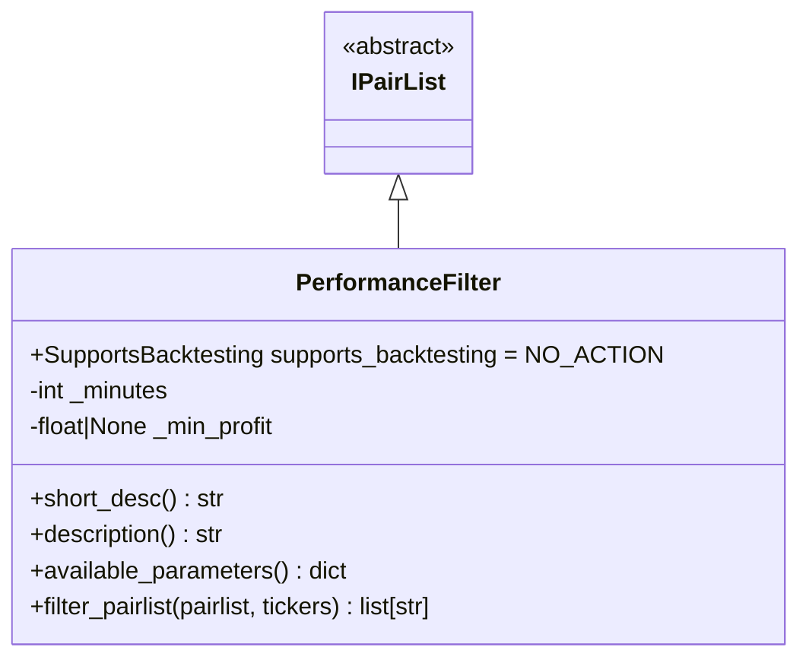
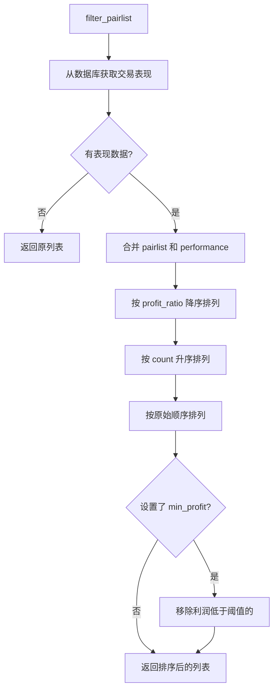

# PerformanceFilter.py

## 概述

基于交易历史表现的过滤/排序插件。该过滤器根据数据库中已完成交易的收益表现对交易对列表进行重新排序，将历史收益最高的交易对排在前面。还可以设置最低利润阈值来移除表现不佳的交易对。

**注意：** 该过滤器在回测模式下不可用（`NO_ACTION`），因为回测时无法获取实时交易数据库。

## 架构图

## 核心类/函数

### PerformanceFilter

继承自 `IPairList`，回测时不执行操作 (`supports_backtesting = NO_ACTION`)。

**配置参数：**
- `minutes` (default: 0) -- 考虑最近 X 分钟内的交易，0 表示所有交易
- `min_profit` (default: None) -- 最低利润阈值（百分比），低于此值的交易对将被移除

**关键方法：**

#### filter_pairlist(pairlist, tickers) -> list[str]
核心过滤和排序逻辑：
1. 从数据库获取交易表现（通过 `Trade.get_overall_performance`，可限制时间范围）
2. 如果没有表现数据，返回原始列表
3. 使用 pandas 进行 left merge，将 pairlist 与 performance 关联
4. 填充没有交易记录的交易对为 0
5. 三级排序：
   - 主排序：`profit_ratio` 降序（高利润优先）
   - 次排序：`count` 升序（同利润时少交易次数优先）
   - 第三排序：`prior_idx` 升序（保持原始顺序）
6. 如果设置了 `min_profit`，移除利润低于阈值的交易对

## 依赖关系

### 内部依赖（本项目模块）
- `freqtrade.plugins.pairlist.IPairList` -- 基类
- `freqtrade.exchange.exchange_types.Tickers` -- Tickers 类型
- `freqtrade.persistence.Trade` -- 交易持久化模型，查询表现数据
- `freqtrade.util.datetime_helpers.dt_now` -- 当前时间

### 外部依赖（第三方库）
- `pandas` -- 数据合并和排序
- `datetime.timedelta` -- 时间计算

### 被依赖（谁引用了本文件）
- `freqtrade.resolvers.pairlist_resolver` -- 动态加载该插件
- `freqtrade.plugins.pairlistmanager` -- PairlistManager 调度链
