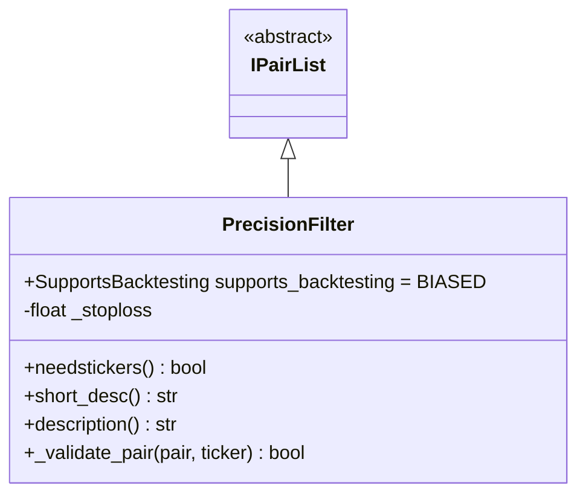
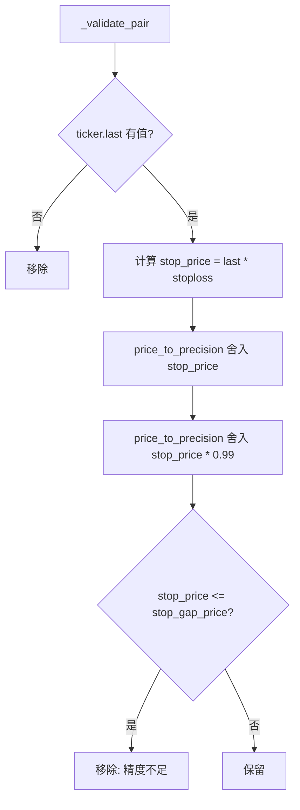

# PrecisionFilter.py

## 概述

精度过滤器插件，用于过滤那些由于价格精度限制而无法有效设置止损的低价值交易对。当某个交易对的价格过低，以至于止损价和止损限价在交易所精度舍入后变得相同（即无法区分），该交易对将被移除。

这解决了一个实际问题：某些极低价格的代币，其止损价和止损限价在精度舍入后可能相同，导致"不可卖出"的买入。

## 架构图

## 核心类/函数

### PrecisionFilter

继承自 `IPairList`，回测支持为 `BIASED`。

**前置条件：**
- 配置中必须定义 `stoploss`，否则抛出 `OperationalException`
- 如果 stoploss 为 0，过滤器将禁用

**构造逻辑：**
- 预计算净止损值：`_stoploss = 1 - abs(config["stoploss"])`（例如 stoploss=-0.1 -> _stoploss=0.9）

**属性：**
- `needstickers = True` -- 需要 ticker 数据获取最新价格

**关键方法：**

#### _validate_pair(pair, ticker) -> bool
验证交易对是否有足够的价格精度空间设置止损：
1. 检查 `ticker["last"]` 是否有值
2. 计算止损价：`stop_price = last * _stoploss`
3. 使用交易所精度将 `stop_price` 向上舍入得到 `sp`
4. 将 `stop_price * 0.99` 向上舍入得到 `stop_gap_price`
5. 如果 `sp <= stop_gap_price`，说明精度不够，无法区分止损价和限价，移除该交易对

## 依赖关系

### 内部依赖（本项目模块）
- `freqtrade.plugins.pairlist.IPairList` -- 基类
- `freqtrade.exceptions.OperationalException` -- 配置错误
- `freqtrade.exchange.ROUND_UP` -- 向上舍入模式常量
- `freqtrade.exchange.exchange_types.Ticker` -- Ticker 类型

### 外部依赖（第三方库）
无

### 被依赖（谁引用了本文件）
- `freqtrade.resolvers.pairlist_resolver` -- 动态加载该插件
- `freqtrade.plugins.pairlistmanager` -- PairlistManager 调度链
