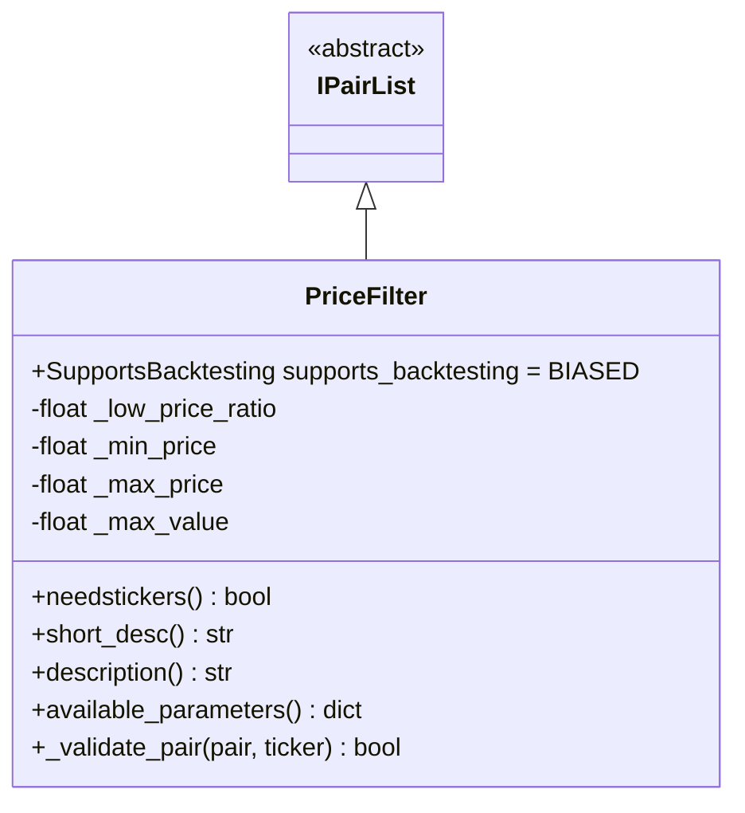
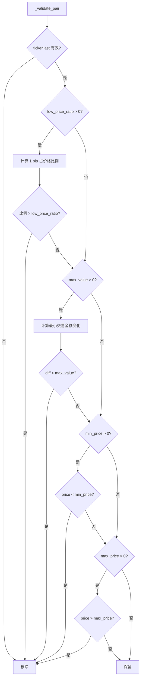

# PriceFilter.py

## 概述

价格过滤器插件，根据交易对的最新价格进行多维度过滤。支持四种过滤条件：
1. **低价格比率过滤** (`low_price_ratio`) -- 移除 1 pip 价格变动占价格比例过高的交易对
2. **最低价格过滤** (`min_price`) -- 移除价格低于阈值的交易对
3. **最高价格过滤** (`max_price`) -- 移除价格高于阈值的交易对
4. **最大价值过滤** (`max_value`) -- 移除最小交易金额变化过大的交易对

## 架构图

## 核心类/函数

### PriceFilter

继承自 `IPairList`，回测支持为 `BIASED`。

**配置参数：**
- `low_price_ratio` (default: 0) -- 低价格比率，移除 1 pip 变动占价格比超过此值的交易对（0 表示禁用）
- `min_price` (default: 0) -- 最低价格阈值（0 表示禁用）
- `max_price` (default: 0) -- 最高价格阈值（0 表示禁用）
- `max_value` (default: 0) -- 最大值阈值，针对最小交易量精度变化的金额（0 表示禁用）

所有参数均不可为负数。如果所有参数都为 0，过滤器将被禁用。

**属性：**
- `needstickers = True` -- 需要 ticker 数据

**关键方法：**

#### _validate_pair(pair, ticker) -> bool
按顺序执行四项检查：

1. **low_price_ratio 检查**：
   - 通过 `exchange.price_get_one_pip(pair, price)` 获取 1 pip 值
   - 计算 `changeperc = pip / price`
   - 如果 `changeperc > low_price_ratio`，移除

2. **max_value 检查**：
   - 获取市场的最小交易量 `min_amount` 和精度 `min_precision`
   - 计算最小交易金额和下一级精度的交易金额之差 `diff`
   - 如果 `diff > max_value`，移除
   - 支持 tick size 模式（precisionMode == 4）和小数位数模式

3. **min_price 检查**：价格低于阈值则移除

4. **max_price 检查**：价格高于阈值则移除

## 依赖关系

### 内部依赖（本项目模块）
- `freqtrade.plugins.pairlist.IPairList` -- 基类
- `freqtrade.exceptions.OperationalException` -- 配置错误
- `freqtrade.exchange.exchange_types.Ticker` -- Ticker 类型

### 外部依赖（第三方库）
无

### 被依赖（谁引用了本文件）
- `freqtrade.resolvers.pairlist_resolver` -- 动态加载该插件
- `freqtrade.plugins.pairlistmanager` -- PairlistManager 调度链
