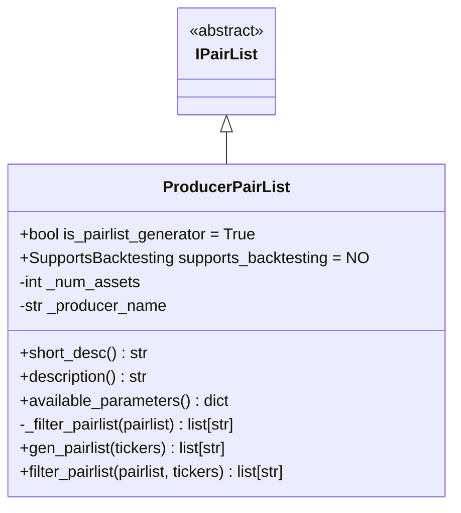
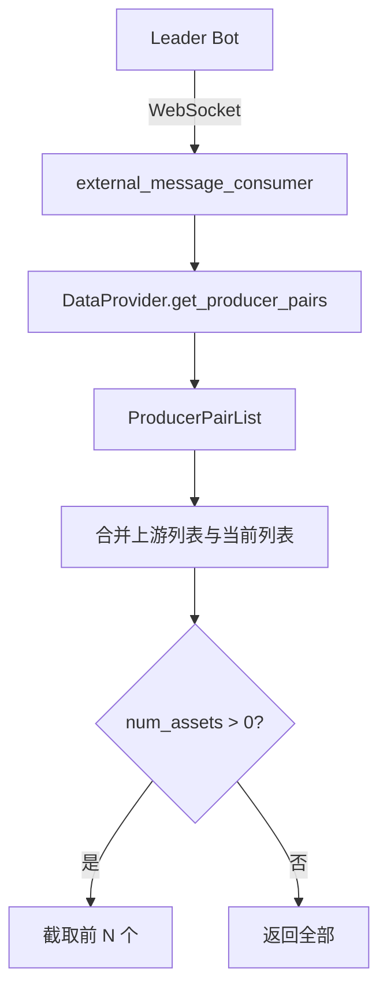

# ProducerPairList.py

## 概述

外部消息消费者（Producer）交易对列表插件。该插件从上游 bot（Leader）通过 `external_message_consumer` 功能获取交易对列表。用于多 bot 架构中，让 follower bot 自动同步 leader bot 的交易对。

## 架构图





## 核心类/函数

### ProducerPairList

继承自 `IPairList`，是 Pairlist Generator，不支持回测。

**配置参数：**
- `number_assets` (default: 0) -- 返回的交易对数量，0 表示不限
- `producer_name` (default: "default") -- 上游 Producer 的名称，需要在 `external_message_consumer` 中有对应配置

**前置条件：**
- `external_message_consumer.enabled` 必须为 True，否则抛出 `OperationalException`

**使用示例：**
```json
{
    "pairlists": [
        {
            "method": "ProducerPairList",
            "number_assets": 5,
            "producer_name": "default"
        }
    ]
}
```

**关键方法：**

#### _filter_pairlist(pairlist) -> list[str]
内部过滤方法：
1. 从 DataProvider 获取上游 Producer 的交易对列表
2. 如果传入 pairlist 为 None（Generator 模式），使用上游列表
3. 合并传入列表和上游列表（使用 `dict.fromkeys` 去重保持顺序）
4. 按 `num_assets` 截取

#### gen_pairlist(tickers) -> list[str]
Generator 入口：
1. 调用 `_filter_pairlist(None)` 获取上游列表
2. 通过 `verify_whitelist` 和 `_whitelist_for_active_markets` 验证

#### filter_pairlist(pairlist, tickers) -> list[str]
Filter 模式：将传入 pairlist 与上游列表合并。

## 依赖关系

### 内部依赖（本项目模块）
- `freqtrade.plugins.pairlist.IPairList` -- 基类
- `freqtrade.exceptions.OperationalException` -- 配置错误
- `freqtrade.exchange.exchange_types.Tickers` -- Tickers 类型
- （间接）`freqtrade.data.dataprovider.DataProvider` -- 通过 PairlistManager 获取上游数据

### 外部依赖（第三方库）
无

### 被依赖（谁引用了本文件）
- `freqtrade.resolvers.pairlist_resolver` -- 动态加载该插件
- `freqtrade.plugins.pairlistmanager` -- PairlistManager 调度链
