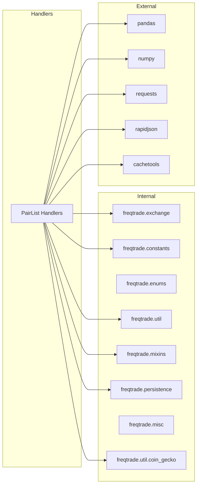
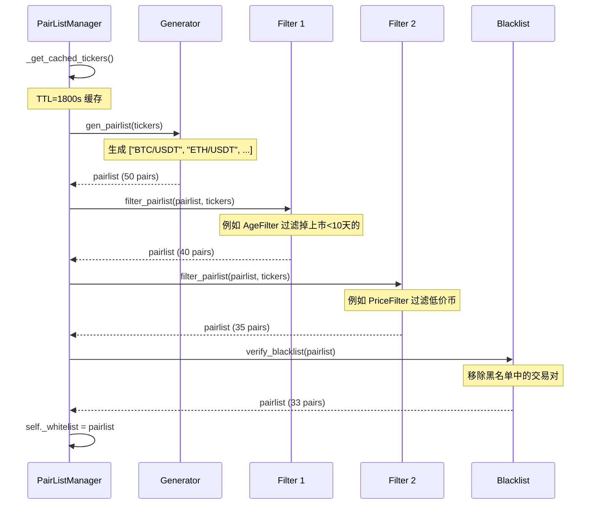
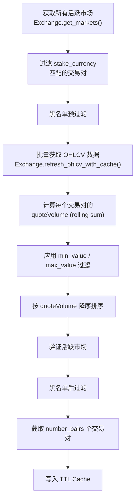

# Pairlist -- 交易对筛选插件

## 1. 模块概述

`freqtrade.plugins.pairlist` 模块实现了 Freqtrade 的交易对筛选插件系统。该系统采用 **链式处理器模式（Chain of Responsibility）**，允许用户通过配置文件灵活组合多个 PairList Handler 来动态生成和过滤交易对白名单。

系统中的 Handler 分为两类：
- **Generator（生成器）**：位于链的第一个位置，负责生成初始交易对列表。标识：`is_pairlist_generator = True`
- **Filter（过滤器）**：位于链的后续位置，对传入的列表进行过滤或排序

每个 Handler 都有明确的回测支持声明（`SupportsBacktesting` 枚举），确保用户在回测模式下不会使用不兼容的插件。

**设计亮点：**
- 基于抽象基类 `IPairList` 的统一接口
- 内置缓存机制（TTL Cache），避免频繁调用交易所 API
- 支持通配符和正则表达式匹配交易对
- 每个 Handler 自声明参数 schema（`available_parameters()`），支持 UI 动态配置

## 2. 目录结构

| 文件 | 类型 | 回测支持 | 功能说明 |
|---|---|---|---|
| `__init__.py` | - | - | 空包标记 |
| `IPairList.py` | 基类 | - | PairList Handler 抽象基类，定义统一接口和参数类型 |
| `pairlist_helpers.py` | 工具 | - | 辅助函数：通配符展开 `expand_pairlist()`、`dynamic_expand_pairlist()` |
| **Generator（生成器）** | | | |
| `StaticPairList.py` | Generator | YES | 使用配置文件中静态定义的交易对列表 |
| `VolumePairList.py` | Generator | NO | 基于交易量排序的动态交易对列表 |
| `PercentChangePairList.py` | Generator | NO | 基于价格变化百分比的动态交易对列表 |
| `MarketCapPairList.py` | Generator | BIASED | 基于 CoinGecko 市值排名的交易对列表 |
| `RemotePairList.py` | Generator | BIASED | 从远程 API 或本地文件获取交易对列表 |
| `ProducerPairList.py` | Generator | NO | 从上游 Bot（Leader）获取交易对列表 |
| `CrossMarketPairList.py` | Generator | BIASED | 基于跨市场（Spot/Futures）交叉的交易对列表 |
| **Filter（过滤器）** | | | |
| `AgeFilter.py` | Filter | NO | 按上市天数过滤（最少/最多天数） |
| `PriceFilter.py` | Filter | BIASED | 按价格过滤（最低价/最高价/价格精度） |
| `SpreadFilter.py` | Filter | NO | 按买卖价差（spread）过滤 |
| `PrecisionFilter.py` | Filter | BIASED | 按精度过滤，确保 stoploss 可设置 |
| `VolatilityFilter.py` | Filter | NO | 按波动率过滤（基于日对数收益率的标准差） |
| `RangeStabilityFilter.py` | Filter | NO | 按价格变化范围过滤（(high-low)/low） |
| `PerformanceFilter.py` | Filter | NO_ACTION | 按历史交易表现排序 |
| `ShuffleFilter.py` | Filter | YES | 随机打乱交易对顺序 |
| `OffsetFilter.py` | Filter | YES | 偏移和截取交易对列表 |
| `FullTradesFilter.py` | Filter | NO_ACTION | 当交易槽位已满时清空白名单 |
| `DelistFilter.py` | Filter | NO | 过滤即将下架的交易对 |

## 3. 架构图

```mermaid
graph TB
    subgraph "IPairList 抽象基类"
        IPAIRLIST["IPairList<br/>(ABC + LoggingMixin)"]
        PARAMS["PairlistParameter<br/>参数类型定义"]
        SUPPORTS["SupportsBacktesting<br/>枚举"]
    end

    subgraph "Generators (生成器)"
        STATIC["StaticPairList<br/>静态白名单"]
        VOLUME["VolumePairList<br/>交易量排序"]
        PCTCHANGE["PercentChangePairList<br/>价格变化排序"]
        MCAP["MarketCapPairList<br/>市值排名"]
        REMOTE["RemotePairList<br/>远程获取"]
        PRODUCER["ProducerPairList<br/>Leader 获取"]
        CROSS["CrossMarketPairList<br/>跨市场"]
    end

    subgraph "Filters (过滤器)"
        AGE["AgeFilter<br/>上市天数"]
        PRICE["PriceFilter<br/>价格范围"]
        SPREAD["SpreadFilter<br/>买卖价差"]
        PREC["PrecisionFilter<br/>精度检查"]
        VOL["VolatilityFilter<br/>波动率"]
        RANGE["RangeStabilityFilter<br/>价格范围稳定性"]
        PERF["PerformanceFilter<br/>历史表现"]
        SHUFFLE["ShuffleFilter<br/>随机打乱"]
        OFFSET["OffsetFilter<br/>偏移截取"]
        FULL["FullTradesFilter<br/>交易槽位"]
        DELIST["DelistFilter<br/>下架过滤"]
    end

    subgraph "Helpers"
        HELPERS["pairlist_helpers.py<br/>expand_pairlist()<br/>dynamic_expand_pairlist()"]
    end

    IPAIRLIST --> STATIC
    IPAIRLIST --> VOLUME
    IPAIRLIST --> PCTCHANGE
    IPAIRLIST --> MCAP
    IPAIRLIST --> REMOTE
    IPAIRLIST --> PRODUCER
    IPAIRLIST --> CROSS

    IPAIRLIST --> AGE
    IPAIRLIST --> PRICE
    IPAIRLIST --> SPREAD
    IPAIRLIST --> PREC
    IPAIRLIST --> VOL
    IPAIRLIST --> RANGE
    IPAIRLIST --> PERF
    IPAIRLIST --> SHUFFLE
    IPAIRLIST --> OFFSET
    IPAIRLIST --> FULL
    IPAIRLIST --> DELIST
```



## 4. 核心类/函数说明

### 4.1 `IPairList` 抽象基类 (`IPairList.py`)

所有 PairList Handler 的基类，继承自 `LoggingMixin` 和 `ABC`。

#### 类属性

| 属性 | 类型 | 说明 |
|---|---|---|
| `is_pairlist_generator` | bool | 是否为生成器（可放在链首位） |
| `supports_backtesting` | SupportsBacktesting | 回测兼容性声明 |

#### 构造函数参数

| 参数 | 类型 | 说明 |
|---|---|---|
| `exchange` | Exchange | 交易所实例 |
| `pairlistmanager` | PairListManager | 管理器实例 |
| `config` | Config | 全局配置 |
| `pairlistconfig` | dict | 该 Handler 的专属配置 |
| `pairlist_pos` | int | 在链中的位置索引 |

#### 抽象方法

| 方法 | 说明 |
|---|---|
| `description()` | 静态方法，返回 Handler 描述 |
| `short_desc()` | 返回简短描述（用于启动消息） |

#### 可覆写方法

| 方法 | 默认行为 | 说明 |
|---|---|---|
| `gen_pairlist(tickers)` | 抛出 OperationalException | 生成初始交易对列表（仅生成器需覆写） |
| `filter_pairlist(pairlist, tickers)` | 对每个 pair 调用 `_validate_pair()` | 过滤交易对列表 |
| `_validate_pair(pair, ticker)` | 抛出 NotImplementedError | 验证单个交易对 |
| `needstickers` (property) | 返回 False | 是否需要 tickers 数据 |
| `available_parameters()` | 返回空字典 | 声明可配置参数 |

#### 辅助方法

| 方法 | 说明 |
|---|---|
| `verify_blacklist(pairlist, logmethod)` | 代理调用管理器的黑名单验证 |
| `verify_whitelist(pairlist, logmethod)` | 代理调用管理器的白名单验证 |
| `_whitelist_for_active_markets(pairlist)` | 过滤掉不活跃/不兼容的市场对 |

#### 参数类型系统

```python
PairlistParameter = (
    __NumberPairlistParameter    # {"type": "number", "default": ..., "description": ...}
    | __StringPairlistParameter  # {"type": "string", "default": ..., "description": ...}
    | __OptionPairlistParameter  # {"type": "option", "default": ..., "options": [...]}
    | __BoolPairlistParameter    # {"type": "boolean", "default": ..., "description": ...}
    | __ListPairListParamenter   # {"type": "list", "default": ..., "description": ...}
)
```

### 4.2 辅助函数 (`pairlist_helpers.py`)

#### `expand_pairlist(wildcardpl, available_pairs, keep_invalid=False)`

展开可能包含正则表达式的交易对列表：
- `wildcardpl`: 可能包含正则的交易对列表（如 `[".*/BTC", "ETH/USDT"]`）
- `available_pairs`: 交易所所有可用交易对
- `keep_invalid`: 若为 True，保留无法匹配到交易所交易对的项

#### `dynamic_expand_pairlist(config, markets)`

动态展开配置中的交易对列表，额外处理 FreqAI 的 `include_corr_pairlist`。

### 4.3 各 Handler 详细说明

#### StaticPairList（静态白名单）

最简单的生成器，直接使用配置文件中的 `pair_whitelist`。

- **回测支持**：完全支持（`YES`）
- **参数**：`allow_inactive`（bool，是否允许不活跃的交易对）
- **缓存**：回测模式下使用 LRU Cache

#### VolumePairList（交易量排序）

基于交易量排序的动态交易对列表生成器，支持两种模式：

1. **Ticker 模式**（默认）：从交易所 tickers 读取 `quoteVolume`
2. **Range 模式**：使用 OHLCV K 线数据计算指定时间段内的累计交易量

- **回测支持**：不支持（`NO`）
- **关键参数**：

| 参数 | 默认值 | 说明 |
|---|---|---|
| `number_assets` | (必填) | 选取的交易对数量 |
| `sort_key` | `quoteVolume` | 排序键 |
| `min_value` | 0 | 最小交易量过滤 |
| `max_value` | None | 最大交易量过滤 |
| `lookback_days` | 0 | 回看天数（设置后自动使用 Range 模式） |
| `lookback_period` | 0 | 回看周期数 |
| `lookback_timeframe` | `1d` | 回看时间框架 |

#### PercentChangePairList（价格变化百分比）

基于价格变化百分比排序的动态交易对列表。

- **双模式**：Ticker 模式（使用 24h percentage）和 Range 模式（计算指定周期内的变化率）
- **参数**：与 VolumePairList 类似，额外支持 `sort_direction`（`asc`/`desc`）

#### MarketCapPairList（市值排名）

基于 CoinGecko API 获取市值排名。

- **回测支持**：有偏差（`BIASED`），因为使用当前市值数据
- **关键参数**：`number_assets`、`max_rank`（最大排名）、`categories`（CoinGecko 分类过滤）
- **特殊处理**：通过 `PairPrefixes` 处理 `1000PEPE` <-> `PEPE` 等前缀映射
- **模式**：`whitelist`（选取排名内的）或 `blacklist`（排除排名内的）

#### RemotePairList（远程获取）

从远程 HTTP API 或本地 `file:///` 路径获取交易对列表。

- **JSON 格式**：`{"pairs": ["BTC/USDT", "ETH/USDT"], "refresh_period": 3600}`
- **模式**：`whitelist`（使用远程列表）或 `blacklist`（排除远程列表中的交易对）
- **处理模式**：`filter`（仅保留交集）或 `append`（合并）
- **容错**：支持 `keep_pairlist_on_failure` 在请求失败时保持上次结果
- **支持 Bearer Token 认证**

#### ProducerPairList（Leader 获取）

从上游 Bot 通过 WebSocket `external_message_consumer` 获取交易对列表。

- **前提**：必须启用 `external_message_consumer`
- **参数**：`number_assets`、`producer_name`

#### CrossMarketPairList（跨市场）

基于 Spot/Futures 市场交叉过滤。

- **模式**：`both_markets`（仅保留两个市场都存在的交易对）或 `current_market_only`（仅保留仅在当前市场存在的交易对）
- **特殊处理**：处理 `1000PEPE`/`PEPE` 等前缀差异

#### AgeFilter（上市天数过滤）

通过获取日 K 线数据来判断交易对的上市天数。

- **参数**：`min_days_listed`（最小天数，默认 10）、`max_days_listed`（最大天数，可选）
- **缓存策略**：通过检查成功的交易对存入 `_symbolsChecked`，失败的存入 `_symbolsCheckFailed`（24 小时过期）

#### PriceFilter（价格过滤）

基于价格的多维过滤器。

- **过滤条件**（均可选）：
  - `low_price_ratio`: 1 pip 变动占价格的比率上限
  - `min_price`: 最低价格
  - `max_price`: 最高价格
  - `max_value`: 最小交易单位的价值上限
- **需要 Tickers**：是

#### SpreadFilter（买卖价差过滤）

过滤买卖价差过大的交易对。

- **公式**：`spread = 1 - bid / ask`
- **参数**：`max_spread_ratio`（默认 0.005，即 0.5%）
- **需要 Tickers**：是

#### PrecisionFilter（精度过滤）

确保交易对有足够的价格精度来设置 stoploss。

- **逻辑**：计算止损价格和止损限价，如果两者在精度截断后相等，则移除该交易对
- **依赖**：需要在配置中定义 `stoploss`

#### VolatilityFilter（波动率过滤）

基于对数收益率的标准差计算波动率。

- **公式**：`volatility = std(log(close[t-1] / close[t])) * sqrt(lookback_days)`
- **参数**：`lookback_days`、`min_volatility`、`max_volatility`、`sort_direction`

#### RangeStabilityFilter（价格范围稳定性过滤）

基于最高价和最低价的比率计算价格变化范围。

- **公式**：`pct_change = (highest_high - lowest_low) / lowest_low`
- **参数**：`lookback_days`、`min_rate_of_change`、`max_rate_of_change`、`sort_direction`

#### PerformanceFilter（历史表现排序）

按历史交易表现对交易对排序。

- **排序规则**：利润率（高到低）-> 交易次数（低到高）-> 原始顺序
- **参数**：`minutes`（回看分钟数，0 表示全部）、`min_profit`（最低利润率）
- **数据源**：`Trade.get_overall_performance()`

#### ShuffleFilter（随机打乱）

随机打乱交易对顺序。

- **回测模式**：使用可配置的 `seed` 确保结果可复现
- **Live 模式**：不使用 seed，每次结果不同
- **打乱频率**：`candle`（每根 K 线打乱一次）或 `iteration`（每次迭代打乱）

#### OffsetFilter（偏移截取）

对交易对列表进行偏移和截取。

- **参数**：`offset`（起始偏移）、`number_assets`（截取数量）
- **示例**：`offset=10, number_assets=20` 表示取第 11~30 个交易对

#### FullTradesFilter（交易槽位过滤）

当当前打开的交易数量达到 `max_open_trades` 时，返回空列表。

#### DelistFilter（下架过滤）

过滤即将被交易所下架的交易对。

- **参数**：`max_days_from_now`（距下架天数阈值，0 表示过滤所有已宣布下架的）
- **依赖**：交易所必须支持 `has_delisting` 功能

## 5. 依赖关系



**各 Handler 特殊依赖：**
- `VolumePairList` / `AgeFilter` / `RangeStabilityFilter` / `VolatilityFilter` / `PercentChangePairList`: 依赖 `Exchange.refresh_ohlcv_with_cache()` 获取 K 线数据
- `PerformanceFilter`: 依赖 `Trade.get_overall_performance()` 获取交易历史
- `MarketCapPairList`: 依赖 `FtCoinGeckoApi` 获取市值数据
- `RemotePairList`: 依赖 `requests` 库进行 HTTP 请求
- `ProducerPairList`: 依赖 `DataProvider.get_producer_pairs()` 获取上游数据
- `DelistFilter`: 依赖 `Exchange.check_delisting_time()` 获取下架信息
- `FullTradesFilter`: 依赖 `Trade.get_open_trade_count()` 获取当前交易数

## 6. 数据流

### 6.1 完整的链式处理流程



### 6.2 VolumePairList Range 模式数据流



### 6.3 缓存策略汇总

| Handler | 缓存类型 | TTL | 说明 |
|---|---|---|---|
| `PairListManager` | `FtTTLCache` | 1800s | Tickers 缓存 |
| `PairListManager` | `LRUCache` | 永不过期 | 黑名单展开缓存 |
| `StaticPairList` | `LRUCache` | 永不过期 | 回测模式交易对缓存 |
| `VolumePairList` | `FtTTLCache` | refresh_period | 生成的交易对列表 |
| `PercentChangePairList` | `FtTTLCache` | refresh_period | 生成的交易对列表 |
| `MarketCapPairList` | `FtTTLCache` | refresh_period | 市值数据和交易对列表 |
| `RemotePairList` | `FtTTLCache` | refresh_period | 远程获取的列表 |
| `CrossMarketPairList` | `FtTTLCache` | refresh_period | 交叉市场列表 |
| `AgeFilter` | dict + PeriodicCache | 永久 / 24h | 验证通过/失败的交易对 |
| `RangeStabilityFilter` | `FtTTLCache` | refresh_period | 每个交易对的变化率 |
| `VolatilityFilter` | `FtTTLCache` | refresh_period | 每个交易对的波动率 |
| `ShuffleFilter` | `PeriodicCache` | 1 candle | 打乱后的列表（candle 模式） |
