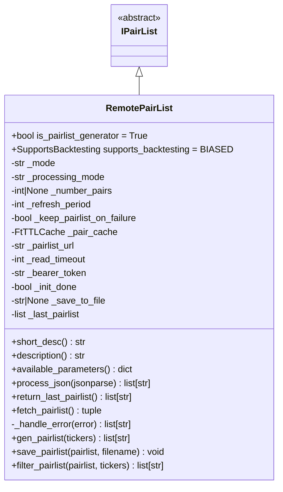
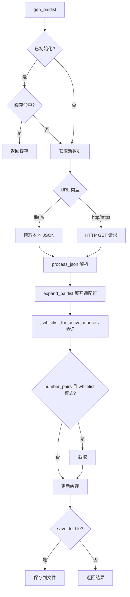

# RemotePairList.py

## 概述

远程交易对列表插件，从远程 API URL 或本地 JSON 文件获取交易对列表。该插件功能丰富，支持：
- 白名单/黑名单两种模式
- 过滤/追加两种处理模式
- Bearer Token 认证
- 远程服务端控制刷新周期
- 失败时保留上次结果
- 将处理后的列表保存到本地文件
- 支持 `file:///` 本地文件协议

## 架构图

## 核心类/函数

### RemotePairList

继承自 `IPairList`，是 Pairlist Generator，回测支持为 `BIASED`。

**配置参数：**
- `pairlist_url` (必填) -- 远程 URL 或 `file:///` 本地路径
- `number_assets` (default: None) -- 返回交易对数量限制
- `mode` (default: "whitelist") -- "whitelist" 或 "blacklist"
- `processing_mode` (default: "filter") -- "filter"（过滤交集）或 "append"（追加合并）
- `refresh_period` (default: 1800) -- 刷新周期（秒），可被远程服务端覆盖
- `keep_pairlist_on_failure` (default: True) -- 获取失败时是否保留上次列表
- `read_timeout` (default: 60) -- HTTP 请求超时
- `bearer_token` (default: "") -- Bearer Token 认证
- `save_to_file` (default: None) -- 保存处理后列表的文件路径

**构造函数验证：**
- `pairlist_url` 必须配置
- `mode` 只能是 "whitelist" 或 "blacklist"
- `processing_mode` 只能是 "filter" 或 "append"
- blacklist 模式不能放在链的第一个位置

**关键方法：**

#### process_json(jsonparse) -> list[str]
解析远程 JSON 响应，提取 `pairs` 列表和 `refresh_period`。如果远程指定的刷新周期更大，会自动提升本地刷新周期。

#### fetch_pairlist() -> tuple[list[str], float]
通过 HTTP GET 获取远程 pairlist，携带 User-Agent 和可选的 Bearer Token。

#### gen_pairlist(tickers) -> list[str]
Generator 入口，支持本地文件和远程 URL。获取后经过通配符展开、活跃市场验证、数量限制。空结果会缓存 `[None]` 标记避免重复请求。

#### filter_pairlist(pairlist, tickers) -> list[str]
Filter 模式的入口：
- **whitelist + filter**：取传入列表和远程列表的交集
- **whitelist + append**：合并两个列表（去重）
- **blacklist**：从传入列表中移除远程列表中的交易对

#### save_pairlist(pairlist, filename) -> None
将处理后的交易对列表保存为 JSON 文件。

## 依赖关系

### 内部依赖（本项目模块）
- `freqtrade.plugins.pairlist.IPairList` -- 基类
- `freqtrade.plugins.pairlist.pairlist_helpers.expand_pairlist` -- 通配符展开
- `freqtrade.__version__` -- 版本号（User-Agent）
- `freqtrade.configuration.load_config.CONFIG_PARSE_MODE` -- JSON 解析模式
- `freqtrade.exceptions.OperationalException` -- 操作异常
- `freqtrade.util.FtTTLCache` -- TTL 缓存

### 外部依赖（第三方库）
- `requests` -- HTTP 请求
- `rapidjson` -- 高性能 JSON 解析（用于本地文件）
- `pathlib.Path` -- 文件路径处理

### 被依赖（谁引用了本文件）
- `freqtrade.resolvers.pairlist_resolver` -- 动态加载该插件
- `freqtrade.plugins.pairlistmanager` -- PairlistManager 调度链
