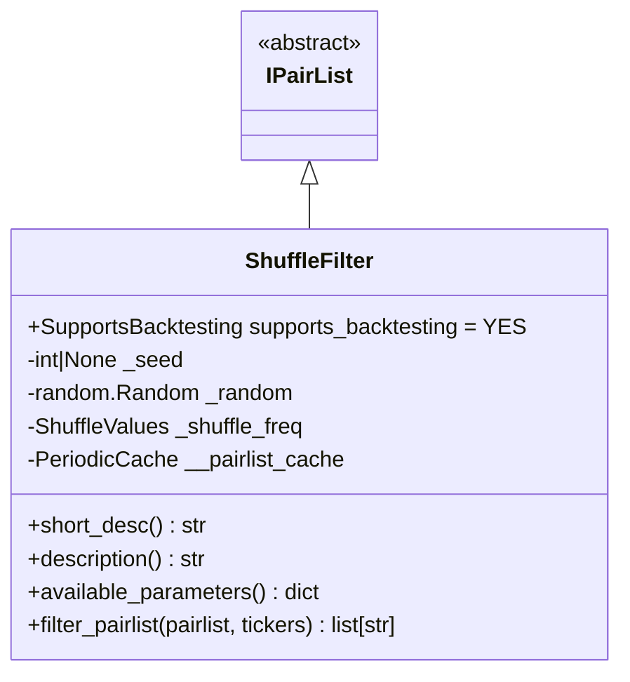
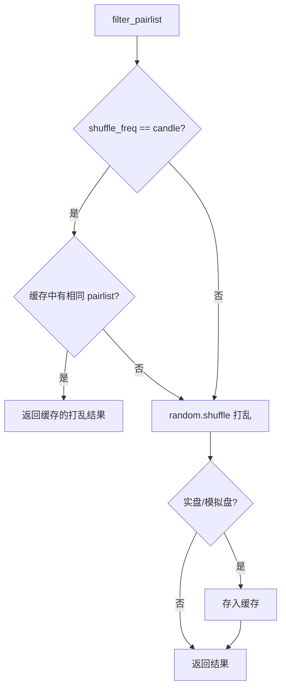

# ShuffleFilter.py

## 概述

随机打乱过滤器插件，用于随机化交易对列表的排列顺序。支持两种打乱频率：
- **candle** -- 每根 K 线（candle）打乱一次，在同一根 K 线内保持相同顺序
- **iteration** -- 每次 bot 迭代都重新打乱

在回测模式下可设置随机种子（seed）以获得可重复的结果，在实盘/模拟盘模式下始终使用随机种子以保证真正的随机性。

## 架构图

## 核心类/函数

### ShuffleFilter

继承自 `IPairList`，完全支持回测 (`supports_backtesting = YES`)。

**配置参数：**
- `shuffle_frequency` (default: "candle") -- 打乱频率
  - `"candle"` -- 每根 K 线打乱一次
  - `"iteration"` -- 每次迭代打乱
- `seed` (default: None) -- 随机种子（仅回测模式生效）

**构造逻辑：**
- 实盘/模拟盘模式：`seed = None`（真随机）
- 回测/HyperOpt 模式：使用配置的 seed
- 使用 `random.Random(seed)` 创建独立的随机数生成器
- 使用 `PeriodicCache` 缓存（TTL = 1 个 timeframe 秒数）

**关键方法：**

#### filter_pairlist(pairlist, tickers) -> list[str]
打乱逻辑：
1. 将当前 pairlist 转为 tuple 作为缓存 key
2. 如果是 candle 模式且缓存命中，返回缓存结果
3. 否则调用 `self._random.shuffle(pairlist)` 原地打乱
4. 实盘/模拟盘模式下将结果存入缓存

## 依赖关系

### 内部依赖（本项目模块）
- `freqtrade.plugins.pairlist.IPairList` -- 基类
- `freqtrade.enums.RunMode` -- 运行模式枚举
- `freqtrade.exchange.timeframe_to_seconds` -- 时间框架转秒数
- `freqtrade.exchange.exchange_types.Tickers` -- Tickers 类型
- `freqtrade.util.periodic_cache.PeriodicCache` -- 周期性缓存

### 外部依赖（第三方库）
- `random` -- Python 随机数模块

### 被依赖（谁引用了本文件）
- `freqtrade.resolvers.pairlist_resolver` -- 动态加载该插件
- `freqtrade.plugins.pairlistmanager` -- PairlistManager 调度链
