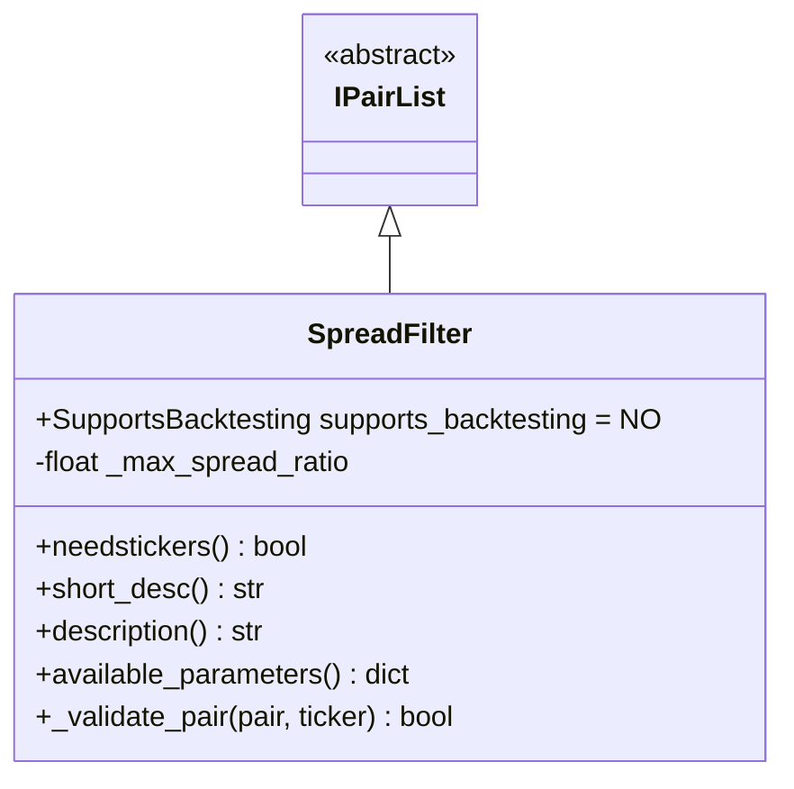
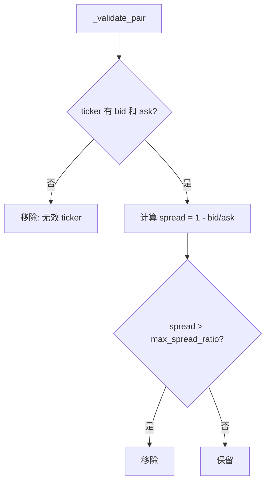

# SpreadFilter.py

## 概述

买卖价差（Spread）过滤器插件，根据交易对的买卖价差比率（bid/ask spread）进行过滤。价差过大的交易对意味着流动性不足，交易成本高，因此需要被移除。

价差计算公式：`spread = 1 - bid / ask`

## 架构图

## 核心类/函数

### SpreadFilter

继承自 `IPairList`，不支持回测 (`supports_backtesting = NO`)。

**配置参数：**
- `max_spread_ratio` (default: 0.005) -- 最大允许的价差比率（0.5%），超过此值的交易对将被移除。设为 0 则禁用。

**前置条件：**
- 交易所必须支持 bid/ask 数据（通过 `tickers_have_bid_ask` 选项检查），否则抛出 `OperationalException`

**属性：**
- `needstickers = True` -- 需要 ticker 数据

**关键方法：**

#### _validate_pair(pair, ticker) -> bool
验证单个交易对的价差：
1. 检查 ticker 中 `bid` 和 `ask` 是否存在且有效
2. 计算价差：`spread = 1 - bid / ask`
3. 如果 `spread > max_spread_ratio`，移除并记录日志
4. 如果 bid/ask 数据无效，移除并记录日志

## 依赖关系

### 内部依赖（本项目模块）
- `freqtrade.plugins.pairlist.IPairList` -- 基类
- `freqtrade.exceptions.OperationalException` -- 配置错误
- `freqtrade.exchange.exchange_types.Ticker` -- Ticker 类型

### 外部依赖（第三方库）
无

### 被依赖（谁引用了本文件）
- `freqtrade.resolvers.pairlist_resolver` -- 动态加载该插件
- `freqtrade.plugins.pairlistmanager` -- PairlistManager 调度链
