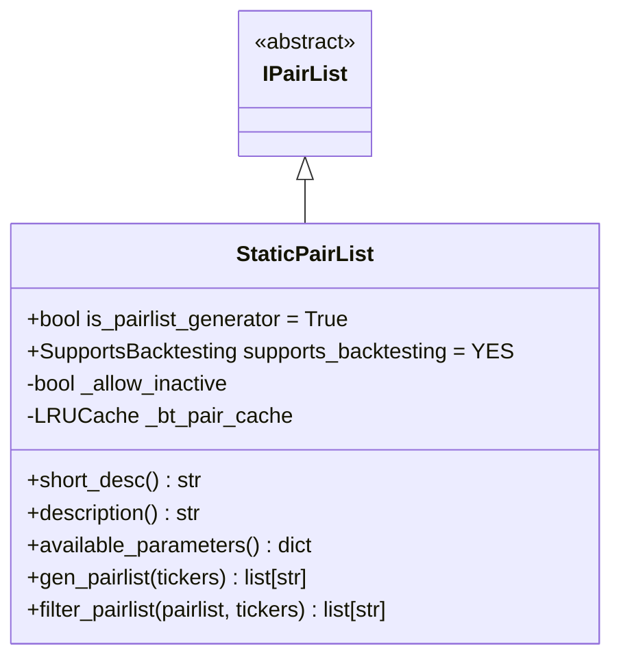
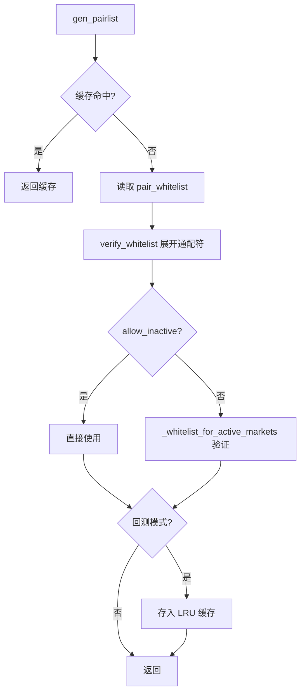

# StaticPairList.py

## 概述

静态交易对列表插件，直接使用配置文件中 `exchange.pair_whitelist` 定义的交易对列表。这是最简单、最常用的 Pairlist Generator，适用于用户手动指定交易对的场景。

作为 Generator 时，从配置中读取白名单；作为 Filter 时，将配置白名单中缺失的交易对追加到传入列表中。

## 架构图

## 核心类/函数

### StaticPairList

继承自 `IPairList`，是 Pairlist Generator，完全支持回测。

**配置参数：**
- `allow_inactive` (default: False) -- 是否允许不活跃的交易对留在白名单中

**关键方法：**

#### gen_pairlist(tickers) -> list[str]
Generator 入口：
1. 检查 LRU 缓存（仅回测/HyperOpt 模式使用）
2. 从 `config["exchange"]["pair_whitelist"]` 读取配置
3. 通过 `verify_whitelist` 展开通配符（`keep_invalid=True` 保留显式指定的无效对）
4. 如果 `allow_inactive=False`，通过 `_whitelist_for_active_markets` 过滤不活跃市场
5. 在回测模式下缓存结果以提高性能

#### filter_pairlist(pairlist, tickers) -> list[str]
Filter 模式：将配置白名单中尚未在传入 pairlist 中的交易对追加进去。

## 依赖关系

### 内部依赖（本项目模块）
- `freqtrade.plugins.pairlist.IPairList` -- 基类
- `freqtrade.enums.RunMode` -- 运行模式枚举
- `freqtrade.exchange.exchange_types.Tickers` -- Tickers 类型

### 外部依赖（第三方库）
- `copy.deepcopy` -- 深拷贝列表
- `cachetools.LRUCache` -- LRU 缓存（回测优化）

### 被依赖（谁引用了本文件）
- `freqtrade.resolvers.pairlist_resolver` -- 动态加载该插件
- `freqtrade.plugins.pairlistmanager` -- PairlistManager 调度链
