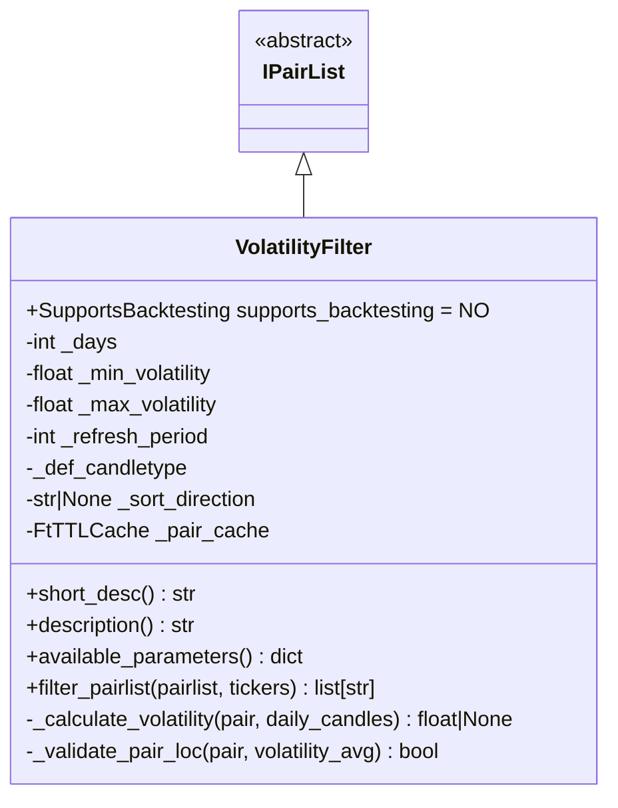
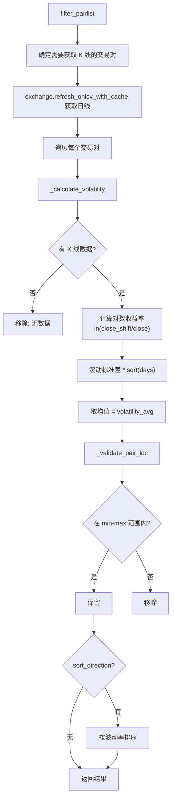

# VolatilityFilter.py

## 概述

波动率过滤器插件，根据交易对的历史波动率（Volatility）进行过滤和可选排序。波动率通过对数收益率的滚动标准差来计算，使用年化因子 `sqrt(N)` 进行调整。

可以设置最小和最大波动率阈值来过滤出波动率在理想范围内的交易对，还可按波动率升序或降序排列。

## 架构图

## 核心类/函数

### VolatilityFilter

继承自 `IPairList`，不支持回测 (`supports_backtesting = NO`)。

**配置参数：**
- `lookback_days` (default: 10) -- 回溯天数，必须 >= 1 且不超过交易所限制
- `min_volatility` (default: 0) -- 最小波动率阈值
- `max_volatility` (default: sys.maxsize) -- 最大波动率阈值
- `sort_direction` (default: None) -- 排序方向，None / "asc" / "desc"
- `refresh_period` (default: 1440) -- 缓存刷新周期（秒）

**关键方法：**

#### filter_pairlist(pairlist, tickers) -> list[str]
完整过滤流程：
1. 筛选出不在缓存中的交易对
2. 批量获取日线 OHLCV 数据
3. 对每个交易对计算波动率
4. 根据阈值验证
5. 可选排序

#### _calculate_volatility(pair, daily_candles) -> float | None
波动率计算核心：
1. 先检查缓存
2. 计算对数收益率：`ln(close[t-1] / close[t])`
3. 计算滚动标准差（窗口 = lookback_days）
4. 乘以 `sqrt(lookback_days)` 进行调整
5. 取滚动波动率序列的均值
6. 结果存入缓存

#### _validate_pair_loc(pair, volatility_avg) -> bool
验证波动率是否在 `[min_volatility, max_volatility]` 范围内。

## 依赖关系

### 内部依赖（本项目模块）
- `freqtrade.plugins.pairlist.IPairList` -- 基类
- `freqtrade.constants.ListPairsWithTimeframes` -- 类型定义
- `freqtrade.exceptions.OperationalException` -- 配置错误
- `freqtrade.exchange.exchange_types.Tickers` -- Tickers 类型
- `freqtrade.misc.plural` -- 复数辅助函数
- `freqtrade.util.FtTTLCache` -- TTL 缓存
- `freqtrade.util.dt_floor_day, dt_now, dt_ts` -- 时间辅助

### 外部依赖（第三方库）
- `numpy` -- 对数计算、sqrt、NaN 检查
- `pandas.DataFrame` -- K 线数据处理
- `sys` -- `sys.maxsize` 用于默认最大波动率
- `datetime.timedelta` -- 时间计算

### 被依赖（谁引用了本文件）
- `freqtrade.resolvers.pairlist_resolver` -- 动态加载该插件
- `freqtrade.plugins.pairlistmanager` -- PairlistManager 调度链
