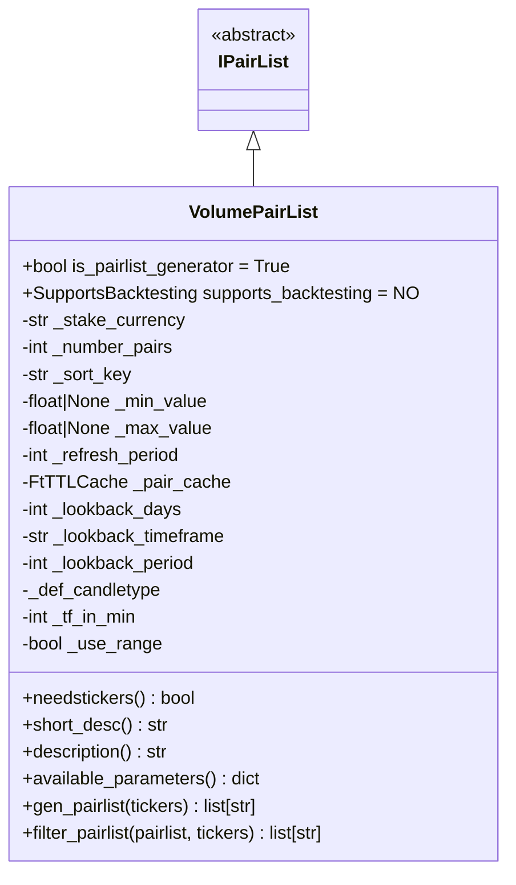
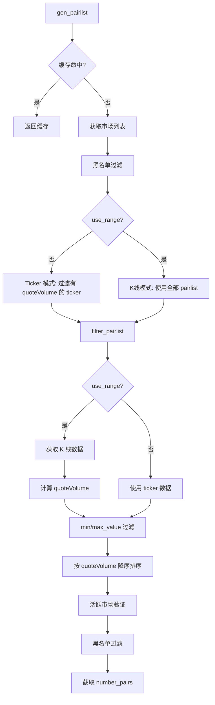

# VolumePairList.py

## 概述

基于交易量（Volume）的动态 Pairlist Generator 插件。这是 Freqtrade 中最常用的动态交易对列表生成器之一，根据交易对的 quoteVolume（以报价货币计的成交量）对交易对进行排序和筛选。支持两种模式：
1. **Ticker 模式** -- 使用交易所 ticker 中的 24h quoteVolume（默认）
2. **K线回溯模式** -- 通过获取历史 K 线数据计算自定义时间范围的累计成交量

## 架构图

## 核心类/函数

### VolumePairList

继承自 `IPairList`，是 Pairlist Generator，不支持回测。

**配置参数：**
- `number_assets` (必填) -- 返回的交易对数量
- `sort_key` (default: "quoteVolume") -- 排序键（目前仅支持 "quoteVolume"）
- `min_value` (default: 0) -- 最小成交量阈值
- `max_value` (default: None) -- 最大成交量阈值
- `refresh_period` (default: 1800) -- 刷新周期（秒）
- `lookback_days` (default: 0) -- 回溯天数（与 lookback_period 互斥）
- `lookback_timeframe` (default: "1d") -- 回溯时间框架
- `lookback_period` (default: 0) -- 回溯周期数（与 lookback_days 互斥）

**构造函数验证：**
- `number_assets` 必须指定
- `lookback_days` 和 `lookback_period` 不可同时设置
- 非 range 模式时交易所必须支持 `fetchTickers` 且含 `quoteVolume`
- `sort_key` 必须在 `SORT_VALUES` 中
- `lookback_period` 不可超过交易所 K 线限制

**关键方法：**

#### needstickers (property) -> bool
当不使用 K 线回溯（`_use_range = False`）时需要 ticker 数据。

#### gen_pairlist(tickers) -> list[str]
Generator 入口：
1. 检查 TTL 缓存
2. 获取符合 stake_currency 的活跃市场
3. 黑名单过滤
4. 在 ticker 模式下预过滤有 quoteVolume 数据的交易对
5. 调用 `filter_pairlist` 完成排序和截取
6. 结果存入缓存

#### filter_pairlist(pairlist, tickers) -> list[str]
核心过滤/排序逻辑：

**K 线回溯模式 (use_range=True)：**
1. 获取指定时间范围的 OHLCV K 线数据
2. 计算每个交易对的累计 quoteVolume：
   - 如果交易所 volume 以 base 货币计：`quoteVolume = volume * typical_price * contractSize`
   - 如果已经是 quote 货币计：直接使用 volume
3. 使用滚动求和（rolling sum）计算 lookback_period 内的总成交量

**Ticker 模式 (use_range=False)：**
- 直接从 tickers 中取 quoteVolume

**后续处理（两种模式共用）：**
1. 按 min_value/max_value 过滤
2. 按 quoteVolume 降序排序
3. 活跃市场验证
4. 黑名单过滤
5. 截取前 number_pairs 个

## 依赖关系

### 内部依赖（本项目模块）
- `freqtrade.plugins.pairlist.IPairList` -- 基类
- `freqtrade.constants.DOCS_LINK, ListPairsWithTimeframes` -- 常量和类型
- `freqtrade.exceptions.OperationalException` -- 配置错误
- `freqtrade.exchange.timeframe_to_minutes, timeframe_to_prev_date` -- 时间框架转换
- `freqtrade.exchange.exchange_types.Tickers` -- Tickers 类型
- `freqtrade.util.FtTTLCache, dt_now, format_ms_time` -- 缓存和时间工具

### 外部依赖（第三方库）
- `datetime.timedelta` -- 时间计算

### 被依赖（谁引用了本文件）
- `freqtrade.resolvers.pairlist_resolver` -- 动态加载该插件
- `freqtrade.plugins.pairlistmanager` -- PairlistManager 调度链
