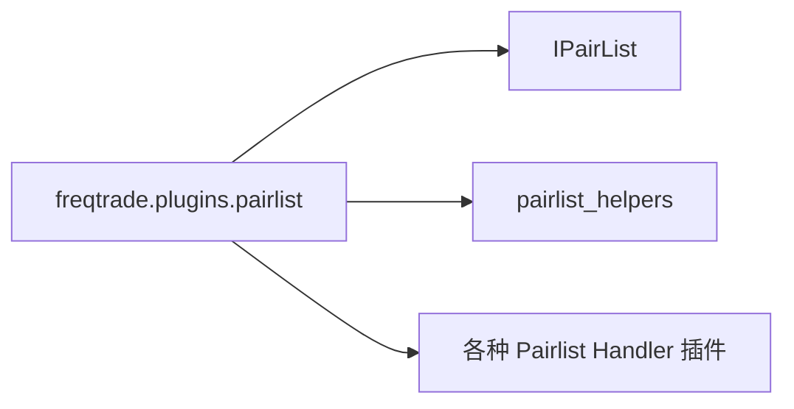

# __init__.py

## 概述

Pairlist 插件包的初始化文件。该文件内容为空，仅作为 Python 包标识，使 `freqtrade.plugins.pairlist` 可以被识别为一个 Python 包。

## 架构图

## 核心类/函数

无（空文件）。

## 依赖关系

### 内部依赖（本项目模块）
无

### 外部依赖（第三方库）
无

### 被依赖（谁引用了本文件）
- 各 Pairlist Handler 插件通过 `from freqtrade.plugins.pairlist.XXX import` 的方式直接引用子模块
