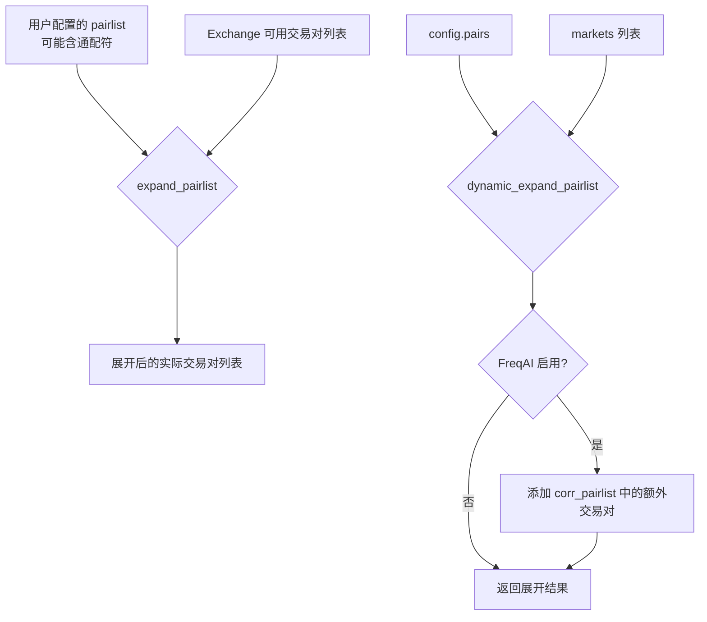

# pairlist_helpers.py

## 概述

Pairlist 辅助函数模块，提供交易对列表的通配符/正则表达式展开功能。核心功能是将用户配置中可能包含通配符（正则表达式）的交易对列表展开为实际可用的交易对列表。

## 架构图

## 核心类/函数

### expand_pairlist(wildcardpl, available_pairs, keep_invalid) -> list[str]

将可能包含正则表达式通配符的交易对列表展开为实际匹配的交易对。

**参数：**
- `wildcardpl: list[str]` -- 可能含正则的交易对列表（如 `[".*/BTC", "ETH/USDT"]`）
- `available_pairs: list[str]` -- 交易所上所有可用的交易对
- `keep_invalid: bool = False` -- 是否保留无法匹配的配对（True 时静默丢弃无效对）

**返回值：** 展开后的交易对列表

**关键逻辑：**
- 使用 `re.fullmatch` 对每个通配符进行完全匹配
- `keep_invalid=True` 时：如果通配符无匹配，保留原字符串；最终通过正则 `^[\w:/-]+$` 过滤掉确实无效的通配符条目，并排除含下划线的条目
- `keep_invalid=False` 时：仅保留有匹配的交易对
- 无效的正则表达式会抛出 `ValueError`

### dynamic_expand_pairlist(config, markets) -> list[str]

动态展开配置中的交易对列表，同时处理 FreqAI 的关联交易对。

**参数：**
- `config: Config` -- 全局配置
- `markets: list[str]` -- 可用市场列表

**返回值：** 展开后的完整交易对列表

**关键逻辑：**
- 先调用 `expand_pairlist` 展开 `config["pairs"]`
- 如果启用了 FreqAI，将 `include_corr_pairlist` 中不在 `config["pairs"]` 内的交易对追加进来

## 依赖关系

### 内部依赖（本项目模块）
- `freqtrade.constants.Config` -- 配置类型定义

### 外部依赖（第三方库）
- `re` -- 正则表达式匹配

### 被依赖（谁引用了本文件）
- `freqtrade.plugins.pairlist.RemotePairList` -- 展开远程获取的交易对列表
- `freqtrade.plugins.pairlistmanager` -- PairlistManager 中的白名单/黑名单处理
- `freqtrade.rpc.rpc` -- RPC 接口中的交易对处理
- `freqtrade.plot.plotting` -- 绘图模块
- `freqtrade.freqai.utils` -- FreqAI 工具
- `freqtrade.data.history.history_utils` -- 历史数据工具
- `freqtrade.data.converter.trade_converter_kraken` -- Kraken 交易数据转换
- `freqtrade.commands.data_commands` -- 数据命令
