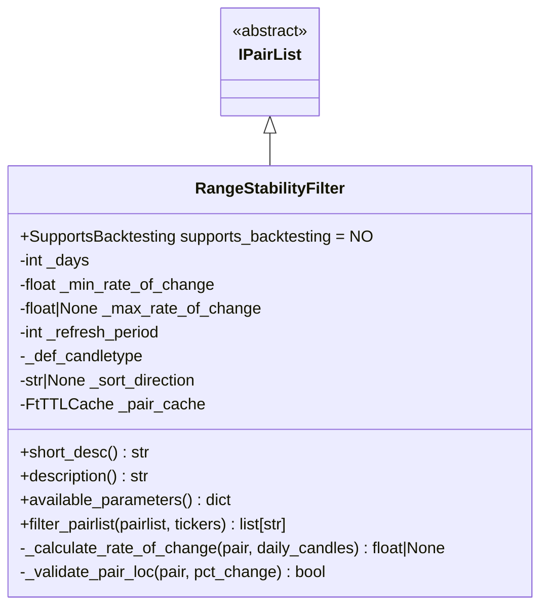
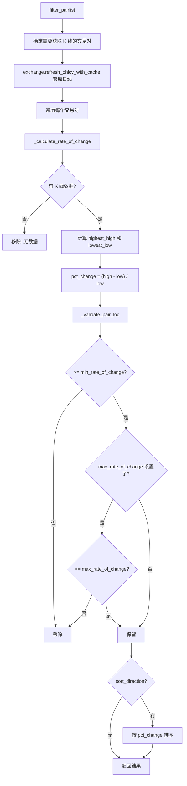

# rangestabilityfilter.py

## 概述

价格范围稳定性过滤器插件（RangeStabilityFilter），根据交易对在指定回溯期内的价格变化率（Rate of Change）进行过滤。价格变化率的计算方式为：`(最高价 - 最低价) / 最低价`，反映了该交易对在指定天数内的价格波动幅度。

可以设置最小和最大变化率阈值，还支持按变化率排序。用于排除波动过小（流动性差）或波动过大（风险高）的交易对。

## 架构图

## 核心类/函数

### RangeStabilityFilter

继承自 `IPairList`，不支持回测 (`supports_backtesting = NO`)。

**配置参数：**
- `lookback_days` (default: 10) -- 回溯天数，必须 >= 1 且不超过交易所限制
- `min_rate_of_change` (default: 0.01) -- 最小价格变化率（1%）
- `max_rate_of_change` (default: None) -- 最大价格变化率（可选）
- `sort_direction` (default: None) -- 排序方向，None / "asc" / "desc"
- `refresh_period` (default: 86400) -- 缓存刷新周期（秒），默认 24 小时

**关键方法：**

#### filter_pairlist(pairlist, tickers) -> list[str]
完整过滤流程：
1. 筛选不在缓存中的交易对
2. 批量获取日线 OHLCV 数据（多获取 1 天的数据以确保完整性）
3. 计算每个交易对的价格变化率
4. 根据阈值验证
5. 可选排序

#### _calculate_rate_of_change(pair, daily_candles) -> float | None
价格变化率计算：
1. 先检查缓存
2. 获取日线数据中的最高价 (`high.max()`) 和最低价 (`low.min()`)
3. 计算变化率：`(highest_high - lowest_low) / lowest_low`
4. 如果 lowest_low 为 0，返回 0
5. 结果存入缓存

#### _validate_pair_loc(pair, pct_change) -> bool
验证变化率是否在 `[min_rate_of_change, max_rate_of_change]` 范围内：
- 低于 `min_rate_of_change` -- 移除
- 高于 `max_rate_of_change`（如果设置了）-- 移除

## 依赖关系

### 内部依赖（本项目模块）
- `freqtrade.plugins.pairlist.IPairList` -- 基类
- `freqtrade.constants.ListPairsWithTimeframes` -- 类型定义
- `freqtrade.exceptions.OperationalException` -- 配置错误
- `freqtrade.exchange.exchange_types.Tickers` -- Tickers 类型
- `freqtrade.misc.plural` -- 复数辅助函数
- `freqtrade.util.FtTTLCache` -- TTL 缓存
- `freqtrade.util.dt_floor_day, dt_now, dt_ts` -- 时间辅助

### 外部依赖（第三方库）
- `pandas.DataFrame` -- K 线数据处理
- `datetime.timedelta` -- 时间计算

### 被依赖（谁引用了本文件）
- `freqtrade.resolvers.pairlist_resolver` -- 动态加载该插件
- `freqtrade.plugins.pairlistmanager` -- PairlistManager 调度链
