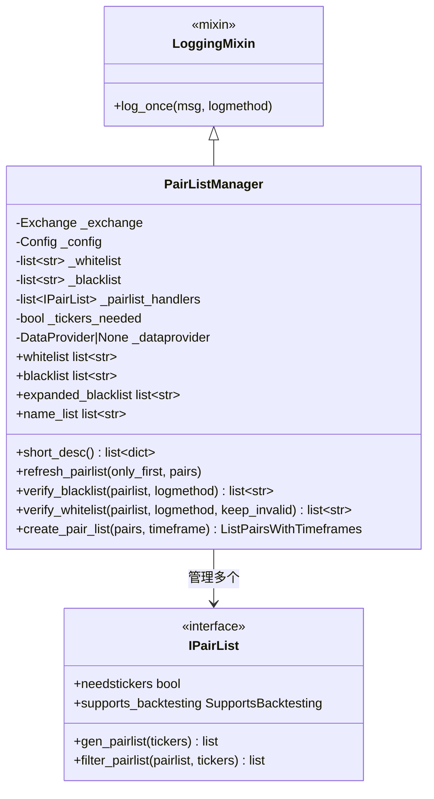

# pairlistmanager.py

## 概述

交易对列表管理器，是 freqtrade 插件系统的核心组件之一。负责管理和协调多个 PairList Handler 的链式调用，生成和过滤交易对白名单。支持黑名单过滤、通配符展开、缓存机制，并对回测模式进行兼容性检查。

## 架构图

```mermaid
flowchart TD
    A[PairListManager.__init__] --> B[加载 PairList Handlers 链]
    B --> C{是否需要 tickers?}
    C -->|是| D[验证交易所支持 fetchTickers]
    C -->|否| E[检查回测兼容性]
    D --> E

    F[refresh_pairlist] --> G{需要 tickers?}
    G -->|是| H[_get_cached_tickers]
    G -->|否| I[跳过]
    H --> J[Handler[0].gen_pairlist -- 生成初始列表]
    I --> J
    J --> K{only_first?}
    K -->|否| L[依次调用后续 Handler.filter_pairlist]
    K -->|是| M[跳过过滤]
    L --> N[verify_blacklist -- 黑名单过滤]
    M --> N
    N --> O[更新 _whitelist]
```



## 核心类/函数

### PairListManager

继承自 `LoggingMixin`，管理交易对列表的生成和过滤。

**构造函数 `__init__(exchange, config, dataprovider)`：**
1. 读取配置中的 `pair_whitelist` 和 `pair_blacklist`
2. 通过 `PairListResolver` 动态加载配置中的所有 PairList Handler
3. 检查是否有任何 Handler 需要 tickers 数据
4. 验证交易所是否支持 `fetchTickers`（如需要但不支持则抛出异常）
5. 调用 `_check_backtest()` 验证回测兼容性
6. 初始化 LRU 缓存和日志刷新周期

**关键属性：**

- `whitelist` -- 当前白名单（经过生成和过滤后的最终结果）
- `blacklist` -- 配置中的黑名单
- `expanded_blacklist` -- 展开通配符后的黑名单。回测模式下会缓存（不变化）
- `name_list` -- 已加载的 Handler 名称列表

**关键方法：**

#### refresh_pairlist(only_first=False, pairs=None)

刷新交易对列表。

**参数：**
- `only_first: bool` -- 仅运行第一个 Handler（生成器）。在回测启动时使用，确保加载完整的候选交易对历史数据。
- `pairs: list[str] | None` -- 可选的交叉过滤列表。回测中用于过滤掉没有数据的交易对。

**流程：**
1. 如果需要，获取缓存的 tickers
2. 第一个 Handler 调用 `gen_pairlist()` 生成初始列表
3. 与 `pairs` 参数取交集
4. 如果非 `only_first`，依次调用后续 Handler 的 `filter_pairlist()`
5. 使用 `verify_blacklist()` 过滤黑名单
6. 更新 `_whitelist`

#### _check_backtest()

检查回测模式下的 Handler 兼容性：
- `SupportsBacktesting.NO` -- 抛出异常，不允许回测
- `SupportsBacktesting.NO_ACTION` -- 警告（安全但不生效）
- `SupportsBacktesting.BIASED` -- 警告（会引入前瞻偏差）

#### verify_blacklist(pairlist, logmethod) -> list[str]

验证黑名单并过滤交易对。展开通配符后移除匹配的 pair。

#### verify_whitelist(pairlist, logmethod, keep_invalid) -> list[str]

验证白名单，展开通配符和正则表达式。

#### create_pair_list(pairs, timeframe) -> ListPairsWithTimeframes

创建 `(pair, timeframe, candle_type)` 元组列表。

#### _get_cached_tickers() -> Tickers

获取缓存的 tickers 数据。使用 `FtTTLCache`（TTL=1800秒）避免频繁调用交易所 API。

## 依赖关系

### 内部依赖（本项目模块）
- `freqtrade.constants` -- Config, ListPairsWithTimeframes
- `freqtrade.data.dataprovider.DataProvider` -- 数据提供器
- `freqtrade.enums.CandleType` -- K 线类型
- `freqtrade.enums.runmode.RunMode` -- 运行模式
- `freqtrade.exceptions.OperationalException` -- 操作异常
- `freqtrade.exchange.exchange_types.Tickers` -- Ticker 数据类型
- `freqtrade.mixins.LoggingMixin` -- 日志混入
- `freqtrade.plugins.pairlist.IPairList` -- PairList Handler 接口
- `freqtrade.plugins.pairlist.pairlist_helpers.expand_pairlist` -- 交易对列表展开
- `freqtrade.resolvers.PairListResolver` -- PairList 解析器
- `freqtrade.util.FtTTLCache` -- TTL 缓存

### 外部依赖（第三方库）
- `cachetools` -- LRUCache, cached 缓存装饰器
- `functools.partial` -- 偏函数

### 被依赖（谁引用了本文件）
- `freqtrade.freqtradebot` -- 主交易机器人
- `freqtrade.optimize.backtesting` -- 回测引擎
- `freqtrade.rpc.api_server.api_pairlists` -- API 交易对列表接口
- `freqtrade.commands.pairlist_commands` -- 交易对列表命令
