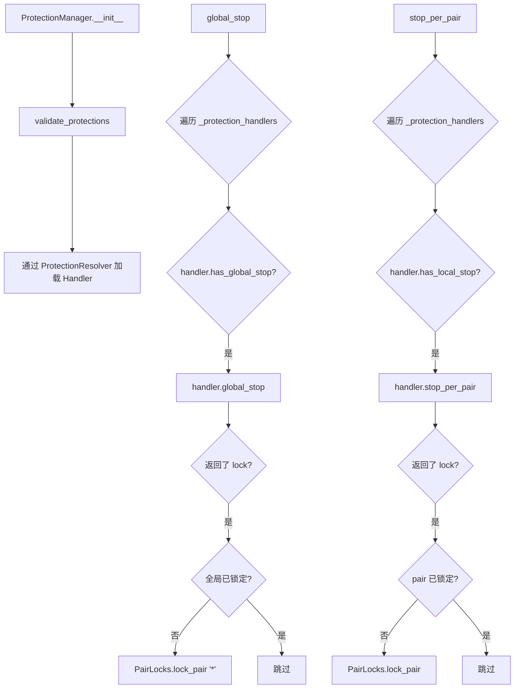
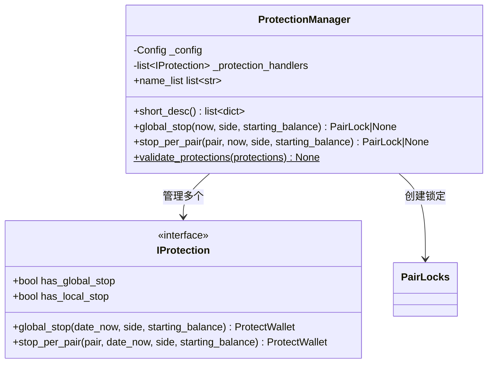

# protectionmanager.py

## 概述

保护机制管理器，是 freqtrade 风控系统的核心组件。负责加载和协调多个保护处理器（Protection Handler），在交易过程中检测异常情况并自动锁定交易对或全局锁定交易。支持全局止损和单交易对止损两种保护级别。

## 架构图

## 核心类/函数

### ProtectionManager

保护机制管理器。

**构造函数 `__init__(config, protections)`：**
- `config: Config` -- 配置对象
- `protections: list` -- 保护配置列表（来自配置文件的 `protections` 字段）

通过 `ProtectionResolver.load_protection()` 动态加载每个保护处理器。如果没有配置任何保护处理器，输出 info 日志。

**属性：**
- `name_list` -- 已加载的 Protection Handler 名称列表

**关键方法：**

#### global_stop(now, side, starting_balance) -> PairLock | None

全局保护检查。遍历所有具有 `has_global_stop` 能力的处理器：

**参数：**
- `now: datetime | None` -- 当前时间，默认 UTC now
- `side: LongShort = "long"` -- 检查方向
- `starting_balance: float = 0.0` -- 起始余额（部分保护策略需要）

**逻辑：**
1. 调用每个 handler 的 `global_stop()` 方法
2. 如果返回了 lock 且指定了 `until` 时间
3. 检查是否已存在全局锁定（避免重复锁定）
4. 如果未锁定，通过 `PairLocks.lock_pair("*", ...)` 创建全局锁定
5. 返回最后创建的 PairLock（如有）

#### stop_per_pair(pair, now, side, starting_balance) -> PairLock | None

单交易对保护检查。逻辑与 `global_stop()` 类似，但针对特定 pair。

**参数：**
- `pair` -- 交易对名称
- 其余参数同 `global_stop`

**逻辑：**
1. 遍历具有 `has_local_stop` 能力的处理器
2. 调用 `stop_per_pair()` 检查
3. 如果返回锁定且 pair 尚未锁定，创建锁定

#### validate_protections(protections) [staticmethod]

验证保护配置的合法性。

**验证规则：**
1. `unlock_at` 格式必须为 `"%H:%M"`
2. `stop_duration` 和 `stop_duration_candles` 不能同时存在
3. `lookback_period` 和 `lookback_period_candles` 不能同时存在
4. `unlock_at` 不能与 `stop_duration` / `stop_duration_candles` 同时存在

如果验证失败，抛出 `ConfigurationError`。

#### short_desc() -> list[dict]

返回每个 Handler 的简短描述列表。

## 依赖关系

### 内部依赖（本项目模块）
- `freqtrade.constants` -- Config, LongShort
- `freqtrade.exceptions.ConfigurationError` -- 配置错误异常
- `freqtrade.persistence.PairLocks` -- 交易对锁定中间件
- `freqtrade.persistence.models.PairLock` -- PairLock 模型
- `freqtrade.plugins.protections.IProtection` -- Protection Handler 接口
- `freqtrade.resolvers.ProtectionResolver` -- Protection 解析器

### 外部依赖（第三方库）
- `datetime` -- 日期时间处理

### 被依赖（谁引用了本文件）
- `freqtrade.freqtradebot` -- 主交易机器人在每次交易后调用保护检查
- `freqtrade.optimize.backtesting` -- 回测引擎中的保护检查
