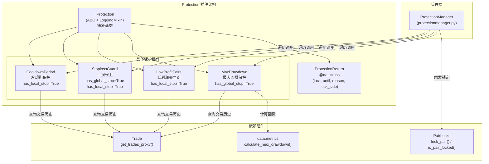
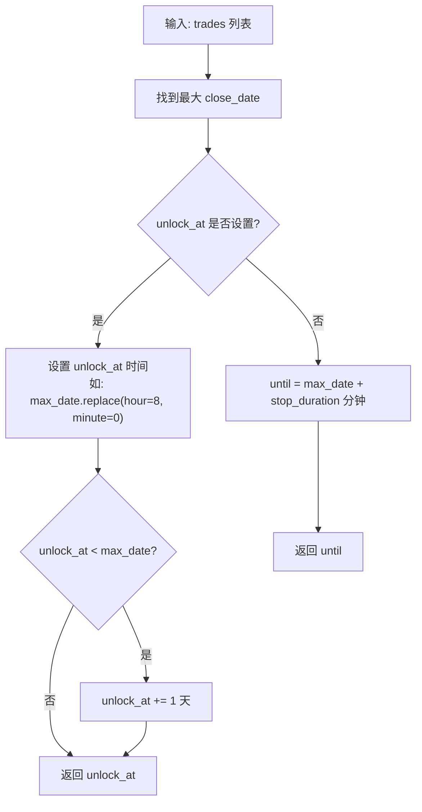
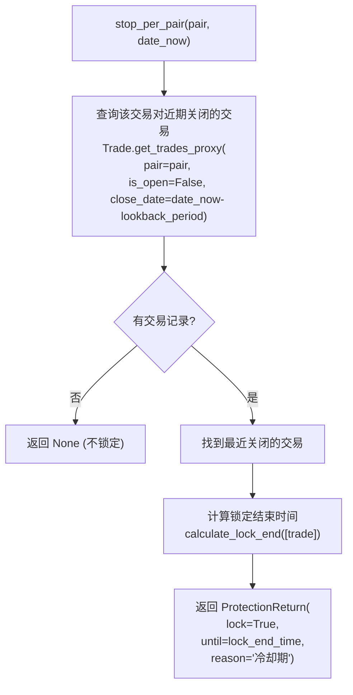
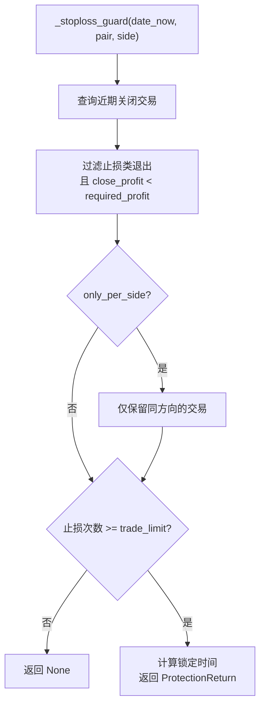
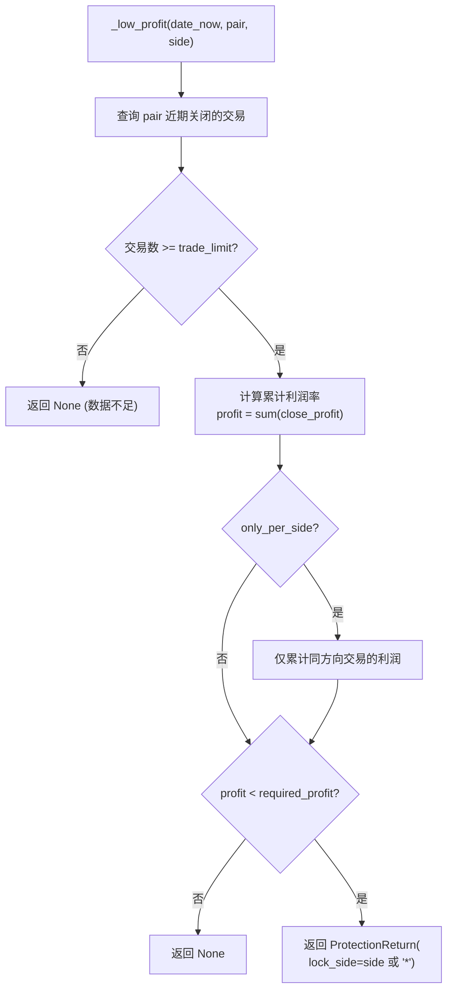
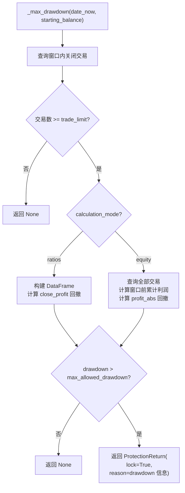
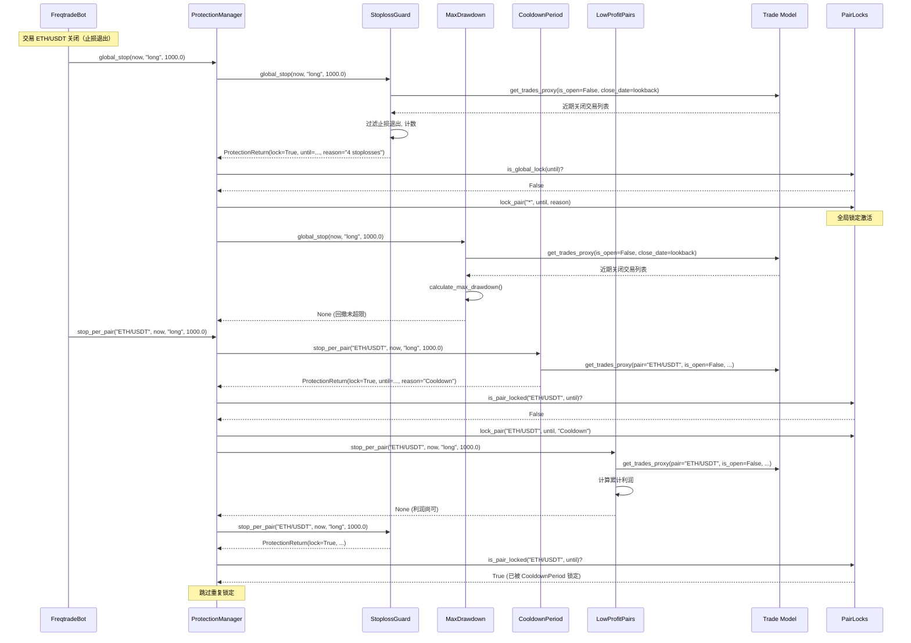

# Protections -- 交易保护插件

## 1. 模块概述

`freqtrade.plugins.protections` 模块实现了 Freqtrade 的交易保护（风控）插件系统。该系统在每笔交易关闭后自动评估预设的风控规则，当触发条件满足时，通过 `PairLocks` 机制临时锁定交易对或全局暂停交易，从而保护策略资金免受连续亏损、过大回撤等风险。

**核心设计特点：**
- **双级保护**：支持全局保护（`has_global_stop`，锁定所有交易对）和单对保护（`has_local_stop`，锁定特定交易对）
- **灵活的时间配置**：支持固定分钟数（`stop_duration`）、K 线数量（`stop_duration_candles`）和固定时间点（`unlock_at`）三种锁定时长配置
- **回看窗口**：支持固定分钟数（`lookback_period`）或 K 线数量（`lookback_period_candles`）的回看周期
- **方向感知**：支持按交易方向（`long`/`short`）独立评估保护条件
- **回测兼容**：通过 `Trade.get_trades_proxy()` 抽象层同时支持实盘和回测

## 2. 目录结构

| 文件 | 功能说明 |
|---|---|
| `__init__.py` | 模块入口，导出 `IProtection` 和 `ProtectionReturn` |
| `iprotection.py` | 保护插件抽象基类 `IProtection`，定义统一接口和通用逻辑 |
| `cooldown_period.py` | **CooldownPeriod** -- 冷却期保护，交易关闭后对该交易对设置冷却时间 |
| `stoploss_guard.py` | **StoplossGuard** -- 止损守卫，短时间内触发过多止损时暂停交易 |
| `low_profit_pairs.py` | **LowProfitPairs** -- 低利润交易对保护，锁定近期利润过低的交易对 |
| `max_drawdown_protection.py` | **MaxDrawdown** -- 最大回撤保护，全局回撤超限时暂停所有交易 |

## 3. 架构图



## 4. 核心类/函数说明

### 4.1 `ProtectionReturn` 数据类 (`iprotection.py`)

保护插件的返回值结构：

```python
@dataclass
class ProtectionReturn:
    lock: bool          # 是否需要锁定
    until: datetime     # 锁定结束时间
    reason: str | None  # 锁定原因
    lock_side: str = "*"  # 锁定方向: "long" / "short" / "*"
```

### 4.2 `IProtection` 抽象基类 (`iprotection.py`)

所有保护插件的基类，继承自 `LoggingMixin` 和 `ABC`。

#### 类属性

| 属性 | 类型 | 说明 |
|---|---|---|
| `has_global_stop` | bool | 是否支持全局停止（锁定所有交易对） |
| `has_local_stop` | bool | 是否支持单对停止（锁定特定交易对） |

#### 构造函数

```python
def __init__(self, config: Config, protection_config: dict[str, Any]):
    # 时间配置解析（三选一）：
    # 1. stop_duration_candles -> 转换为分钟数
    # 2. unlock_at -> 固定解锁时间（如 "08:00"）
    # 3. stop_duration -> 直接分钟数

    # 回看周期配置（二选一）：
    # 1. lookback_period_candles -> 转换为分钟数
    # 2. lookback_period -> 直接分钟数
```

**关键配置项解析逻辑：**

| 配置项 | 优先级 | 转换方式 |
|---|---|---|
| `stop_duration_candles` | 最高 | `candles * timeframe_to_minutes(config["timeframe"])` |
| `unlock_at` | 中等 | 存储为 `"HH:MM"` 字符串 |
| `stop_duration` | 最低（默认 60） | 直接使用分钟数 |
| `lookback_period_candles` | 最高 | `candles * timeframe_to_minutes(config["timeframe"])` |
| `lookback_period` | 最低（默认 60） | 直接使用分钟数 |

#### 抽象方法

| 方法 | 签名 | 说明 |
|---|---|---|
| `short_desc()` | `-> str` | 返回简短描述 |
| `global_stop()` | `(date_now, side, starting_balance) -> ProtectionReturn \| None` | 评估全局停止条件 |
| `stop_per_pair()` | `(pair, date_now, side, starting_balance) -> ProtectionReturn \| None` | 评估单对停止条件 |

#### 通用方法

| 方法 | 功能 |
|---|---|
| `calculate_lock_end(trades)` | 计算锁定结束时间。根据 `unlock_at` 或 `stop_duration` 从最近交易的 `close_date` 推算 |
| `stop_duration_str` (property) | 格式化输出锁定时长描述 |
| `lookback_period_str` (property) | 格式化输出回看周期描述 |
| `unlock_reason_time_element` (property) | 格式化输出解锁时间描述 |

#### `calculate_lock_end()` 逻辑详解



### 4.3 `CooldownPeriod` 冷却期保护 (`cooldown_period.py`)

**功能**：在交易对的交易关闭后，为该交易对设置一个冷却期，防止立即重新开仓。

**保护级别**：
- `has_global_stop = False`（不支持全局停止）
- `has_local_stop = True`（支持单对停止）

**触发逻辑：**



**配置示例：**
```json
{
    "method": "CooldownPeriod",
    "stop_duration_candles": 5,
    "lookback_period_candles": 1
}
```

### 4.4 `StoplossGuard` 止损守卫 (`stoploss_guard.py`)

**功能**：在指定时间窗口内，如果止损触发次数超过阈值，暂停该交易对或全局交易。

**保护级别**：
- `has_global_stop = True`（支持全局停止，可通过 `only_per_pair` 禁用）
- `has_local_stop = True`（支持单对停止）

**配置参数：**

| 参数 | 类型 | 默认值 | 说明 |
|---|---|---|---|
| `trade_limit` | int | 10 | 止损触发次数阈值 |
| `only_per_pair` | bool | False | 若为 True，禁用全局停止 |
| `only_per_side` | bool | False | 若为 True，按方向（long/short）独立计数 |
| `required_profit` | float | 0.0 | 利润阈值，仅计算利润低于此值的止损 |

**过滤的退出原因：**
- `ExitType.TRAILING_STOP_LOSS`
- `ExitType.STOP_LOSS`
- `ExitType.STOPLOSS_ON_EXCHANGE`
- `ExitType.LIQUIDATION`

**触发逻辑：**



**配置示例：**
```json
{
    "method": "StoplossGuard",
    "lookback_period_candles": 24,
    "trade_limit": 4,
    "stop_duration_candles": 2,
    "only_per_pair": false,
    "only_per_side": false,
    "required_profit": -0.01
}
```

### 4.5 `LowProfitPairs` 低利润交易对保护 (`low_profit_pairs.py`)

**功能**：在指定时间窗口内，如果某交易对的累计利润低于阈值，暂停该交易对的交易。

**保护级别**：
- `has_global_stop = False`
- `has_local_stop = True`

**配置参数：**

| 参数 | 类型 | 默认值 | 说明 |
|---|---|---|---|
| `trade_limit` | int | 1 | 最少交易次数（不足则不评估） |
| `required_profit` | float | 0.0 | 利润阈值（累计利润率低于此值时触发锁定） |
| `only_per_side` | bool | False | 按方向独立计算利润 |

**触发逻辑：**



**配置示例：**
```json
{
    "method": "LowProfitPairs",
    "lookback_period_candles": 60,
    "trade_limit": 2,
    "stop_duration": 60,
    "required_profit": 0.02,
    "only_per_side": true
}
```

### 4.6 `MaxDrawdown` 最大回撤保护 (`max_drawdown_protection.py`)

**功能**：全局级保护，当指定时间窗口内的最大回撤超过阈值时，暂停所有交易。

**保护级别**：
- `has_global_stop = True`
- `has_local_stop = False`

**配置参数：**

| 参数 | 类型 | 默认值 | 说明 |
|---|---|---|---|
| `trade_limit` | int | 1 | 最少交易次数 |
| `max_allowed_drawdown` | float | 0.0 | 允许的最大回撤 |
| `calculation_mode` | str | `"ratios"` | 计算模式：`"ratios"` 或 `"equity"` |

**两种计算模式：**

1. **`ratios` 模式（默认）**：基于 `close_profit`（利润比率）计算回撤
   - 使用 `calculate_max_drawdown(trades_df, value_col="close_profit")`
   - `drawdown = drawdown_abs`（累计比率下降值）

2. **`equity` 模式**：基于账户权益（实际资金）计算回撤
   - 计算窗口前的累计利润 -> 实际起始余额
   - 使用 `calculate_max_drawdown(trades_df, value_col="profit_abs", starting_balance=..., relative=True)`
   - `drawdown = relative_account_drawdown`（相对账户回撤比率）

**触发逻辑：**



**配置示例：**
```json
{
    "method": "MaxDrawdown",
    "lookback_period_candles": 48,
    "trade_limit": 20,
    "stop_duration_candles": 12,
    "max_allowed_drawdown": 0.2,
    "calculation_mode": "equity"
}
```

## 5. 依赖关系

### 内部依赖

| 模块 | 用途 | 使用者 |
|---|---|---|
| `freqtrade.persistence.Trade` | 查询交易历史 `get_trades_proxy()` | 所有保护插件 |
| `freqtrade.persistence.PairLocks` | 执行交易对锁定 | ProtectionManager |
| `freqtrade.persistence.models.PairLock` | PairLock 数据模型 | ProtectionManager |
| `freqtrade.exchange.timeframe_to_minutes` | 时间框架转换 | IProtection |
| `freqtrade.constants.LongShort` | 交易方向类型 | 所有保护插件 |
| `freqtrade.enums.ExitType` | 退出类型枚举 | StoplossGuard |
| `freqtrade.data.metrics.calculate_max_drawdown` | 回撤计算 | MaxDrawdown |
| `freqtrade.mixins.LoggingMixin` | 日志去重 | IProtection |
| `freqtrade.misc.plural` | 复数格式化 | IProtection |

### 外部依赖

| 库 | 用途 | 使用者 |
|---|---|---|
| `pandas` | DataFrame 构建和数据处理 | MaxDrawdown, PerformanceFilter |
| `datetime` / `timedelta` | 时间计算 | 所有保护插件 |

## 6. 数据流

### 6.1 完整的保护评估流程



### 6.2 保护插件能力矩阵

| 插件 | global_stop | local_stop | 评估对象 | 典型场景 |
|---|---|---|---|---|
| `CooldownPeriod` | - | pair | 最近关闭的交易 | 防止同一交易对快速重新开仓 |
| `StoplossGuard` | all pairs | pair | 止损退出的交易 | 连续止损时暂停交易 |
| `LowProfitPairs` | - | pair | 窗口内所有关闭交易的利润 | 锁定表现差的交易对 |
| `MaxDrawdown` | all pairs | - | 窗口内所有关闭交易 | 全局回撤过大时停止交易 |

### 6.3 时间配置对比

```
                    ┌─────────────────────────────────────┐
  lookback_period   │  回看窗口 (分钟/K 线)                │
                    │  在此窗口内检查历史交易               │
                    └──────────────────┬──────────────────┘
                                       │
                              date_now ─┤── 评估时间点
                                       │
                    ┌──────────────────┴──────────────────┐
  stop_duration     │  锁定持续时间                         │
  或 unlock_at      │  从最后一笔交易的 close_date 开始计算  │
                    └─────────────────────────────────────┘
```
