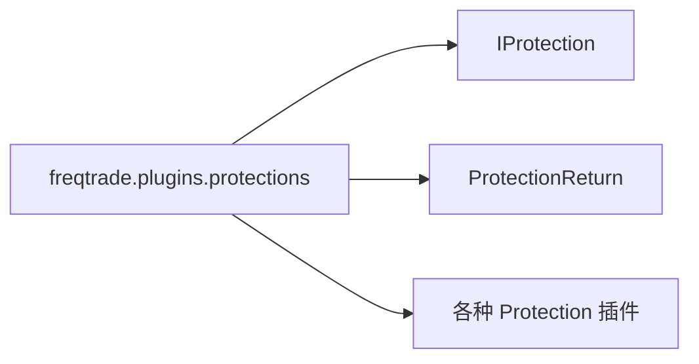

# __init__.py

## 概述

Protection 插件包的初始化文件，导出保护机制的核心类型。

## 架构图



## 核心类/函数

### 导出内容

```python
from freqtrade.plugins.protections.iprotection import IProtection, ProtectionReturn
```

导出两个核心类型：
- `IProtection` -- Protection 抽象基类
- `ProtectionReturn` -- Protection 返回值数据类

## 依赖关系

### 内部依赖（本项目模块）
- `freqtrade.plugins.protections.iprotection` -- 导入 IProtection 和 ProtectionReturn

### 外部依赖（第三方库）
无

### 被依赖（谁引用了本文件）
- `freqtrade.plugins.protections.cooldown_period` -- CooldownPeriod 导入基类
- `freqtrade.plugins.protections.low_profit_pairs` -- LowProfitPairs 导入基类
- `freqtrade.plugins.protections.max_drawdown_protection` -- MaxDrawdown 导入基类
- `freqtrade.plugins.protections.stoploss_guard` -- StoplossGuard 导入基类
- `freqtrade.plugins.protectionmanager` -- ProtectionManager 使用保护机制
- `freqtrade.resolvers.protection_resolver` -- 动态加载 Protection 插件
