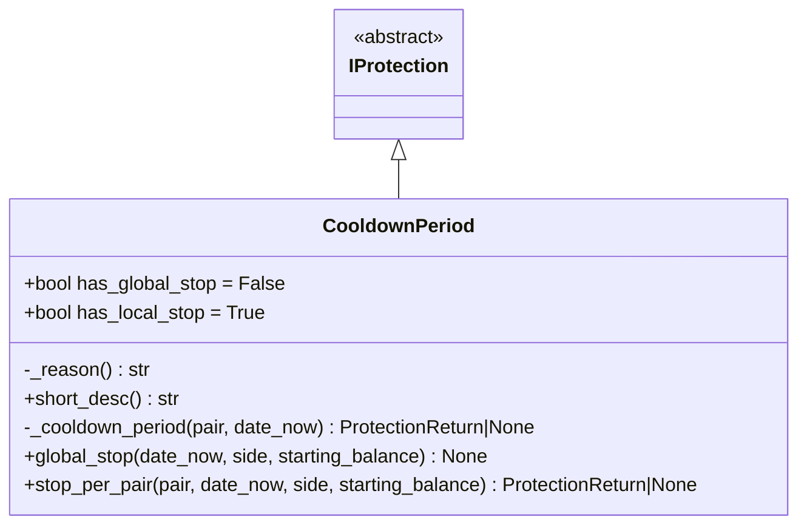
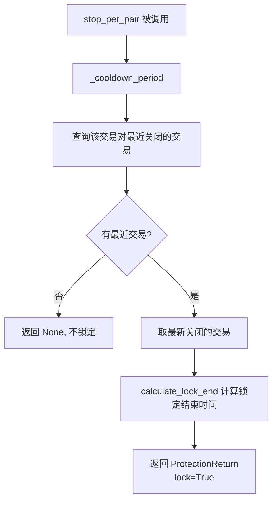

# cooldown_period.py

## 概述

冷却期保护插件（CooldownPeriod），在某个交易对完成一笔交易后，自动锁定该交易对一段时间，防止 bot 在短时间内对同一交易对重复开仓。

这是一个纯粹的"单对停止"保护（`has_local_stop = True, has_global_stop = False`），不会影响其他交易对的交易。

## 架构图

## 核心类/函数

### CooldownPeriod

继承自 `IProtection`。

**类属性：**
- `has_global_stop = False` -- 不支持全局停止
- `has_local_stop = True` -- 支持单对停止

**配置参数（继承自 IProtection）：**
- `stop_duration` / `stop_duration_candles` / `unlock_at` -- 冷却时长
- `lookback_period` / `lookback_period_candles` -- 回溯期

**关键方法：**

#### _cooldown_period(pair, date_now) -> ProtectionReturn | None
核心冷却检查逻辑：
1. 计算回溯时间：`date_now - lookback_period`
2. 查询该交易对在回溯期内已关闭的交易（通过 `Trade.get_trades_proxy`）
3. 如果有交易记录：
   - 按关闭时间排序，取最新的一笔
   - 调用 `calculate_lock_end` 计算锁定结束时间
   - 返回 `ProtectionReturn(lock=True, until=..., reason=...)`
4. 如果没有交易记录，返回 None（不锁定）

#### global_stop(date_now, side, starting_balance) -> None
始终返回 None，CooldownPeriod 不实现全局停止。

#### stop_per_pair(pair, date_now, side, starting_balance) -> ProtectionReturn | None
委托给 `_cooldown_period` 方法。

## 依赖关系

### 内部依赖（本项目模块）
- `freqtrade.plugins.protections.IProtection` -- 基类
- `freqtrade.plugins.protections.ProtectionReturn` -- 返回值类型
- `freqtrade.constants.LongShort` -- 方向类型
- `freqtrade.persistence.Trade` -- 交易持久化模型

### 外部依赖（第三方库）
- `datetime` -- 日期时间处理

### 被依赖（谁引用了本文件）
- `freqtrade.resolvers.protection_resolver` -- 动态加载该插件
- `freqtrade.plugins.protectionmanager` -- ProtectionManager 调度
