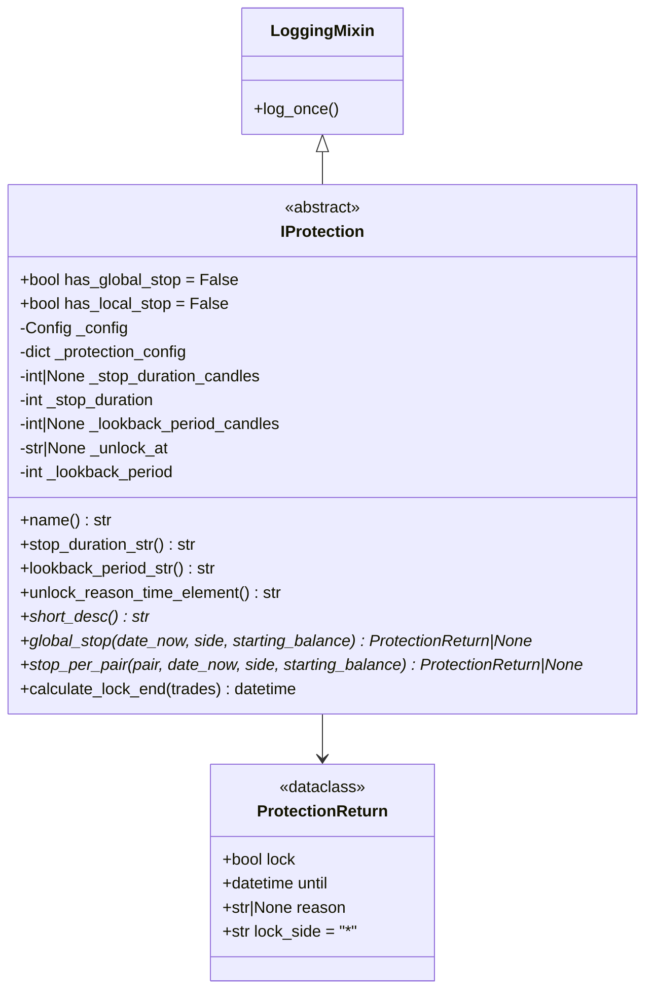

# iprotection.py

## 概述

Protection 机制的抽象基类文件，定义了所有保护插件必须遵循的接口规范。保护机制用于在检测到不利交易模式时（如连续止损、回撤过大等）自动停止交易，保护账户资金。

该文件包含：
1. **ProtectionReturn** -- 保护机制返回值的 dataclass
2. **IProtection** -- 所有 Protection Handler 的抽象基类

## 架构图

## 核心类/函数

### ProtectionReturn (dataclass)

保护机制的返回值：
- `lock: bool` -- 是否需要锁定
- `until: datetime` -- 锁定到什么时间
- `reason: str | None` -- 锁定原因
- `lock_side: str = "*"` -- 锁定方向，`"*"` 表示双向，也可以是 `"long"` 或 `"short"`

### IProtection (抽象基类)

**类属性：**
- `has_global_stop = False` -- 是否支持全局停止（停止所有交易对）
- `has_local_stop = False` -- 是否支持单对停止（停止某个交易对）

**构造参数：**
- `config: Config` -- 全局 bot 配置
- `protection_config: dict[str, Any]` -- 该 Protection 的专属配置

**构造逻辑（时间配置优先级）：**
1. 停止时长配置（三选一）：
   - `stop_duration_candles` -- 以 K 线数量表示停止时长（自动乘以 timeframe 分钟数）
   - `unlock_at` -- 固定解锁时间（如 "08:00"）
   - `stop_duration` -- 以分钟表示停止时长（默认 60 分钟）
2. 回溯期配置（二选一）：
   - `lookback_period_candles` -- 以 K 线数量表示（自动乘以 timeframe 分钟数）
   - `lookback_period` -- 以分钟表示（默认 60 分钟）

**关键属性：**

| 属性 | 说明 |
|------|------|
| `name` | 返回类名 |
| `stop_duration_str` | 格式化的停止时长描述 |
| `lookback_period_str` | 格式化的回溯期描述 |
| `unlock_reason_time_element` | 锁定原因中的时间描述（"until HH:MM" 或 "for X candles"） |

**抽象方法：**

#### global_stop(date_now, side, starting_balance) -> ProtectionReturn | None
全局停止检查。评估所有交易对的整体情况，决定是否全局停止交易。
- `date_now: datetime` -- 当前时间
- `side: LongShort` -- 交易方向
- `starting_balance: float` -- 起始余额

#### stop_per_pair(pair, date_now, side, starting_balance) -> ProtectionReturn | None
单对停止检查。评估单个交易对的情况，决定是否停止该对的交易。

#### calculate_lock_end(trades) -> datetime
计算锁定结束时间：
- `unlock_at` 模式：取最后交易关闭时间当天的指定时刻，如果已过则加一天
- `stop_duration` 模式：最后交易关闭时间 + stop_duration 分钟

## 依赖关系

### 内部依赖（本项目模块）
- `freqtrade.constants.Config, LongShort` -- 配置和方向类型
- `freqtrade.exchange.timeframe_to_minutes` -- 时间框架转分钟
- `freqtrade.misc.plural` -- 复数辅助函数
- `freqtrade.mixins.LoggingMixin` -- 日志混入类
- `freqtrade.persistence.LocalTrade` -- 交易数据类型

### 外部依赖（第三方库）
- `dataclasses.dataclass` -- 数据类装饰器
- `datetime` -- 日期时间处理
- `abc.ABC, abstractmethod` -- 抽象基类

### 被依赖（谁引用了本文件）
- `freqtrade.plugins.protections.__init__` -- 包导出
- `freqtrade.plugins.protections.cooldown_period` -- CooldownPeriod 继承
- `freqtrade.plugins.protections.low_profit_pairs` -- LowProfitPairs 继承
- `freqtrade.plugins.protections.max_drawdown_protection` -- MaxDrawdown 继承
- `freqtrade.plugins.protections.stoploss_guard` -- StoplossGuard 继承
- `freqtrade.plugins.protectionmanager` -- ProtectionManager 管理
- `freqtrade.resolvers.protection_resolver` -- 动态加载
