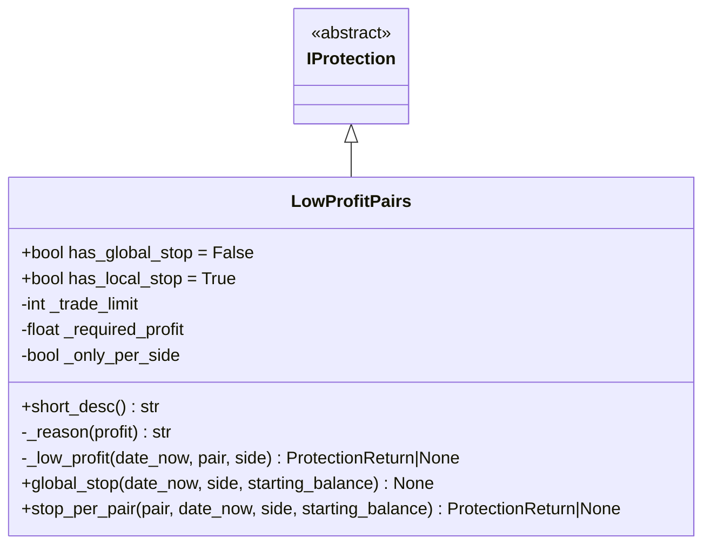
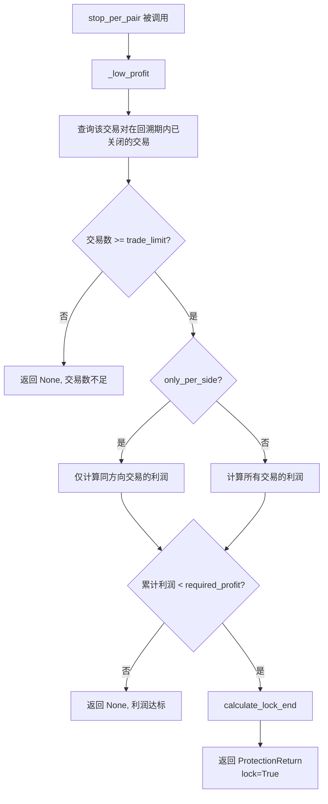

# low_profit_pairs.py

## 概述

低利润交易对保护插件（LowProfitPairs），当某个交易对在回溯期内的累计利润低于设定阈值时，自动锁定该交易对，阻止继续交易。

这是一个"单对停止"保护（`has_local_stop = True, has_global_stop = False`），仅影响表现不佳的单个交易对。支持按交易方向（long/short）分别评估。

## 架构图

## 核心类/函数

### LowProfitPairs

继承自 `IProtection`。

**类属性：**
- `has_global_stop = False` -- 不支持全局停止
- `has_local_stop = True` -- 支持单对停止

**配置参数：**
- `trade_limit` (default: 1) -- 最少交易笔数阈值，低于此值不触发保护
- `required_profit` (default: 0.0) -- 要求的最低累计利润（百分比之和），低于此值触发锁定
- `only_per_side` (default: False) -- 是否按交易方向分别评估
- 继承的参数：`stop_duration` / `stop_duration_candles` / `unlock_at`、`lookback_period` / `lookback_period_candles`

**关键方法：**

#### _low_profit(date_now, pair, side) -> ProtectionReturn | None
核心利润评估逻辑：
1. 计算回溯时间窗口
2. 查询该交易对在回溯期内已关闭的交易
3. 如果交易数不足 `trade_limit`，返回 None（不触发）
4. 计算累计利润（`sum of close_profit`）：
   - 如果 `only_per_side=True`，只计算同方向（long/short）的交易利润
   - 否则计算所有方向的交易利润
5. 如果累计利润 < `required_profit`：
   - 计算锁定结束时间
   - 返回 `ProtectionReturn`，如果 `only_per_side=True` 则设置 `lock_side` 为当前方向

#### global_stop(date_now, side, starting_balance) -> None
始终返回 None，LowProfitPairs 不实现全局停止。

#### stop_per_pair(pair, date_now, side, starting_balance) -> ProtectionReturn | None
委托给 `_low_profit` 方法。

## 依赖关系

### 内部依赖（本项目模块）
- `freqtrade.plugins.protections.IProtection` -- 基类
- `freqtrade.plugins.protections.ProtectionReturn` -- 返回值类型
- `freqtrade.constants.Config, LongShort` -- 配置和方向类型
- `freqtrade.persistence.Trade` -- 交易持久化模型

### 外部依赖（第三方库）
- `datetime` -- 日期时间处理

### 被依赖（谁引用了本文件）
- `freqtrade.resolvers.protection_resolver` -- 动态加载该插件
- `freqtrade.plugins.protectionmanager` -- ProtectionManager 调度
