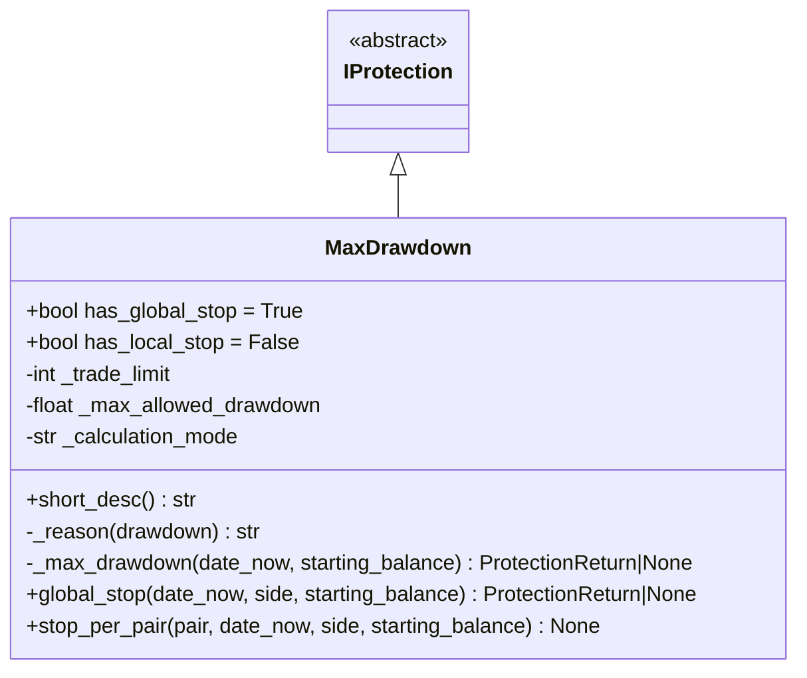
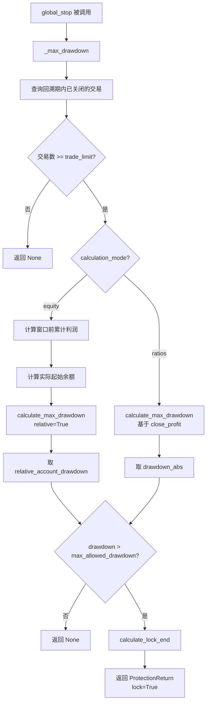

# max_drawdown_protection.py

## 概述

最大回撤保护插件（MaxDrawdown），当回溯期内所有交易的最大回撤超过设定阈值时，全局停止所有交易。这是最重要的风险控制保护之一，用于在持续亏损时及时止损。

这是一个纯粹的"全局停止"保护（`has_global_stop = True, has_local_stop = False`），触发时会停止所有交易对的开仓。

支持两种计算模式：
1. **ratios 模式**（默认）-- 基于利润率累计计算回撤
2. **equity 模式** -- 基于实际账户权益变化计算回撤

## 架构图

## 核心类/函数

### MaxDrawdown

继承自 `IProtection`。

**类属性：**
- `has_global_stop = True` -- 支持全局停止
- `has_local_stop = False` -- 不支持单对停止

**配置参数：**
- `trade_limit` (default: 1) -- 最少交易笔数阈值，低于此值不触发保护
- `max_allowed_drawdown` (default: 0.0) -- 允许的最大回撤（比率或百分比，取决于计算模式）
- `calculation_mode` (default: "ratios") -- 计算模式
  - `"ratios"` -- 基于利润率之和的回撤（legacy 模式），`drawdown_abs` 是累计利润率的最大回落
  - `"equity"` -- 基于账户实际权益的回撤，考虑了起始余额和之前的累计利润
- 继承的参数：`stop_duration`、`lookback_period` 等

**关键方法：**

#### _max_drawdown(date_now, starting_balance) -> ProtectionReturn | None
核心回撤评估逻辑：

**Equity 模式：**
1. 获取回溯期内的所有已关闭交易
2. 获取所有历史已关闭交易
3. 计算回溯窗口之前的累计利润
4. 计算实际起始余额：`starting_balance + profit_before_window`
5. 使用 `calculate_max_drawdown` 计算相对账户回撤（`relative=True`）
6. 使用 `relative_account_drawdown` 作为回撤值

**Ratios 模式（默认）：**
1. 获取回溯期内的所有已关闭交易
2. 使用 `calculate_max_drawdown` 基于 `close_profit` 计算
3. 使用 `drawdown_abs`（累计利润率最大回落）作为回撤值

如果回撤超过阈值，锁定所有交易。

#### global_stop(date_now, side, starting_balance) -> ProtectionReturn | None
委托给 `_max_drawdown` 方法。

#### stop_per_pair(pair, date_now, side, starting_balance) -> None
始终返回 None，MaxDrawdown 不实现单对停止。

## 依赖关系

### 内部依赖（本项目模块）
- `freqtrade.plugins.protections.IProtection` -- 基类
- `freqtrade.plugins.protections.ProtectionReturn` -- 返回值类型
- `freqtrade.constants.Config, LongShort` -- 配置和方向类型
- `freqtrade.data.metrics.calculate_max_drawdown` -- 最大回撤计算函数
- `freqtrade.persistence.Trade` -- 交易持久化模型

### 外部依赖（第三方库）
- `pandas` -- DataFrame 数据处理
- `datetime` -- 日期时间处理

### 被依赖（谁引用了本文件）
- `freqtrade.resolvers.protection_resolver` -- 动态加载该插件
- `freqtrade.plugins.protectionmanager` -- ProtectionManager 调度
