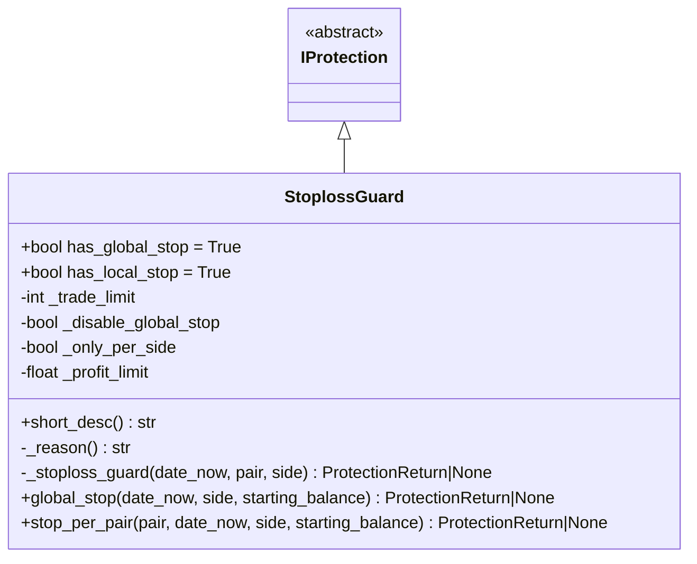
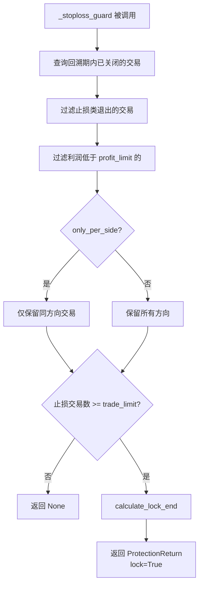

# stoploss_guard.py

## 概述

止损保护插件（StoplossGuard），当在回溯期内触发止损的交易次数达到阈值时，停止交易。该保护同时支持全局停止和单对停止，是最全面的保护机制之一。

可以按交易方向（long/short）分别评估，也可以设置为仅对单个交易对生效（`only_per_pair`）而不全局生效。

## 架构图

## 核心类/函数

### StoplossGuard

继承自 `IProtection`。

**类属性：**
- `has_global_stop = True` -- 支持全局停止
- `has_local_stop = True` -- 支持单对停止

**配置参数：**
- `trade_limit` (default: 10) -- 触发保护所需的止损交易笔数阈值
- `only_per_pair` (default: False) -- 设为 True 时禁用全局停止，仅单对生效
- `only_per_side` (default: False) -- 是否按交易方向分别统计
- `required_profit` (default: 0.0) -- 利润阈值，仅统计利润低于此值的止损交易
- 继承的参数：`stop_duration`、`lookback_period` 等

**关键方法：**

#### _stoploss_guard(date_now, pair, side) -> ProtectionReturn | None
核心止损统计逻辑：
1. 查询回溯期内的已关闭交易（如果 pair 为 None 则查询所有交易对）
2. 过滤止损类退出原因：
   - `TRAILING_STOP_LOSS` -- 追踪止损
   - `STOP_LOSS` -- 普通止损
   - `STOPLOSS_ON_EXCHANGE` -- 交易所止损
   - `LIQUIDATION` -- 清算
3. 过滤利润低于 `profit_limit` 的交易
4. 如果 `only_per_side=True`，仅统计同方向的交易
5. 如果止损交易数 >= `trade_limit`，触发锁定

#### global_stop(date_now, side, starting_balance) -> ProtectionReturn | None
- 如果 `_disable_global_stop=True`（即 `only_per_pair=True`），返回 None
- 否则调用 `_stoploss_guard(date_now, None, side)` 评估所有交易

#### stop_per_pair(pair, date_now, side, starting_balance) -> ProtectionReturn | None
调用 `_stoploss_guard(date_now, pair, side)` 评估单个交易对。

## 依赖关系

### 内部依赖（本项目模块）
- `freqtrade.plugins.protections.IProtection` -- 基类
- `freqtrade.plugins.protections.ProtectionReturn` -- 返回值类型
- `freqtrade.constants.Config, LongShort` -- 配置和方向类型
- `freqtrade.enums.ExitType` -- 退出类型枚举
- `freqtrade.persistence.Trade` -- 交易持久化模型

### 外部依赖（第三方库）
- `datetime` -- 日期时间处理

### 被依赖（谁引用了本文件）
- `freqtrade.resolvers.protection_resolver` -- 动态加载该插件
- `freqtrade.plugins.protectionmanager` -- ProtectionManager 调度
