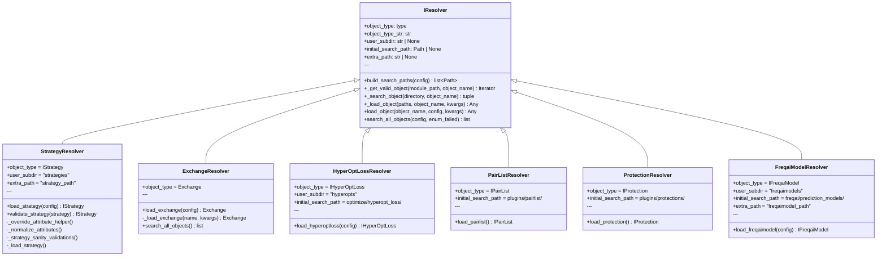
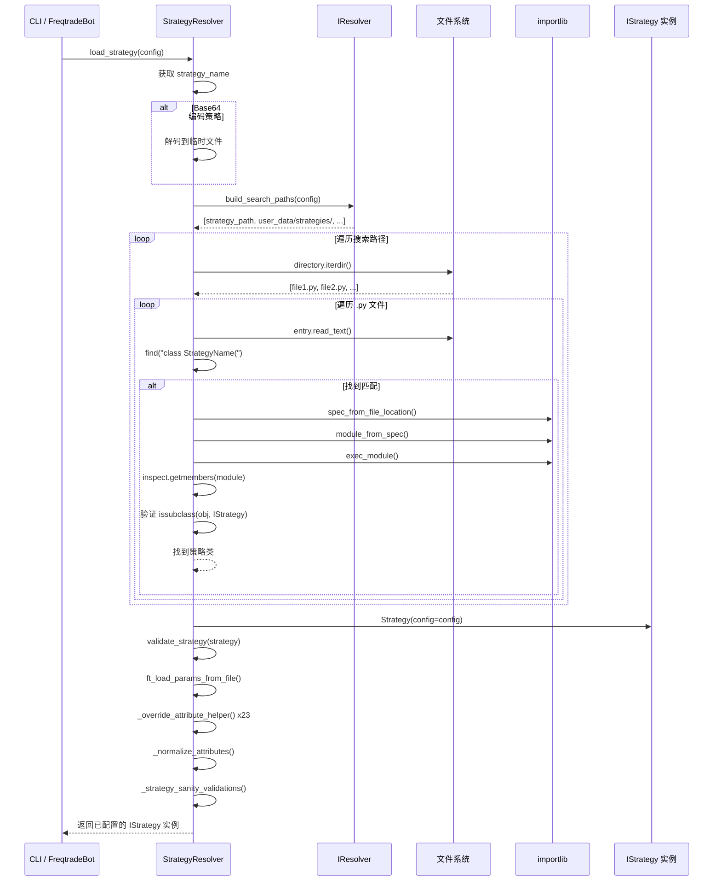
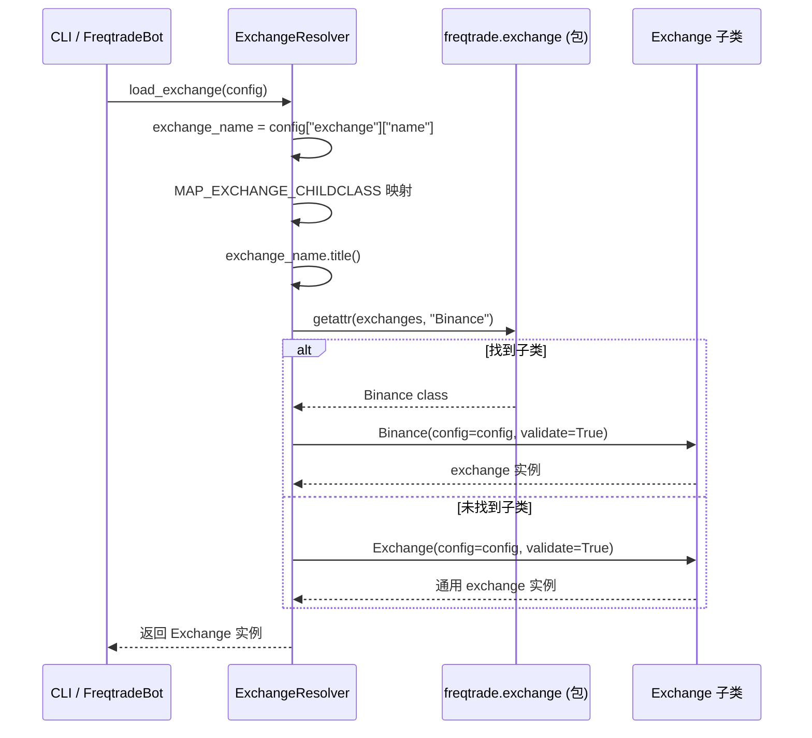
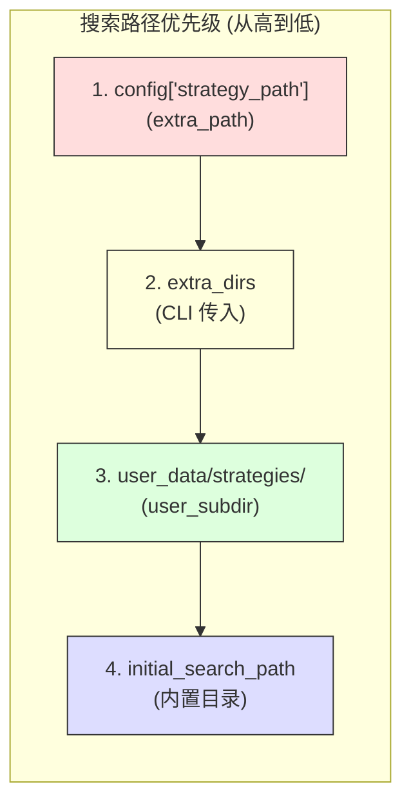

# Resolvers -- 组件解析器源码文档

## 1. 模块概述

`freqtrade/resolvers/` 是 Freqtrade 的组件动态加载框架。该模块实现了一套统一的插件发现和加载机制，用于在运行时动态加载用户自定义的策略（Strategy）、交易所（Exchange）、Hyperopt 损失函数、Pairlist 插件、保护插件（Protection）和 FreqAI 模型等组件。

### 核心设计理念

- **统一的解析器模式**：所有 Resolver 都继承自 `IResolver` 基类，遵循相同的搜索-加载-实例化流程
- **多路径搜索**：支持从用户目录、内置目录、配置指定的额外目录中搜索组件
- **基于文件系统的插件发现**：扫描 `.py` 文件，使用 `importlib` 动态导入，通过 `inspect` 验证类型
- **惰性加载**：仅在需要时加载组件，避免不必要的模块导入
- **快速跳过**：在执行 `importlib` 之前，先用字符串搜索 `class ClassName(` 快速排除不匹配的文件

### Resolver 类型总览

| Resolver | 加载目标 | 基类 | 搜索目录 |
|----------|---------|------|---------|
| `StrategyResolver` | 用户策略 | `IStrategy` | `user_data/strategies/` + `strategy_path` |
| `ExchangeResolver` | 交易所类 | `Exchange` | `freqtrade/exchange/` (静态注册) |
| `HyperOptLossResolver` | Hyperopt 损失函数 | `IHyperOptLoss` | `user_data/hyperopts/` + 内置 `optimize/hyperopt_loss/` |
| `PairListResolver` | Pairlist 插件 | `IPairList` | 内置 `plugins/pairlist/` |
| `ProtectionResolver` | 保护插件 | `IProtection` | 内置 `plugins/protections/` |
| `FreqaiModelResolver` | FreqAI 模型 | `IFreqaiModel` | `user_data/freqaimodels/` + 内置 `freqai/prediction_models/` |

---

## 2. 目录结构

| 文件名 | 大小 | 功能说明 |
|--------|------|----------|
| `__init__.py` | ~400B | 模块入口，导出 `IResolver`、`ExchangeResolver`、`PairListResolver`、`ProtectionResolver`、`StrategyResolver` |
| `iresolver.py` | ~9KB | **核心文件**。`IResolver` 基类和 `PathModifier` 上下文管理器，定义组件搜索和加载的通用逻辑 |
| `strategy_resolver.py` | ~11KB | `StrategyResolver` 策略解析器，最复杂的 Resolver，包含策略加载、属性覆盖、兼容性验证 |
| `exchange_resolver.py` | ~3KB | `ExchangeResolver` 交易所解析器，从 `freqtrade.exchange` 包中按名称查找交易所类 |
| `hyperopt_resolver.py` | ~1.5KB | `HyperOptLossResolver` Hyperopt 损失函数解析器 |
| `pairlist_resolver.py` | ~1.5KB | `PairListResolver` Pairlist 插件解析器 |
| `protection_resolver.py` | ~1.2KB | `ProtectionResolver` 保护插件解析器 |
| `freqaimodel_resolver.py` | ~1.5KB | `FreqaiModelResolver` FreqAI 模型解析器 |

---

## 3. 架构图

```mermaid
graph TB
    subgraph "Resolvers 模块架构"
        direction TB

        subgraph "基类"
            IResolver["IResolver<br/>iresolver.py<br/>通用搜索/加载逻辑"]
            PathModifier["PathModifier<br/>sys.path 临时注入"]
        end

        subgraph "具体 Resolver"
            StrategyResolver["StrategyResolver<br/>strategy_resolver.py<br/>策略加载 + 验证 + 属性覆盖"]
            ExchangeResolver["ExchangeResolver<br/>exchange_resolver.py<br/>交易所类查找"]
            HyperOptLossResolver["HyperOptLossResolver<br/>hyperopt_resolver.py"]
            PairListResolver["PairListResolver<br/>pairlist_resolver.py"]
            ProtectionResolver["ProtectionResolver<br/>protection_resolver.py"]
            FreqaiModelResolver["FreqaiModelResolver<br/>freqaimodel_resolver.py"]
        end

        subgraph "加载目标 (object_type)"
            IStrategy["IStrategy<br/>策略接口"]
            Exchange["Exchange<br/>交易所基类"]
            IHyperOptLoss["IHyperOptLoss<br/>Hyperopt 损失接口"]
            IPairList["IPairList<br/>Pairlist 接口"]
            IProtection["IProtection<br/>保护插件接口"]
            IFreqaiModel["IFreqaiModel<br/>FreqAI 模型接口"]
        end

        subgraph "搜索路径"
            UserStrategies["user_data/strategies/"]
            UserHyperopts["user_data/hyperopts/"]
            UserFreqAI["user_data/freqaimodels/"]
            BuiltinPairlist["plugins/pairlist/"]
            BuiltinProtection["plugins/protections/"]
            BuiltinHyperopt["optimize/hyperopt_loss/"]
            BuiltinFreqAI["freqai/prediction_models/"]
            ExchangePackage["freqtrade.exchange (包属性)"]
        end
    end

    IResolver --> PathModifier

    StrategyResolver --> IResolver
    ExchangeResolver --> IResolver
    HyperOptLossResolver --> IResolver
    PairListResolver --> IResolver
    ProtectionResolver --> IResolver
    FreqaiModelResolver --> IResolver

    StrategyResolver -.->|加载| IStrategy
    ExchangeResolver -.->|加载| Exchange
    HyperOptLossResolver -.->|加载| IHyperOptLoss
    PairListResolver -.->|加载| IPairList
    ProtectionResolver -.->|加载| IProtection
    FreqaiModelResolver -.->|加载| IFreqaiModel

    StrategyResolver -->|搜索| UserStrategies
    HyperOptLossResolver -->|搜索| UserHyperopts
    HyperOptLossResolver -->|搜索| BuiltinHyperopt
    PairListResolver -->|搜索| BuiltinPairlist
    ProtectionResolver -->|搜索| BuiltinProtection
    FreqaiModelResolver -->|搜索| UserFreqAI
    FreqaiModelResolver -->|搜索| BuiltinFreqAI
    ExchangeResolver -->|查找| ExchangePackage
```



### 类继承关系



---

## 4. 核心类/函数说明

### 4.1 `IResolver` 基类 (`iresolver.py`)

所有 Resolver 的基类，实现了通用的组件搜索和加载逻辑。

#### 类属性（子类需覆盖）

| 属性 | 类型 | 说明 |
|------|------|------|
| `object_type` | `type` | 要加载的目标基类（如 `IStrategy`） |
| `object_type_str` | `str` | 用于日志的类型名称（如 `"Strategy"`） |
| `user_subdir` | `str | None` | 用户数据子目录名（如 `"strategies"`） |
| `initial_search_path` | `Path | None` | 内置搜索路径（如内置 pairlist 目录） |
| `extra_path` | `str | None` | 配置中额外路径的键名（如 `"strategy_path"`） |

#### 搜索路径构建 (`build_search_paths`)

```python
@classmethod
def build_search_paths(cls, config, user_subdir=None, extra_dirs=None) -> list[Path]:
```

路径优先级（从高到低）：
1. `extra_path` 配置项指向的目录
2. `extra_dirs` 额外传入的目录列表
3. `user_data_dir / user_subdir` 用户数据目录
4. `initial_search_path` 内置目录

#### 对象验证 (`_get_valid_object`)

```python
@classmethod
def _get_valid_object(cls, module_path, object_name, enum_failed=False) -> Iterator:
```

1. 使用 `PathModifier` 临时注入模块所在目录到 `sys.path`
2. 通过 `importlib.util.spec_from_file_location()` 创建模块 spec
3. 通过 `importlib.util.module_from_spec()` 创建模块
4. 执行 `spec.loader.exec_module(module)` 加载模块
5. 使用 `inspect.getmembers()` 过滤满足条件的类：
   - 是 class（`inspect.isclass(obj)`）
   - 是目标类型的子类（`issubclass(obj, cls.object_type)`）
   - 不是目标类型本身
   - 模块名匹配（`obj.__module__ == module_name`）

#### 文件级快速跳过 (`_search_object`)

```python
@classmethod
def _search_object(cls, directory, *, object_name, add_source=False):
```

在执行代价昂贵的 `importlib` 之前，先使用字符串搜索快速判断：

```python
if entry.read_text().find(f"class {object_name}(") == -1:
    # 快速跳过不匹配的文件
    continue
```

#### 对象加载 (`_load_object`)

遍历所有搜索路径，找到第一个匹配的对象并实例化：

```python
module(**kwargs)  # 使用传入的关键字参数实例化
```

#### 全对象搜索 (`search_all_objects`)

扫描所有搜索路径中的所有 `.py` 文件，返回所有有效对象的列表，支持递归搜索子目录。

### 4.2 `PathModifier` 上下文管理器

```python
class PathModifier:
    def __enter__(self):
        sys.path.insert(0, str(self.path))
    def __exit__(self, ...):
        sys.path.remove(str(self.path))
```

临时将模块路径注入 `sys.path`，使得动态加载的模块可以使用相对导入。退出上下文时自动清理。

### 4.3 `StrategyResolver` (`strategy_resolver.py`)

最复杂的 Resolver，除了标准的搜索-加载流程外，还包含大量策略特定的逻辑。

#### 加载流程 (`load_strategy`)

```
1. 获取策略名称 config["strategy"]
2. _load_strategy()
   a. 构建搜索路径（支持递归搜索 recursive_strategy_search）
   b. 支持 base64 编码的策略（"StrategyName:base64code" 格式）
   c. _load_object() 搜索并加载策略
   d. validate_strategy() 验证策略
3. ft_load_params_from_file() 从 JSON 文件加载参数
4. _override_attribute_helper() 覆盖约 23 个策略属性
5. _normalize_attributes() 标准化属性类型
6. _strategy_sanity_validations() 完整性验证
```

#### 属性覆盖机制 (`_override_attribute_helper`)

属性优先级（从高到低）：
1. **配置文件** (`config[attribute]`)
2. **策略类属性** (`strategy.attribute`)
3. **默认值** (`default`)

覆盖的属性包括：`minimal_roi`, `timeframe`, `stoploss`, `trailing_stop`, `trailing_stop_positive`, `order_types`, `order_time_in_force`, `stake_currency`, `startup_candle_count`, `use_exit_signal`, `position_adjustment_enable`, `max_open_trades` 等约 23 个。

#### 策略验证 (`validate_strategy`)

```python
@staticmethod
def validate_strategy(strategy: IStrategy) -> IStrategy:
```

验证内容：
- **Futures 模式必须使用新版 API**：`populate_entry_trend` 和 `populate_exit_trend` 必须存在
- **旧版方法检测**：`check_buy_timeout` / `check_sell_timeout` / `custom_sell` 不能在 Futures 模式使用
- **接口版本检查**：v1 接口（2 个参数的 populate_*）不再支持
- **弃用设置迁移**：`sell_profit_only` -> `exit_profit_only` 等
- **`custom_stoploss` after_fill 参数检测**
- **`adjust_order_price` 与 `adjust_entry_price`/`adjust_exit_price` 互斥**

#### 辅助函数

```python
def warn_deprecated_setting(strategy, old, new, error=False):
    """警告或报错弃用的设置"""

def check_override(obj, parentclass, attribute):
    """检查子类是否覆盖了父类的属性/方法"""
```

### 4.4 `ExchangeResolver` (`exchange_resolver.py`)

与其他 Resolver 不同，ExchangeResolver 不扫描文件系统，而是直接从 `freqtrade.exchange` 包的属性中查找交易所类。

#### 加载流程

```python
@staticmethod
def load_exchange(config, *, validate=True, load_leverage_tiers=False) -> Exchange:
```

```
1. 获取交易所名称 config["exchange"]["name"]
2. MAP_EXCHANGE_CHILDCLASS 映射别名（如 okex -> okx）
3. 名称 title case 化（如 binance -> Binance）
4. getattr(exchanges, exchange_name) 从包中获取类
5. 实例化 ex_class(**kwargs)
6. 如果找不到子类，回退到基类 Exchange(config, ...)
```

#### `search_all_objects` 重写

不扫描文件系统，而是遍历 `freqtrade.exchange` 包的所有属性，找出所有 `Exchange` 子类：

```python
for exchange_name in dir(exchanges):
    exchange = getattr(exchanges, exchange_name)
    if isclass(exchange) and issubclass(exchange, Exchange):
        result.append({...})
```

### 4.5 `HyperOptLossResolver` (`hyperopt_resolver.py`)

加载 Hyperopt 损失函数。

```python
@staticmethod
def load_hyperoptloss(config) -> IHyperOptLoss:
```

搜索路径：
1. 用户目录 `user_data/hyperopts/`
2. 内置目录 `optimize/hyperopt_loss/`

加载后额外设置：`hyperoptloss.__class__.timeframe = str(config["timeframe"])`

### 4.6 `PairListResolver` (`pairlist_resolver.py`)

加载 Pairlist 插件。

```python
@staticmethod
def load_pairlist(pairlist_name, exchange, pairlistmanager, config, pairlistconfig, pairlist_pos):
```

仅搜索内置目录 `plugins/pairlist/`（无用户自定义 pairlist 目录）。

传递参数包括 `exchange`、`pairlistmanager`、`config`、`pairlistconfig`、`pairlist_pos`。

### 4.7 `ProtectionResolver` (`protection_resolver.py`)

加载保护插件。

```python
@staticmethod
def load_protection(protection_name, config, protection_config):
```

仅搜索内置目录 `plugins/protections/`。

### 4.8 `FreqaiModelResolver` (`freqaimodel_resolver.py`)

加载 FreqAI 机器学习模型。

```python
@staticmethod
def load_freqaimodel(config) -> IFreqaiModel:
```

搜索路径：
1. 配置的 `freqaimodel_path`
2. 用户目录 `user_data/freqaimodels/`
3. 内置目录 `freqai/prediction_models/`

包含禁用基类检查：`BaseRegressionModel` 不能直接使用。

---

## 5. 依赖关系

### 外部依赖

| 依赖 | 用途 |
|------|------|
| `importlib` | Python 标准库，动态模块导入 |
| `inspect` | Python 标准库，运行时内省（获取类成员、源码、参数等） |

### 内部依赖

| 模块 | 用途 |
|------|------|
| `freqtrade.constants` | 路径常量（`USERPATH_STRATEGIES` 等）、配置类型 |
| `freqtrade.exceptions` | `OperationalException` |
| `freqtrade.strategy.interface` | `IStrategy` 接口（StrategyResolver 目标类型） |
| `freqtrade.exchange` | `Exchange` 基类和 `MAP_EXCHANGE_CHILDCLASS`（ExchangeResolver） |
| `freqtrade.plugins.pairlist.IPairList` | Pairlist 接口 |
| `freqtrade.plugins.protections.IProtection` | Protection 接口 |
| `freqtrade.optimize.hyperopt_loss.hyperopt_loss_interface` | `IHyperOptLoss` 接口 |
| `freqtrade.freqai.freqai_interface` | `IFreqaiModel` 接口 |
| `freqtrade.configuration.config_validation` | 策略配置迁移验证 |

### 被依赖关系

| 调用方 | 用途 |
|--------|------|
| `freqtrade.freqtradebot` | 加载策略和交易所 |
| `freqtrade.optimize.hyperopt` | 加载策略和 HyperOptLoss |
| `freqtrade.optimize.backtesting` | 加载策略 |
| `freqtrade.plugins.pairlistmanager` | 加载 Pairlist 插件 |
| `freqtrade.plugins.protectionmanager` | 加载 Protection 插件 |
| `freqtrade.commands` | CLI 命令中加载各组件 |

---

## 6. 数据流

### 6.1 策略加载完整流程



### 6.2 交易所加载流程



### 6.3 搜索路径优先级



### 6.4 `__init__.py` 的导入策略

```python
# 注意：HyperOptResolver 未在 __init__.py 中导入
# 原因：避免加载整个 Optimize 模块树

from freqtrade.resolvers.iresolver import IResolver          # 基类
from freqtrade.resolvers.exchange_resolver import ExchangeResolver
from freqtrade.resolvers.pairlist_resolver import PairListResolver
from freqtrade.resolvers.protection_resolver import ProtectionResolver
from freqtrade.resolvers.strategy_resolver import StrategyResolver

# HyperOptLossResolver 和 FreqaiModelResolver 按需导入
```

这种设计是因为 `HyperOptLossResolver` 依赖 `optimize` 模块，而 `FreqaiModelResolver` 依赖 `freqai` 模块，这两个都是重量级模块。通过不在 `__init__.py` 中导入它们，可以在不使用 Hyperopt 或 FreqAI 时避免加载这些依赖。
