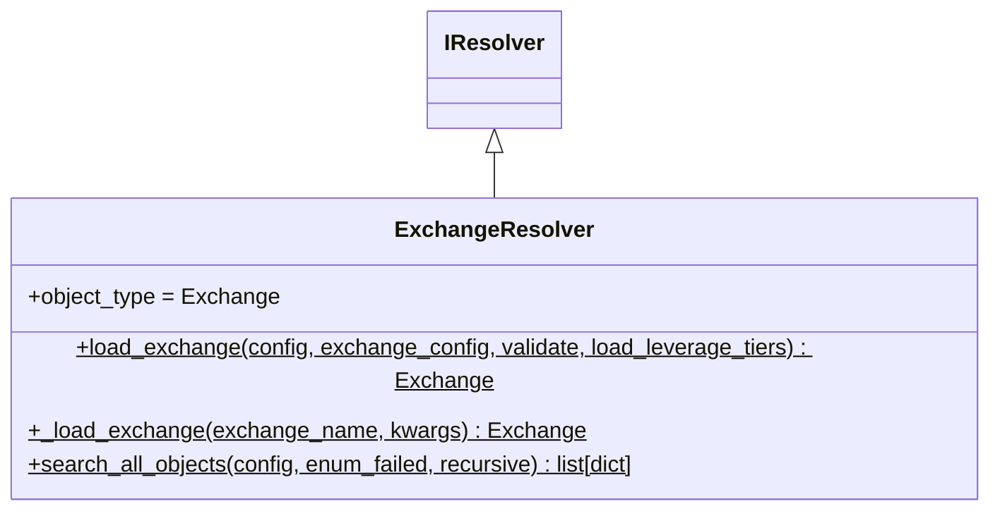

# exchange_resolver.py

## 概述

`freqtrade/resolvers/exchange_resolver.py` 定义了 `ExchangeResolver`，负责根据配置加载正确的交易所类。它尝试查找交易所特定的子类实现（如 `Binance`, `Kraken`），如果找不到则使用通用的 `Exchange` 基类。

## 架构图

## 核心类/函数

### ExchangeResolver

**`load_exchange(config, *, exchange_config, validate, load_leverage_tiers) -> Exchange`** (static)

交易所加载的主入口。

**参数：**
- `config` — 全局配置字典
- `exchange_config` — 可选的交易所特定配置
- `validate: bool = True` — 是否验证交易所配置
- `load_leverage_tiers: bool = False` — 是否加载杠杆层级数据

**流程：**
1. 从配置中获取交易所名称
2. 通过 `MAP_EXCHANGE_CHILDCLASS` 映射别名（避免重复类）
3. 将名称转为 Title Case（如 'binance' -> 'Binance'）
4. 尝试加载特定子类
5. 如果加载失败，使用通用 `Exchange` 类实例化

**`_load_exchange(exchange_name, kwargs) -> Exchange`** (static)

通过 `getattr` 从 `freqtrade.exchange` 模块中查找交易所类。不使用文件系统搜索，而是直接查找已注册的交易所类。

**`search_all_objects(cls, config, enum_failed, recursive) -> list[dict]`** (classmethod)

列出所有可用的交易所类。通过遍历 `freqtrade.exchange` 模块中的所有类，过滤出 `Exchange` 的子类。

## 依赖关系

### 内部依赖（本项目模块）
- `freqtrade.exchange` — Exchange 基类及所有交易所子类
- `freqtrade.exchange.MAP_EXCHANGE_CHILDCLASS` — 交易所名称到子类的映射
- `freqtrade.constants` — Config, ExchangeConfig
- `freqtrade.resolvers.iresolver.IResolver` — 基类

### 外部依赖（第三方库）
- `inspect.isclass` — 类型检查

### 被依赖（谁引用了本文件）
- `freqtrade.resolvers.__init__` — 导出 ExchangeResolver
- `freqtrade.freqtradebot` — 加载交易所
- `freqtrade.plot.plotting` — 绘图时加载交易所
- `freqtrade.optimize.backtesting` — 回测时加载交易所
- `freqtrade.rpc.api_server.*` — API 加载交易所
- `freqtrade.data.history.history_utils` — 数据下载时加载交易所
