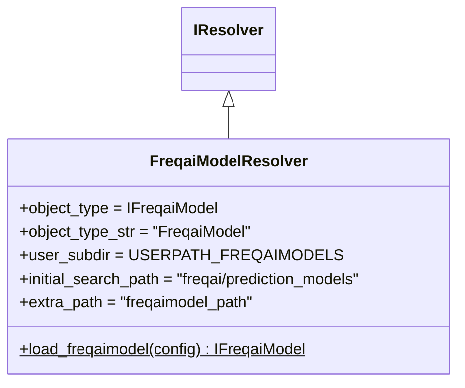

# freqaimodel_resolver.py

## 概述

`freqtrade/resolvers/freqaimodel_resolver.py` 定义了 `FreqaiModelResolver`，负责加载 FreqAI 预测模型。FreqAI 是 freqtrade 内置的机器学习框架，支持多种预测模型（如回归模型、分类模型等）。

## 架构图

## 核心类/函数

### FreqaiModelResolver

**类变量配置：**
- `object_type` = `IFreqaiModel` — FreqAI 模型基类
- `user_subdir` = `USERPATH_FREQAIMODELS` — 用户自定义模型目录
- `initial_search_path` = `freqtrade/freqai/prediction_models/` — 内置模型目录
- `extra_path` = `"freqaimodel_path"` — 配置中额外模型路径键名

**`load_freqaimodel(config) -> IFreqaiModel`** (static)

加载 FreqAI 模型的主入口。

**流程：**
1. 从配置中获取 `freqaimodel` 名称
2. 验证不是基类（`BaseRegressionModel` 等不允许直接使用）
3. 调用 `load_object()` 搜索并实例化模型

**异常处理：**
- 未设置 `freqaimodel` 时抛出 OperationalException
- 尝试使用基类时抛出 OperationalException

## 依赖关系

### 内部依赖（本项目模块）
- `freqtrade.constants.USERPATH_FREQAIMODELS` — 用户模型目录常量
- `freqtrade.exceptions.OperationalException` — 异常
- `freqtrade.freqai.freqai_interface.IFreqaiModel` — FreqAI 模型基类
- `freqtrade.resolvers.IResolver` — 解析器基类

### 被依赖（谁引用了本文件）
- `freqtrade.strategy.interface.IStrategy.load_freqAI_model()` — 策略初始化时加载 FreqAI 模型
- `freqtrade.freqai.conftest` — 测试中加载模型
