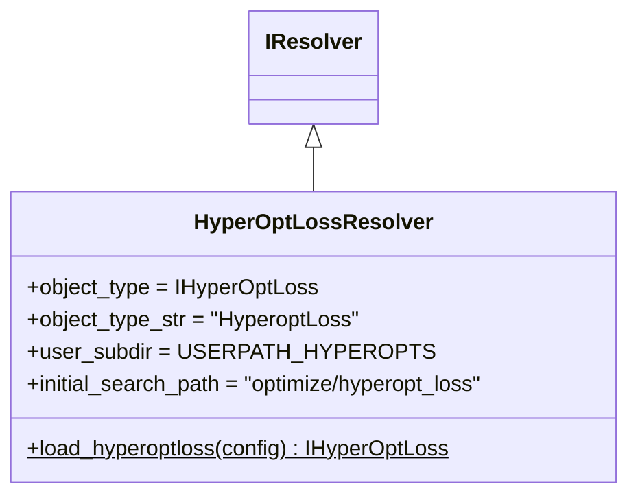

# hyperopt_resolver.py

## 概述

`freqtrade/resolvers/hyperopt_resolver.py` 定义了 `HyperOptLossResolver`，负责加载 Hyperopt 损失函数类。Hyperopt（超参数优化）需要一个损失函数来评估每组参数的好坏，不同的损失函数侧重不同的优化目标（如利润最大化、回撤最小化、Sharpe 比率最大化等）。

## 架构图

## 核心类/函数

### HyperOptLossResolver

**类变量配置：**
- `object_type` = `IHyperOptLoss` — Hyperopt 损失函数基类
- `user_subdir` = `USERPATH_HYPEROPTS` — 用户自定义损失函数目录
- `initial_search_path` = `freqtrade/optimize/hyperopt_loss/` — 内置损失函数目录

**`load_hyperoptloss(config) -> IHyperOptLoss`** (static)

加载 Hyperopt 损失函数的主入口。

**流程：**
1. 从配置中获取 `hyperopt_loss` 名称
2. 如果未设置，抛出 OperationalException 并列出可用的内置损失函数
3. 调用 `load_object()` 搜索并实例化
4. 将配置中的 `timeframe` 赋值到损失函数类的类变量中

**内置损失函数包括：**
- `ShortTradeDurHyperOptLoss` — 偏好短交易时间
- `OnlyProfitHyperOptLoss` — 仅优化利润
- `SharpeHyperOptLoss` — 优化 Sharpe 比率
- `SortinoHyperOptLoss` — 优化 Sortino 比率
- `MaxDrawDownHyperOptLoss` — 最小化最大回撤
- 等等

## 依赖关系

### 内部依赖（本项目模块）
- `freqtrade.constants.HYPEROPT_LOSS_BUILTIN` — 内置损失函数列表
- `freqtrade.constants.USERPATH_HYPEROPTS` — 用户目录常量
- `freqtrade.exceptions.OperationalException` — 异常
- `freqtrade.optimize.hyperopt_loss.hyperopt_loss_interface.IHyperOptLoss` — 损失函数基类
- `freqtrade.resolvers.IResolver` — 解析器基类

### 被依赖（谁引用了本文件）
- `freqtrade.optimize.hyperopt.hyperopt_optimizer` — Hyperopt 优化器加载损失函数
