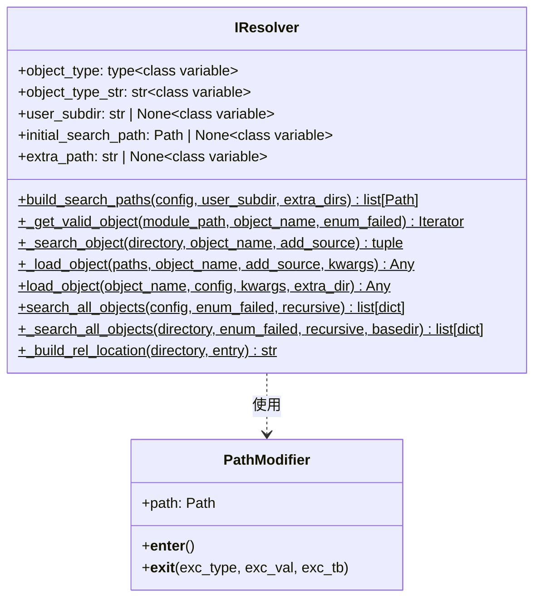

# iresolver.py

## 概述

`freqtrade/resolvers/iresolver.py` 定义了 `IResolver` — 所有解析器的基类。它提供了通用的对象加载机制，能够从文件系统中搜索、导入并实例化 Python 类。这是 freqtrade 插件化架构的核心组件，支持加载策略、交易所、pairlist、protection、hyperopt loss 等各种可扩展对象。

## 架构图

## 核心类/函数

### PathModifier

上下文管理器，临时将指定路径添加到 `sys.path`，以支持模块内的相对导入。

**行为：**
- `__enter__` — 将路径插入 `sys.path[0]`
- `__exit__` — 从 `sys.path` 移除该路径

### IResolver

所有解析器的基类。子类需要设置以下类变量：

| 类变量 | 说明 |
|--------|------|
| `object_type` | 目标对象的基类类型（如 IStrategy） |
| `object_type_str` | 对象类型的字符串描述（如 "Strategy"） |
| `user_subdir` | 用户数据目录下的子目录名（如 "strategies"） |
| `initial_search_path` | 内置对象的搜索路径 |
| `extra_path` | 配置中额外搜索路径的配置键名 |

**`build_search_paths(cls, config, user_subdir, extra_dirs) -> list[Path]`**
- 构建搜索路径列表，优先级从高到低：
  1. `extra_path` 配置指定的路径
  2. `extra_dirs` 额外目录
  3. `user_subdir` 用户数据子目录
  4. `initial_search_path` 内置路径

**`_get_valid_object(cls, module_path, object_name, enum_failed) -> Iterator`**
- 从指定 Python 文件中查找匹配的类
- 使用 `importlib.util` 动态加载模块
- 通过 `inspect.getmembers()` 和类型检查过滤有效对象
- 验证条件：是类、是 `object_type` 的子类、不是基类本身、在正确的模块中定义
- 返回 `(类, 源代码)` 元组的生成器

**`_search_object(cls, directory, object_name, add_source) -> tuple`**
- 在目录中搜索指定名称的类
- 优化：先用文本搜索 `class {object_name}(` 快速过滤文件
- 找到后设置 `__file__` 和可选的 `__source__` 属性

**`_load_object(cls, paths, object_name, add_source, kwargs) -> Any | None`**
- 在路径列表中搜索并实例化对象
- 找到类后用 `kwargs` 调用构造函数
- 返回实例化的对象或 None

**`load_object(cls, object_name, config, kwargs, extra_dir) -> Any`**
- 高层 API，搜索并加载对象
- 如果找不到对象，抛出 `OperationalException`

**`search_all_objects(cls, config, enum_failed, recursive) -> list[dict]`**
- 搜索所有可用对象（用于列表展示）
- 返回 `[{'name': ..., 'class': ..., 'location': ..., 'location_rel': ...}]`
- 支持递归搜索子目录

## 依赖关系

### 内部依赖（本项目模块）
- `freqtrade.constants.Config` — 配置类型
- `freqtrade.exceptions.OperationalException` — 异常处理

### 外部依赖（第三方库）
- `importlib.util` — 动态模块加载
- `inspect` — 类成员检查和源代码获取
- `pathlib.Path` — 路径操作

### 被依赖（谁引用了本文件）
- `freqtrade.resolvers.__init__` — 导出 IResolver
- `freqtrade.resolvers.strategy_resolver.StrategyResolver` — 继承 IResolver
- `freqtrade.resolvers.exchange_resolver.ExchangeResolver` — 继承 IResolver
- `freqtrade.resolvers.freqaimodel_resolver.FreqaiModelResolver` — 继承 IResolver
- `freqtrade.resolvers.hyperopt_resolver.HyperOptLossResolver` — 继承 IResolver
- `freqtrade.resolvers.pairlist_resolver.PairListResolver` — 继承 IResolver
- `freqtrade.resolvers.protection_resolver.ProtectionResolver` — 继承 IResolver
