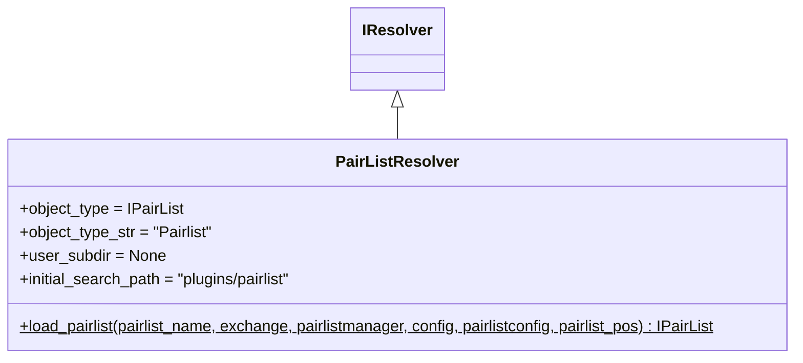

# pairlist_resolver.py

## 概述

`freqtrade/resolvers/pairlist_resolver.py` 定义了 `PairListResolver`，负责加载交易对列表（Pairlist）插件。Pairlist 插件用于动态生成和过滤交易对列表，例如按交易量排序、价格过滤、波动率过滤等。

## 架构图

## 核心类/函数

### PairListResolver

**类变量配置：**
- `object_type` = `IPairList` — Pairlist 基类
- `user_subdir` = `None` — 不支持用户自定义 pairlist 目录
- `initial_search_path` = `freqtrade/plugins/pairlist/` — 内置 pairlist 目录

**`load_pairlist(pairlist_name, exchange, pairlistmanager, config, pairlistconfig, pairlist_pos) -> IPairList`** (static)

加载指定的 Pairlist 插件。

**参数：**
- `pairlist_name: str` — Pairlist 类名（如 'VolumePairList', 'StaticPairList'）
- `exchange` — 已初始化的交易所实例
- `pairlistmanager` — 已初始化的 pairlist 管理器
- `config` — 全局配置字典
- `pairlistconfig: dict` — 此 pairlist 的专属配置
- `pairlist_pos: int` — 在 pairlist 链中的位置

所有参数通过 `kwargs` 传递给 Pairlist 构造函数。

## 依赖关系

### 内部依赖（本项目模块）
- `freqtrade.constants.Config` — 配置类型
- `freqtrade.plugins.pairlist.IPairList` — Pairlist 基类
- `freqtrade.resolvers.IResolver` — 解析器基类

### 被依赖（谁引用了本文件）
- `freqtrade.resolvers.__init__` — 导出 PairListResolver
- `freqtrade.plugins.pairlistmanager` — Pairlist 管理器加载各 pairlist 插件
- `freqtrade.rpc.api_server.api_pairlists` — API 接口加载 pairlist
