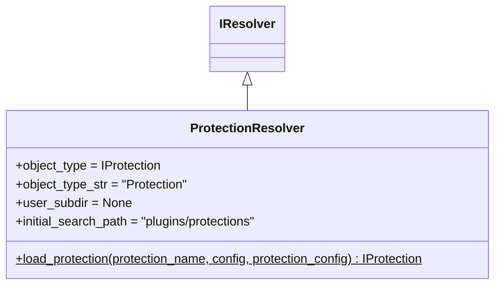

# protection_resolver.py

## 概述

`freqtrade/resolvers/protection_resolver.py` 定义了 `ProtectionResolver`，负责加载交易保护（Protection）插件。保护插件可以在特定条件下锁定交易对或全局暂停交易，例如连续亏损后暂停交易、止损后锁定交易对等。

## 架构图

## 核心类/函数

### ProtectionResolver

**类变量配置：**
- `object_type` = `IProtection` — Protection 基类
- `user_subdir` = `None` — 不支持用户自定义 protection 目录
- `initial_search_path` = `freqtrade/plugins/protections/` — 内置 protection 目录

**`load_protection(protection_name, config, protection_config) -> IProtection`** (static)

加载指定的 Protection 插件。

**参数：**
- `protection_name: str` — Protection 类名（如 'StoplossGuard', 'CooldownPeriod'）
- `config` — 全局配置字典
- `protection_config: dict` — 此 protection 的专属配置

**常见内置 Protection：**
- `StoplossGuard` — 连续止损后暂停交易
- `MaxDrawdown` — 最大回撤保护
- `CooldownPeriod` — 冷却期保护
- `LowProfitPairs` — 低收益交易对锁定

## 依赖关系

### 内部依赖（本项目模块）
- `freqtrade.constants.Config` — 配置类型
- `freqtrade.plugins.protections.IProtection` — Protection 基类
- `freqtrade.resolvers.IResolver` — 解析器基类

### 被依赖（谁引用了本文件）
- `freqtrade.resolvers.__init__` — 导出 ProtectionResolver
- `freqtrade.plugins.protectionmanager` — Protection 管理器加载各 protection 插件
