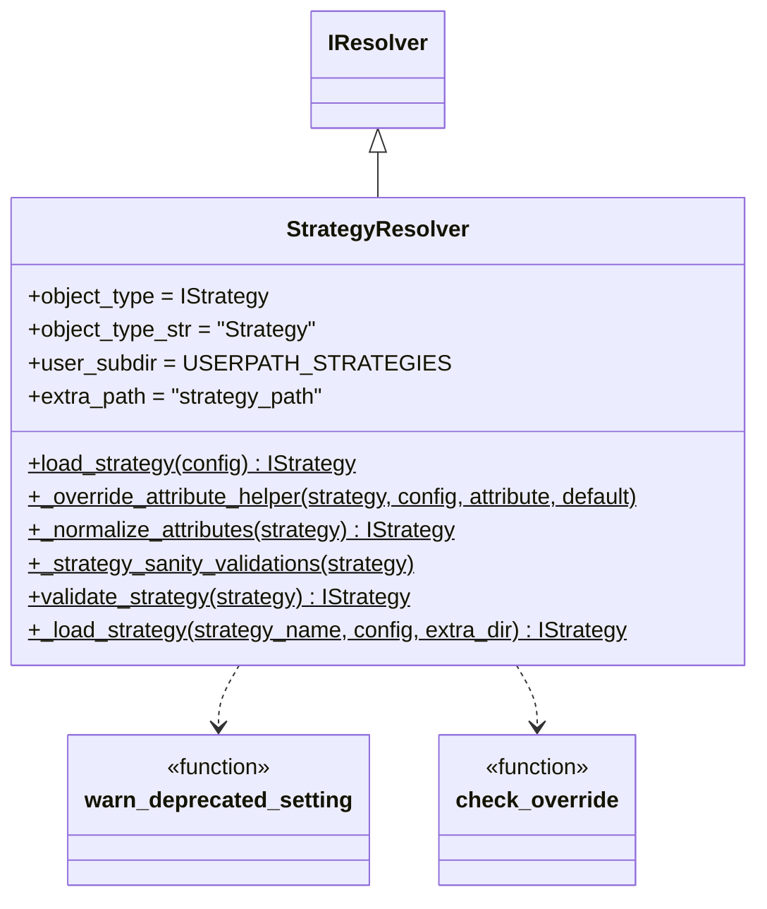

# strategy_resolver.py

## 概述

`freqtrade/resolvers/strategy_resolver.py` 定义了 `StrategyResolver`，负责搜索、加载、配置和验证用户策略。它是策略生命周期中最关键的入口点之一，处理以下工作：

1. 从文件系统查找策略类（支持递归搜索和 base64 编码策略）
2. 实例化策略对象
3. 用配置文件中的值覆盖策略属性
4. 验证策略的完整性和正确性（接口版本、必需方法、已废弃设置等）

## 架构图

## 核心类/函数

### StrategyResolver

继承自 `IResolver`，专门用于加载策略。

**`load_strategy(config) -> IStrategy`** (static)
- 策略加载的主入口
- 流程：
  1. 调用 `_load_strategy()` 搜索并实例化策略
  2. 调用 `ft_load_params_from_file()` 加载参数文件
  3. 使用 `_override_attribute_helper()` 按优先级设置 20+ 个策略属性
  4. 调用 `_normalize_attributes()` 标准化属性类型
  5. 调用 `_strategy_sanity_validations()` 进行基础验证

**`_override_attribute_helper(strategy, config, attribute, default)`** (static)
- 属性覆盖优先级：
  1. **Configuration** — 配置文件/命令行中的值
  2. **Strategy** — 策略类中定义的值
  3. **Default** — 默认值（如果不为 None）
- 特殊处理 `max_open_trades`: `-1` 自动转换为 `float('inf')`
- 保护 Python property 属性不被覆盖

**`_normalize_attributes(strategy) -> IStrategy`** (static)
- `minimal_roi` 的 key 转为 int 并排序
- `stoploss` 转为 float
- `max_open_trades` 负值转为 infinity

**`_strategy_sanity_validations(strategy)`** (static)
- 验证 `order_types` 包含所有必需的键
- 验证 `order_time_in_force` 包含 entry 和 exit
- 验证 `can_short` 策略不能在现货市场运行
- 调用 `validate_migrated_strategy_settings()` 确保旧设置已迁移

**`validate_strategy(strategy) -> IStrategy`** (static)
- 全面的策略验证，区分现货和期货模式：
  - **期货模式**：要求使用新版方法名（强制报错旧名称）
  - **现货模式**：允许旧版方法名（仅警告）
- 检测 `custom_stoploss` 是否支持 `after_fill` 参数
- 检测 `adjust_order_price` 与 `adjust_entry_price`/`adjust_exit_price` 的互斥性
- 验证接口版本（v1 已不支持）

**`_load_strategy(strategy_name, config, extra_dir) -> IStrategy`** (static)
- 底层策略加载：
  - 支持 `recursive_strategy_search` 递归搜索子目录
  - 支持 `name:base64code` 格式加载 base64 编码的策略
  - 调用 `_load_object()` 搜索并实例化
  - 调用 `validate_strategy()` 验证

### warn_deprecated_setting(strategy, old, new, error=False)

检查策略是否使用了已废弃的属性名，并进行迁移或报错。

### check_override(obj, parentclass, attribute) -> bool

检查对象是否重写了父类的指定属性/方法。通过比较 `type(obj)` 和 `parentclass` 上的属性实现。

## 依赖关系

### 内部依赖（本项目模块）
- `freqtrade.configuration.config_validation` — 配置验证
- `freqtrade.constants` — REQUIRED_ORDERTYPES, REQUIRED_ORDERTIF, USERPATH_STRATEGIES
- `freqtrade.enums.TradingMode` — 交易模式枚举
- `freqtrade.exceptions.OperationalException` — 异常
- `freqtrade.resolvers.iresolver.IResolver` — 基类
- `freqtrade.strategy.interface.IStrategy` — 策略接口

### 外部依赖（第三方库）
- `inspect.getfullargspec` — 检查函数签名
- `base64.urlsafe_b64decode` — 解码 base64 策略
- `tempfile` — 临时文件处理

### 被依赖（谁引用了本文件）
- `freqtrade.resolvers.__init__` — 导出 StrategyResolver
- `freqtrade.freqtradebot` — 加载策略
- `freqtrade.optimize.backtesting` — 回测加载策略
- `freqtrade.plot.plotting` — 绘图加载策略
- `freqtrade.commands.list_commands` — 列出策略
