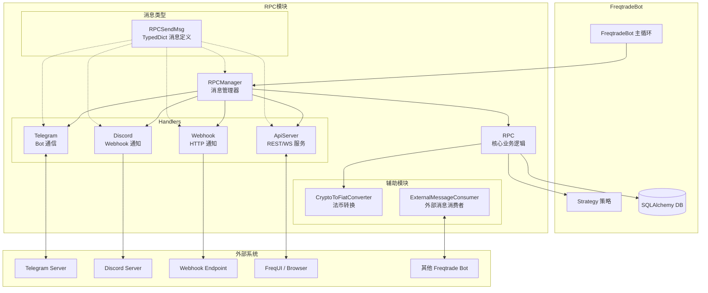
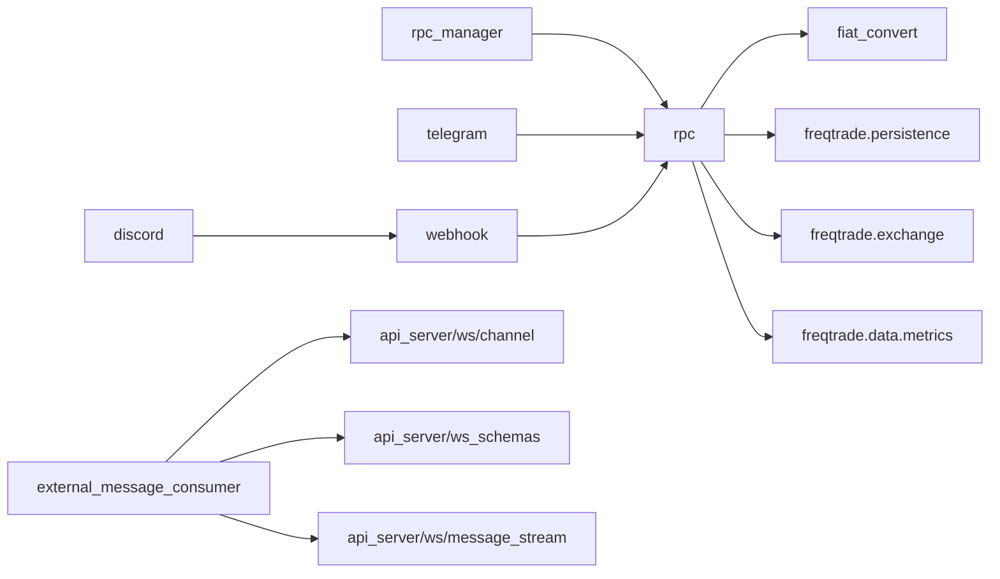
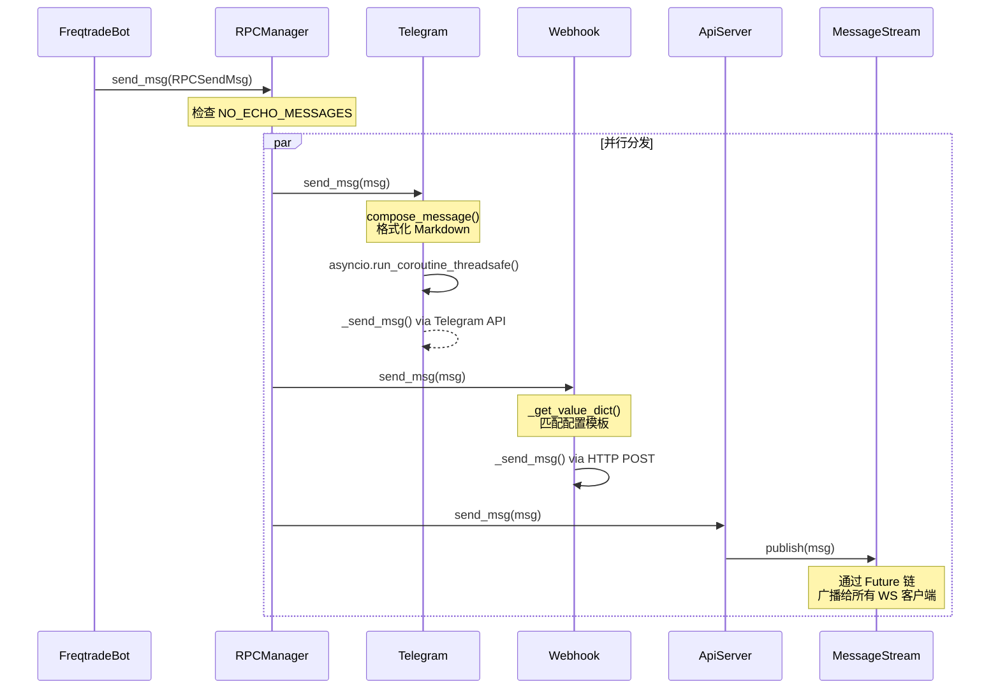
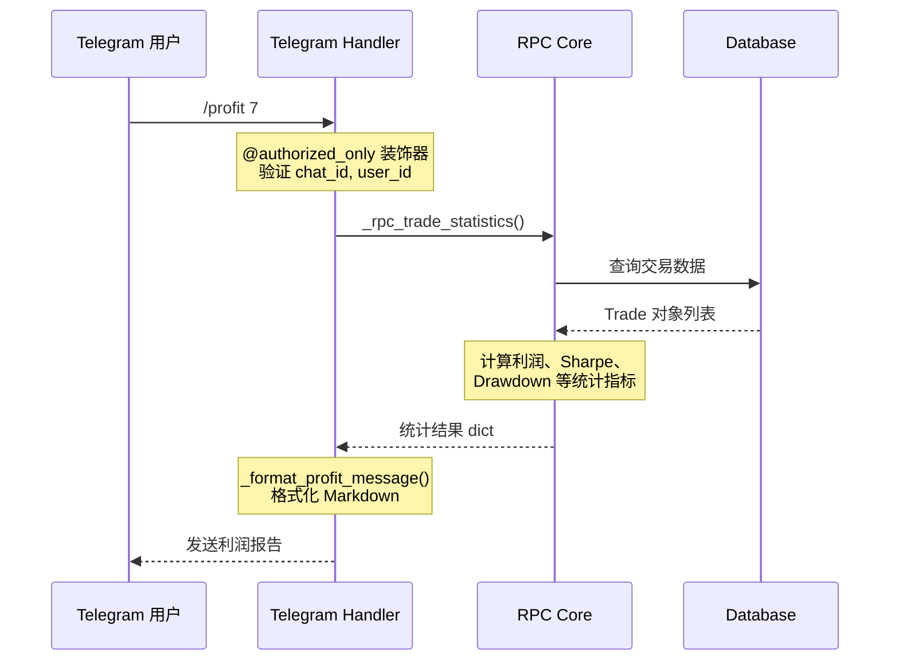
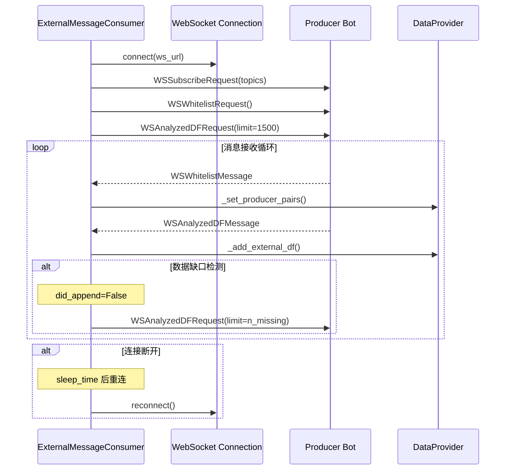

# RPC 模块源码文档

## 1. 模块概述

RPC（Remote Procedure Call）模块是 freqtrade 交易机器人的**核心通信层**，负责将机器人内部的交易状态、收益统计、账户余额等数据暴露给外部消费者。该模块采用**发布-订阅**与**请求-响应**混合架构，支持多种通信渠道并行运行，包括 Telegram Bot、Discord Webhook、HTTP Webhook、REST API Server 以及外部消息消费者（ExternalMessageConsumer）。

RPC 模块的核心设计理念是**解耦**：核心业务逻辑集中在 `RPC` 类中，各通信渠道仅负责格式化和传输消息。这使得新增通信渠道变得简单，只需继承 `RPCHandler` 基类并实现 `send_msg()` 和 `cleanup()` 方法。

## 2. 目录结构

```
freqtrade/rpc/
├── __init__.py                     # 模块入口，导出 RPC、RPCException、RPCHandler、RPCManager
├── rpc.py                          # (~73KB) 核心 RPC 类，包含所有 _rpc_* 业务逻辑方法
├── rpc_types.py                    # RPC 消息类型定义（TypedDict），定义所有消息的数据结构
├── rpc_manager.py                  # RPC 管理器，负责注册/分发消息到所有 RPCHandler
├── telegram.py                     # (~93KB) Telegram Bot 通信实现，最大的 Handler
├── webhook.py                      # HTTP Webhook 通信实现，支持 form/json/raw 格式
├── discord.py                      # Discord Webhook 通信实现，继承自 Webhook
├── fiat_convert.py                 # 法币转换工具，通过 CoinGecko API 获取汇率
├── external_message_consumer.py    # 外部消息消费者，通过 WebSocket 连接其他 bot 实例
├── api_server/                     # REST API 服务器子模块（见独立文档）
│   └── ws/                         # WebSocket 通信子模块（见独立文档）
```

## 3. 架构图



## 4. 核心类/函数说明

### 4.1 `RPCException` (rpc.py)

自定义异常类，当 RPC 调用遇到错误状态时抛出（如"无活跃交易"、"交易未找到"等）。包含 `message` 属性，支持 JSON 序列化。

### 4.2 `RPCHandler` (rpc.py)

所有 RPC 通信处理器的**抽象基类**。

```python
class RPCHandler:
    def __init__(self, rpc: "RPC", config: Config) -> None
    @property
    def name(self) -> str                           # 返回类名小写
    @abstractmethod
    def cleanup(self) -> None                       # 清理资源
    @abstractmethod
    def send_msg(self, msg: RPCSendMsg) -> None     # 发送消息
```

所有 Handler（Telegram、Webhook、Discord、ApiServer）都继承此基类。

### 4.3 `RPC` (rpc.py) -- 核心类

这是整个 RPC 模块最核心的类，包含约 1800 行代码。它持有对 `FreqtradeBot` 实例的引用，通过 `_rpc_*` 前缀的方法提供所有远程调用功能。

**主要方法分类：**

| 方法 | 功能 | 返回类型 |
|------|------|----------|
| `_rpc_show_config()` | 返回安全的配置信息（排除敏感数据） | `dict` |
| `_rpc_trade_status()` | 获取当前交易状态，包含实时利润计算 | `list[dict]` |
| `_rpc_status_table()` | 交易状态表格格式 | `tuple` |
| `_rpc_timeunit_profit()` | 按日/周/月统计利润 | `dict` |
| `_rpc_trade_history()` | 历史交易查询，支持分页 | `dict` |
| `_rpc_trade_statistics()` | 累计交易统计（Sharpe、Sortino、SQN、CAGR 等） | `dict` |
| `_rpc_stats()` | 退出原因统计与平均持仓时间 | `dict` |
| `_rpc_balance()` | 账户余额（含 Futures position 计算） | `dict` |
| `_rpc_start()` / `_rpc_stop()` / `_rpc_pause()` | Bot 状态控制 | `dict` |
| `_rpc_reload_config()` | 重新加载配置 | `dict` |
| `_rpc_force_exit()` | 强制退出交易 | `dict` |
| `_rpc_force_entry()` | 强制进入交易 | `Trade \| None` |
| `_rpc_cancel_open_order()` | 取消挂单 | `None` |
| `_rpc_delete()` | 删除交易记录 | `dict` |
| `_rpc_performance()` | 交易对表现排名 | `list[dict]` |
| `_rpc_whitelist()` / `_rpc_blacklist()` | 白名单/黑名单管理 | `dict` |
| `_rpc_locks()` / `_rpc_delete_lock()` / `_rpc_add_lock()` | 交易对锁定管理 | `dict` |
| `_rpc_get_logs()` | 获取日志 | `dict` |
| `_rpc_analysed_dataframe()` | 获取策略分析后的 DataFrame | `dict` |
| `_rpc_analysed_history_full()` | 获取完整历史分析数据 | `dict` |
| `_rpc_plot_config()` | 获取绘图配置 | `dict` |
| `_rpc_sysinfo()` | 系统信息（CPU、RAM） | `dict` |
| `health()` | 健康检查 | `dict` |
| `_rpc_list_custom_data()` | 自定义数据查询 | `list[dict]` |

**关键内部方法：**

- `_collect_trade_statistics_data()`: 遍历所有交易，计算利润、胜率等统计数据
- `__balance_get_est_stake()`: 计算单个币种的估值（含 Futures 仓位计算）
- `__exec_force_exit()`: 执行强制退出的核心逻辑（取消挂单 -> 计算价格 -> 下单）
- `_convert_dataframe_to_dict()`: 将 pandas DataFrame 转换为可序列化的 dict
- `_ws_all_analysed_dataframes()`: 为 WebSocket 生成所有交易对的分析数据（Generator）

### 4.4 `RPCManager` (rpc_manager.py)

RPC 管理器，作为所有 Handler 的**协调中枢**。

```python
class RPCManager:
    def __init__(self, freqtrade) -> None    # 根据配置注册启用的 Handler
    def cleanup(self) -> None                 # 清理所有注册的 Handler
    def send_msg(self, msg: RPCSendMsg)       # 将消息分发到所有注册的 Handler
    def process_msg_queue(self, queue)        # 处理策略消息队列
    def startup_messages(self, config, ...)   # 发送启动消息
```

Handler 注册顺序：Telegram -> Discord -> Webhook -> ApiServer

### 4.5 `Telegram` (telegram.py) -- 最大的 Handler

约 93KB 的 Telegram Bot 实现，功能极为丰富。

**关键架构特点：**
- 运行在独立的 Thread 中，拥有自己的 asyncio event loop
- 使用 `python-telegram-bot` 库（Application、CommandHandler、CallbackQueryHandler）
- 通过 `@authorized_only` 装饰器实现权限验证（chat_id + user_id + topic_id）
- 通过 `@safe_async_db` 装饰器处理跨异步上下文的数据库 Session

**支持的命令（40+）：**

| 命令 | 功能 |
|------|------|
| `/status` | 当前交易状态 |
| `/profit` / `/profit_long` / `/profit_short` | 利润统计（支持方向过滤） |
| `/balance` | 账户余额 |
| `/daily` / `/weekly` / `/monthly` | 按时间维度的利润 |
| `/trades` | 历史交易 |
| `/performance` / `/entries` / `/exits` / `/mix_tags` | 表现统计 |
| `/stats` | 退出原因分析 |
| `/count` | 当前交易数 |
| `/start` / `/stop` / `/pause` | Bot 控制 |
| `/forcelong` / `/forceshort` / `/forceexit` | 强制交易 |
| `/delete` / `/cancel_open_order` | 交易管理 |
| `/whitelist` / `/blacklist` / `/bl_delete` | 交易对管理 |
| `/locks` / `/unlock` | 交易对锁定 |
| `/logs` / `/health` / `/show_config` / `/version` | 信息查询 |
| `/marketdir` | 市场方向设置 |
| `/reload_config` / `/reload_trade` | 配置/交易重载 |
| `/order` / `/list_custom_data` | 订单/自定义数据 |

**消息格式化：**
- `compose_message()`: 根据消息类型路由到对应格式化方法
- `_format_entry_msg()`: 格式化入场消息（含 Emoji、杠杆、标签）
- `_format_exit_msg()`: 格式化出场消息（含利润、持仓时间、子交易信息）
- `_message_loudness()`: 消息通知级别控制（on/off/silent）

### 4.6 `Webhook` (webhook.py)

HTTP Webhook 通信实现，支持三种格式：

| 格式 | Content-Type | 说明 |
|------|-------------|------|
| `form` | application/x-www-form-urlencoded | 表单提交 |
| `json` | application/json | JSON 格式 |
| `raw` | text/plain | 纯文本 |

支持重试机制（`_retries` + `_retry_delay`），使用 `recursive_format()` 方法递归格式化消息模板。

### 4.7 `Discord` (discord.py)

继承自 `Webhook`，专门适配 Discord 的 Embed 消息格式：
- 根据利润正负设置 Embed 颜色（绿色/红色）
- 使用 Discord Webhook URL 发送 JSON 格式的 Embed 消息
- 配置中按消息类型定义自定义字段模板

### 4.8 `CryptoToFiatConverter` (fiat_convert.py)

法币转换单例类，通过 CoinGecko API 获取加密货币到法币的汇率：
- 使用 `FtTTLCache`（TTL=6小时）缓存价格
- 支持所有 `SUPPORTED_FIAT` 法币
- 内置 `coingecko_mapping` 处理常见币种的 ID 映射冲突
- 具备请求限流退避机制（429 响应时 backoff 60秒）

### 4.9 `ExternalMessageConsumer` (external_message_consumer.py)

外部消息消费者，用于**多 Bot 协同**场景：
- 通过 WebSocket 连接到其他 Freqtrade Bot 的 API Server
- 消费 `WHITELIST` 和 `ANALYZED_DF` 两种消息类型
- 运行在独立 Thread 的 asyncio event loop 中
- 每个 Producer 连接是一个独立的 asyncio Task
- 支持断线重连、ping/pong 心跳检测
- 支持数据缺口检测与补全请求

### 4.10 消息类型定义 (rpc_types.py)

使用 `TypedDict` 定义所有 RPC 消息的数据结构：

```
RPCSendMsg = (
    RPCStatusMsg          # Status/Startup/Warning 消息
  | RPCStrategyMsg        # 策略自定义消息
  | RPCProtectionMsg      # 保护触发消息
  | RPCWhitelistMsg       # 白名单变更消息
  | RPCEntryMsg           # 入场/入场填充消息
  | RPCCancelMsg          # 入场取消消息
  | RPCExitMsg            # 出场/出场填充消息
  | RPCExitCancelMsg      # 出场取消消息
  | RPCAnalyzedDFMsg      # 分析后 DataFrame 消息
  | RPCNewCandleMsg       # 新蜡烛消息
)
```

## 5. 依赖关系

### 内部依赖



### 外部依赖

| 依赖 | 使用者 | 说明 |
|------|--------|------|
| `python-telegram-bot` | telegram.py | Telegram Bot API 客户端 |
| `requests` | webhook.py | HTTP 请求 |
| `websockets` | external_message_consumer.py | WebSocket 客户端 |
| `psutil` | rpc.py | 系统信息获取 |
| `pandas` / `numpy` | rpc.py | 数据处理与统计 |
| `sqlalchemy` | rpc.py | 数据库查询 |
| `tabulate` | telegram.py | 表格格式化 |
| `pydantic` | rpc_types.py, external_message_consumer.py | 数据验证 |
| `pycoingecko` | fiat_convert.py | CoinGecko API |
| `dateutil` | rpc.py | 日期处理 |

## 6. 数据流

### 6.1 消息发送流程



### 6.2 Telegram 命令处理流程



### 6.3 ExternalMessageConsumer 数据流


